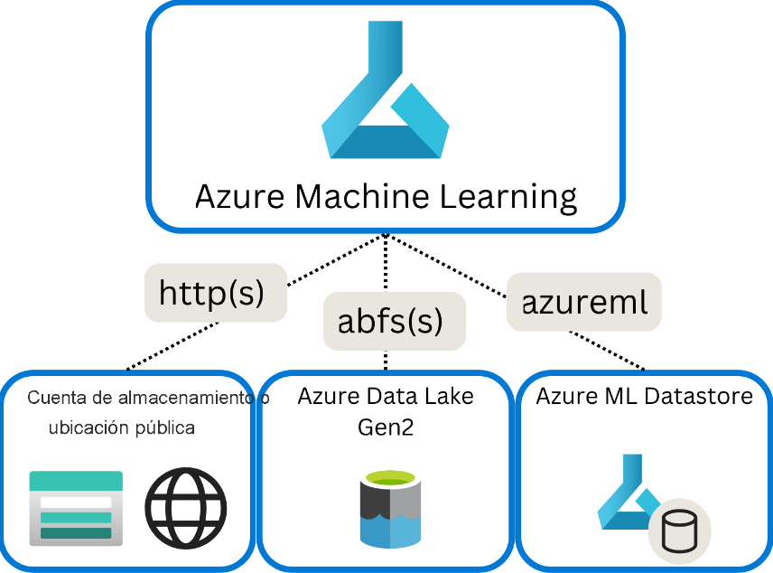
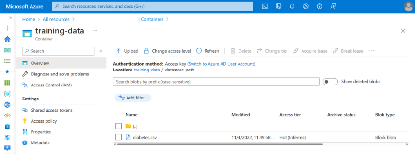
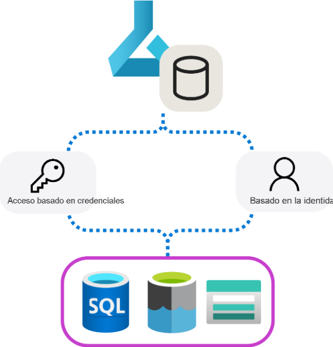
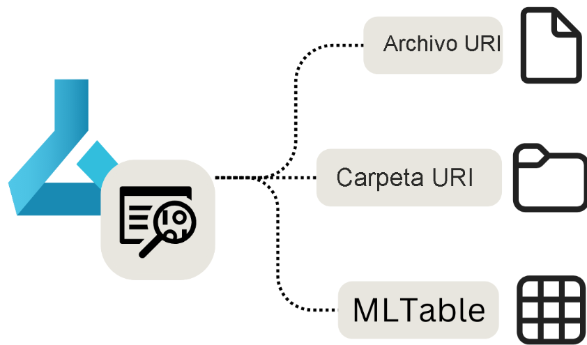

# Hacer que los datos estén disponibles en Azure Machine Learning

## Introducción

Para trabajar con datos en Azure Machine Learning, puede acceder a los datos mediante `identificadores uniformes de recursos (URI)`. Al trabajar con un origen de datos o con un archivo o carpeta específicos repetidamente, puede crear almacenes de datos y recursos de datos en el área de trabajo de Azure Machine Learning. Los almacenes de datos y los recursos de datos permiten almacenar de forma segura la información de conexión a los datos.

## Descripción de los URI

_Puede almacenar datos en el dispositivo local o en algún lugar de la nube_. Dondequiera que almacene los datos, querrá acceder a ellos al entrenar modelos de aprendizaje automático. Para buscar los datos en Azure Machine Learning y poder acceder a ellos, use identificadores uniformes de recursos (URI).

---

Un URI hace referencia a la ubicación de los datos. Para que Azure Machine Learning se conecte a los datos, debe anexar al URI un prefijo con el protocolo adecuado. _Hay tres protocolos comunes al trabajar con datos en el contexto de Azure Machine Learning:_



- `http(s):` se usa para almacenes de datos pública o privadamente en una ubicación http(s) de Azure Blob Storage o disponible públicamente.
- `abfs(s):` se usa para almacenes de datos en una instancia de Azure Data Lake Storage Gen 2.
- `azureml:` se usa para los datos almacenados en un almacén de datos.

_Ejemplo:_

Puede crear una instancia de _Azure Blob Storage en Azure_. Para almacenar datos, crea un `contenedor denominado training-data`. Dentro del contenedor, crea una `carpeta datastore-path`. Dentro de la carpeta, almacena el archivo `CSV diabetes.csv`.



Cuando quiera acceder a los datos desde el área de trabajo de Azure Machine Learning, puede usar la ruta de acceso a la carpeta o el archivo directamente. Cuando quiera conectarse directamente a la carpeta o al archivo, puede usar el protocolo `http(s)`. _Si el contenedor está establecido en privado, deberá proporcionar algún tipo de autenticación para obtener acceso a los datos, como una firma de acceso compartido (SAS)._

Al crear un almacén de datos en Azure Machine Learning, almacenará la información de conexión y autenticación en el área de trabajo. A continuación, para acceder a los datos del contenedor, puede usar el protocolo `azureml`.

> Un almacén de datos es una referencia a una cuenta de almacenamiento existente en Azure. Por lo tanto, cuando se hace referencia a los datos almacenados en un almacén de datos, es posible que se haga referencia a los datos que se almacenan en Azure Blob Storage o Azure Data Lake Storage. Sin embargo, cuando se hace referencia al almacén de datos, no tendrá que autenticarse, ya que Azure Machine Learning usará la información de conexión almacenada con el almacén de datos.

Se considera un procedimiento recomendado para evitar cualquier dato confidencial en el código, como la información de autenticación. Por lo tanto, siempre que sea posible, debe trabajar con almacenes de datos y recursos de datos en Azure Machine Learning. Sin embargo, durante la experimentación en cuadernos, es posible que desee conectarse directamente a una ubicación de almacenamiento para evitar una sobrecarga innecesaria.

## Creación de un almacén de datos

En Azure Machine Learning, los almacenes de datos son abstracciones de los orígenes de datos en la nube. Encapsulan la información necesaria para conectarse a orígenes de datos y almacenan de forma segura esta información de conexión para que no tenga que codificarla en los scripts.

Las ventajas de usar almacén de datos son las siguientes:

- Proporciona URI fáciles de usar al almacenamiento de datos.
- Facilita la detección de datos en Azure Machine Learning.
- Almacena de forma segura la información de conexión, sin exponer secretos y claves a científicos de datos.

Al crear un almacén de datos con una cuenta de almacenamiento existente en Azure, puede elegir entre dos métodos de autenticación diferentes:



- **Basado en credenciales**: use una entidad de servicio, un token de firma de acceso compartido (SAS) o una clave de cuenta para autenticar el acceso a la cuenta de almacenamiento.
- **Basado en la identidad**: Use la identidad de Microsoft Entra o la identidad administrada.

## Descripción de los tipos de almacenes de datos

Azure Machine Learning admite la creación de almacenes de datos para varios tipos de orígenes de datos de Azure, entre los que se incluyen:

- Azure Blob Storage
- Recurso compartido de archivos de Azure
- Azure Data Lake (Gen 2)

## Uso de almacenes de datos integrados

Cada área de trabajo tiene cuatro almacenes de datos integrados (dos conectados a contenedores de blobs de Azure Storage y dos conectados a recursos compartidos de archivos de Azure Storage), que Azure Machine Learning usa como almacenamiento del sistema.

En la mayoría de los proyectos de aprendizaje automático, debe trabajar con orígenes de datos propios. Por ejemplo, puede integrar la solución de aprendizaje automático con datos de aplicaciones existentes o canalizaciones de ingeniería de datos.

## Creación de un almacén de datos

Los almacenes de datos están conectados a áreas de trabajo y se usan para almacenar información de conexión a los servicios de almacenamiento. Al crear un almacén de datos, se proporciona un nombre que se puede usar para recuperar la información de conexión.

Los almacenes de datos le permiten conectarse fácilmente a los servicios de almacenamiento sin tener que proporcionar todos los detalles necesarios cada vez que quiera leer o escribir datos. También crea una capa de protección si desea que los usuarios usen los datos, pero que no se conecten directamente al servicio de almacenamiento subyacente.

## Creación de un almacén de datos para un contenedor de Azure Blob Storage

Puede crear un almacén de datos mediante la interfaz gráfica de usuario, la interfaz de línea de comandos (CLI) de Azure o el kit de desarrollo de software (SDK) de Python.

En función del servicio de almacenamiento al que desea conectarse, hay diferentes opciones para que Azure Machine Learning se autentique.

Por ejemplo, cuando quiera crear un almacén de datos para conectarse a un contenedor de Azure Blob Storage, puede usar una clave de cuenta:

```Python
from azure.ai.ml.entities import AzureBlobDatastore
from azure.ai.ml.entities import AccountKeyConfiguration
from azure.ai.ml import MLClient

ml_client = MLClient.from_config()

store = AzureBlobDatastore(
    name="blob_protocol_example",
    description="Datastore pointing to a blob container using https protocol.",
    account_name="mytestblobstore",
    container_name="data-container",
    protocol="https",
    credentials=AccountKeyConfiguration(
        account_key="XXXxxxXXXxXXXXxxXXXXXxXXXXXxXxxXxXXXxXXXxXXxxxXXxxXXXxXxXXXxxXxxXXXXxxxxxXXxxxxxxXXXxXXX"
    ),
)

ml_client.create_or_update(store)
```

Como alternativa, puede crear un almacén de datos para conectarse a un contenedor de Azure Blob Storage mediante un token de SAS para autenticarse:

```Python
from azure.ai.ml.entities import AzureBlobDatastore
from azure.ai.ml.entities import AccountKeyConfiguration
from azure.ai.ml import MLClient

ml_client = MLClient.from_config()

store = AzureBlobDatastore(
    name="blob_protocol_example",
    description="Datastore pointing to a blob container using https protocol.",
    account_name="mytestblobstore",
    container_name="data-container",
    protocol="https",
    credentials=AccountKeyConfiguration(
        account_key="XXXxxxXXXxXXXXxxXXXXXxXXXXXxXxxXxXXXxXXXxXXxxxXXxxXXXxXxXXXxxXxxXXXXxxxxxXXxxxxxxXXXxXXX"
    ),
)

ml_client.create_or_update(store)
```

### Data Lake Storage Gen 2

- Entidad de Servicio

```Python
from azure.ai.ml.entities import AzureDataLakeGen2Datastore
from azure.ai.ml.entities._datastore.credentials import ServicePrincipalCredentials

from azure.ai.ml import MLClient

ml_client = MLClient.from_config()

store = AzureDataLakeGen2Datastore(
    name="adls_gen2_example",
    description="Datastore pointing to an Azure Data Lake Storage Gen2.",
    account_name="mytestdatalakegen2",
    filesystem="my-gen2-container",
     credentials=ServicePrincipalCredentials(
        tenant_id= "XXXXXXXX-XXXX-XXXX-XXXX-XXXXXXXXXXXX",
        client_id= "XXXXXXXX-XXXX-XXXX-XXXX-XXXXXXXXXXXX",
        client_secret= "XXXXXXXXXXXXXXXXXXXXXXXXXXXXXXXXXX",
    ),
)

ml_client.create_or_update(store)
```

[cómo crear almacenes de datos para conectarse a otros tipos de soluciones de almacenamiento en la nube](https://learn.microsoft.com/es-es/azure/machine-learning/how-to-datastore?view=azureml-api-2&tabs=sdk-account-key%2Csdk-adls-sp%2Csdk-azfiles-accountkey%2Csdk-adlsgen1-identity-access%2Csdk-onelake-identity-access)

## Crear un Recurso de Datos

Como científico de datos, quiere centrarse en el entrenamiento de modelos de Machine Learning. Aunque necesita acceso a los datos como entrada para un modelo de Machine Learning, no quiere preocuparse por cómo obtener acceso. Para simplificar el acceso a los datos con los que desea trabajar, puede usar recursos de datos.

## Descripción de los recursos de datos

En Azure Machine Learning, los recursos de datos son referencias a dónde se almacenan los datos, cómo obtener acceso y cualquier otro metadato pertinente. Puede crear recursos de datos para obtener acceso a los datos en almacenes de datos, servicios de almacenamiento de Azure, direcciones URL públicas o datos almacenados en el dispositivo local.

Las ventajas de usar recursos de datos son las siguientes:

- Puede compartir y reutilizar datos con otros miembros del equipo de forma que no necesiten recordar ubicaciones de archivos.
- Puede acceder sin problemas a los datos durante el entrenamiento del modelo (en cualquier tipo de proceso admitido) sin preocuparse por las cadenas de conexión o las rutas de acceso de datos.
- Puede crear una versión de los metadatos del recurso de datos.

Hay tres tipos principales de recursos de datos que puede usar:



- **Archivo URI**: apunta a un archivo específico.
- **Carpeta URI**: apunta a una carpeta.
- **MLTable**: apunta a una carpeta o archivo e incluye un esquema para leer como datos tabulares.

> **URI significa identificador uniforme de recursos** y representa una ubicación de almacenamiento en el equipo local, Azure Blob o Data Lake Storage, ubicación HTTPS disponible públicamente o incluso un almacén de datos asociado.

## Cuándo usar recursos de datos

Los recursos de datos son más útiles al ejecutar tareas de aprendizaje automático como trabajos de Azure Machine Learning. Como trabajo, puede ejecutar un script de Python que toma entradas y genera salidas. Un recurso de datos se puede analizar como entrada o salida de un trabajo de Azure Machine Learning.

Echemos un vistazo a cada uno de los tipos de recursos de datos, cómo crearlos y cómo usar el recurso de datos en un trabajo.

## Creación de un recurso de datos de archivo URI

Un recurso de datos de archivo URI apunta a un archivo específico. Azure Machine Learning solo almacena la ruta de acceso al archivo, lo que significa que puede apuntar a cualquier tipo de archivo. Al usar el recurso de datos, especifique cómo desea leer los datos, lo que depende del tipo de datos al que se conecte.

Las rutas de acceso admitidas que puede usar al crear un recurso de datos de archivo URI son:

- `Local`: ./<path>
- `Azure Blob Storage`: wasbs://<account_name>.blob.core.windows.net/<container_name>/<folder>/<file>
- `Azure Data Lake Storage (Gen 2)`: abfss://<file_system>@<account_name>.dfs.core.windows.net/<folder>/<file>
- `Almacén de datos: azureml`://datastores/<datastore_name>/paths/<folder>/<file>

> **Importante:** Al crear un recurso de datos y apuntar a un archivo o carpeta almacenado en el dispositivo local, se cargará una copia del archivo o carpeta en el almacén de datos predeterminado workspaceblobstore. Puede encontrar el archivo o carpeta en la carpeta LocalUpload. Al cargar una copia, todavía podrá acceder a los datos desde el área de trabajo de Azure Machine Learning, incluso cuando el dispositivo local en el que se almacenan los datos no está disponible.

Para crear un recurso de datos de archivo URI, puede usar el código siguiente:

```Python
from azure.ai.ml.entities import Data
from azure.ai.ml.constants import AssetTypes

my_path = '<supported-path>'

my_data = Data(
    path=my_path,
    type=AssetTypes.URI_FILE,
    description="<description>",
    name="<name>",
    version="<version>"
)

ml_client.data.create_or_update(my_data)
```

Al analizar el recurso de datos del archivo URI como entrada en un trabajo de Azure Machine Learning, primero debe leer los datos para poder trabajar con él.

Imagine que crea un script de Python que desea ejecutar como trabajo y establece el valor del parámetro input_data de entrada para que sea el recurso de datos del archivo URI (que apunta a un archivo CSV). Para leer los datos, incluya el código siguiente en el script de Python:

```Python
import argparse
import pandas as pd

parser = argparse.ArgumentParser()
parser.add_argument("--input_data", type=str)
args = parser.parse_args()

df = pd.read_csv(args.input_data)
print(df.head(10))
```

Si el recurso de datos del archivo URI apunta a un tipo diferente de archivo, debe usar el código de Python adecuado para leer los datos. Por ejemplo, si en lugar de usar archivos CSV está trabajando con archivos JSON, usaría `pd.read_json()` en su lugar.

## Creación de un recurso de datos de carpeta URI

Un recurso de datos de carpeta URI apunta a una carpeta específica. Funciona de forma similar a un recurso de datos de archivo URI y admite las mismas rutas de acceso.

Para crear un recurso de datos de carpeta URI con el SDK de Python, puede usar el código siguiente:

```Python
from azure.ai.ml.entities import Data
from azure.ai.ml.constants import AssetTypes

my_path = '<supported-path>'

my_data = Data(
    path=my_path,
    type=AssetTypes.URI_FOLDER,
    description="<description>",
    name="<name>",
    version='<version>'
)

ml_client.data.create_or_update(my_data)
```

Al analizar el recurso de datos de la carpeta URI como entrada en un trabajo de Azure Machine Learning, primero debe leer los datos para poder trabajar con él.

Imagine que crea un script de Python que desea ejecutar como trabajo y establece el valor del parámetro input_data de entrada para que sea el recurso de datos de la carpeta URI (que apunta a varios archivos CSV). Puede leer todos los archivos CSV de la carpeta y concatenarlos; puede hacerlo mediante la inclusión del código siguiente en el script de Python:

```Python
import argparse
import glob
import pandas as pd

parser = argparse.ArgumentParser()
parser.add_argument("--input_data", type=str)
args = parser.parse_args()

data_path = args.input_data
all_files = glob.glob(data_path + "/*.csv")
df = pd.concat((pd.read_csv(f) for f in all_files), sort=False)
```

## Creación de un recurso de datos de MLTable

Un recurso de datos de MLTable permite apuntar a datos tabulares. Al crear un recurso de datos de MLTable, se especifica la definición de esquema para leer los datos. Como el esquema ya está definido y almacenado con el recurso de datos, no es necesario especificar cómo leer los datos al usarlo.

> Por lo tanto, quiere usar un recurso de datos MLTable cuando el esquema de los datos sea complejo o cambie con frecuencia. En lugar de cambiar cómo leer los datos en cada script que los usa, solo tiene que cambiarlos en el propio recurso de datos.

Al definir el esquema al crear un recurso de datos de MLTable, también puede optar por especificar solo un subconjunto de los datos.

Para determinadas características de Azure Machine Learning, como el aprendizaje automático automatizado, debe usar un recurso de datos de MLTable, ya que Azure Machine Learning debe saber cómo leer los datos.

Para definir el esquema, puede incluir un archivo MLTable en la misma carpeta que los datos que desea leer. El archivo MLTable incluye la ruta de acceso que apunta a los datos que desea leer y cómo leer los datos:

```yml
type: mltable

paths:
  - pattern: ./*.txt
transformations:
  - read_delimited:
      delimiter: ","
      encoding: ascii
      header: all_files_same_headers
```

Usando `SDK Python`

```Python
from azure.ai.ml.entities import Data
from azure.ai.ml.constants import AssetTypes

my_path = '<path-including-mltable-file>'

my_data = Data(
    path=my_path,
    type=AssetTypes.MLTABLE,
    description="<description>",
    name="<name>",
    version='<version>'
)

ml_client.data.create_or_update(my_data)
```

Al analizar un recurso de datos de MLTable como entrada en un script de Python que desea ejecutar como un trabajo de Azure Machine Learning, puede incluir el código siguiente para leer los datos:

```Python
import argparse
import mltable
import pandas

parser = argparse.ArgumentParser()
parser.add_argument("--input_data", type=str)
args = parser.parse_args()

tbl = mltable.load(args.input_data)
df = tbl.to_pandas_dataframe()

print(df.head(10))
```

Un enfoque común consiste en convertir los datos tabulares en una trama de datos de Pandas. Sin embargo, también puede convertir los datos en una trama de datos de Spark si se adapta mejor a la carga de trabajo.

## [EJERCICIO](https://microsoftlearning.github.io/mslearn-azure-ml/Instructions/03-Make-data-available.html)

## [NOTEBOOK EXAMPLE](https://github.com/MicrosoftLearning/mslearn-azure-ml/blob/main/Labs/03/Work%20with%20data.ipynb)
