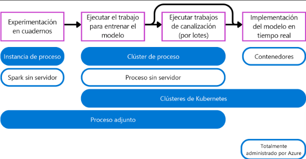
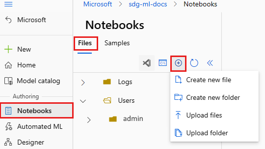
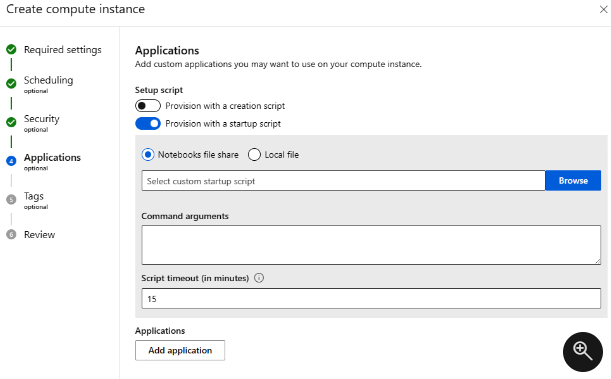

# Trabajo con destinos de proceso en Azure Machine Learning

Como científico de datos, puede entrenar modelos de Machine Learning en el dispositivo local. Para los proyectos a gran escala, un único dispositivo local puede limitar el entrenamiento de modelos de Machine Learning de forma eficaz. Cuando use el proceso en la nube para cargas de trabajo de aprendizaje automático, está listo para escalar el trabajo cuando sea necesario.

En Azure Machine Learning, puede usar varios tipos de procesos en la nube administrados. Con cualquiera de las opciones de proceso del área de trabajo de Azure Machine Learning puede ahorrar tiempo en la administración del proceso.

## Elección del destino de proceso adecuado

En Azure Machine Learning, los destinos de proceso son equipos físicos o virtuales en los que se ejecutan trabajos.

---

## Descripción de los tipos de proceso disponibles

Azure Machine Learning admite varios tipos de proceso para la experimentación, el entrenamiento y la implementación. Al tener varios tipos de proceso, puedes seleccionar el tipo de destino de proceso más adecuado para tus necesidades concretas.



- **Instancia de proceso**: se comporta de forma similar a una máquina virtual y se usa principalmente para ejecutar cuadernos. Es idóneo para la experimentación.
- **Clústeres de proceso**: clústeres de varios nodos de máquinas virtuales que se escalan o reducen verticalmente de forma automática para satisfacer la demanda. Una manera rentable de ejecutar scripts que necesitan procesar grandes volúmenes de datos. Los clústeres también permiten usar el procesamiento paralelo para distribuir la carga de trabajo y reducir el tiempo necesario para ejecutar un script.
- **Clústeres de Kubernetes**: clúster basado en la tecnología Kubernetes, que proporciona más control sobre cómo se configura y administra el proceso. Puede asociar el clúster de Azure Kubernetes (AKS) autoadministrado para el proceso en la nube, o bien un clúster Arc de Kubernetes para cargas de trabajo locales.
- **Proceso adjunto**: Permite asociar un proceso existente como máquinas virtuales de Azure o clústeres de Azure Databricks al área de trabajo.
- **Proceso sin servidor**: Un proceso totalmente administrado a petición que puede usar para los trabajos de entrenamiento.

## ¿Cuándo usar cada tipo de proceso?

### Elección de un destino de proceso para la experimentación

Imagínate que eres un científico de datos y que te han pedido que desarrolles un nuevo modelo de Machine Learning. Es probable que dispongas de un pequeño subconjunto de los datos de entrenamiento con los que puedes experimentar.

Durante la experimentación y el desarrollo, es posible que prefieras trabajar en un cuaderno Jupyter Notebook. Una experiencia de cuaderno se beneficia principalmente de un proceso que se ejecuta de forma continuada.

Muchos científicos de datos están familiarizados con la ejecución de cuadernos en su dispositivo local. _Una alternativa en la nube administrada por Azure Machine Learning es una instancia de proceso_. Como alternativa, también puedes optar por el proceso sin servidor de Spark para ejecutar código Spark en cuadernos, si quieres hacer uso de la potencia de proceso distribuida de Spark.

### Elección de un destino de proceso para producción

Después de la experimentación, puedes entrenar los modelos mediante la ejecución de scripts de Python como preparación para la producción. Los scripts serán más fáciles de automatizar y programar para cuando quiera volver a entrenar el modelo continuamente en el tiempo. Puedes ejecutar scripts como trabajos (de canalización).

Al pasar a producción, quiere que el destino de proceso esté listo para controlar grandes volúmenes de datos. Cuantos más datos use, mejor será el modelo de Machine Learning.

Al entrenar modelos con scripts, quieres un destino de proceso a petición. _Un clúster de proceso se escalará verticalmente de forma automática cuando sea necesario ejecutar los scripts y se reducirá verticalmente cuando el script haya terminado de ejecutarse_. Si quieres una alternativa que no tengas que crear y administrar, puedes usar el proceso sin servidor de Azure Machine Learning.

### Elección de un destino de proceso para la implementación

El tipo de proceso que necesitas al usar el modelo para generar predicciones depende de si quieres realizar predicciones por lotes o en tiempo real.

Para las predicciones por lotes, puedes ejecutar un trabajo de canalización en Azure Machine Learning. _Los destinos de proceso_, como los `clústeres de proceso` y `el proceso sin servidor` de Azure Machine Learning, son ideales para los trabajos de canalización, ya que son a petición y escalables.

Cuando quieras predicciones en tiempo real, necesitarás un tipo de proceso que se ejecute continuamente. Por lo tanto, las implementaciones en tiempo real se benefician de un proceso más ligero (y, por consiguiente, son más rentables). _Los contenedores son ideales para implementaciones en tiempo real_. Al implementar el modelo en un punto de conexión en línea administrado, Azure Machine Learning crea y administra contenedores para que ejecutes tu modelo. Como alternativa, puedes asociar `clústeres de Kubernetes` para administrar el proceso necesario y generar predicciones en tiempo real.

## Creación y uso de una instancia de proceso

Cuando quiera ejecutar código en cuadernos, puede optar por usar una instancia de proceso administrada por Azure Machine Learning. Puede crear una instancia de proceso en Estudio de Azure Machine Learning, mediante la interfaz de la línea de comandos (CLI) de Azure o el kit de desarrollo de software (SDK) de Python.

### Creación de una instancia de proceso con el SDK de Python

Para crear una instancia de proceso con el SDK de Python, puede usar el código siguiente:

```Python
from azure.ai.ml.entities import ComputeInstance

ci_basic_name = "basic-ci-12345"
ci_basic = ComputeInstance(
    name=ci_basic_name,
    size="STANDARD_DS3_v2"
)
ml_client.begin_create_or_update(ci_basic).result()
```

- [Documentación](https://learn.microsoft.com/es-es/python/api/azure-ai-ml/azure.ai.ml.entities.computeinstance?view=azure-python)

> Las instancias de proceso deben tener un **nombre único en una región de Azure** (por ejemplo, dentro de Oeste de Europa). Si el nombre ya existe, un mensaje de error le indicará que vuelva a intentarlo con otro nombre

## Personalización de la instancia de proceso con un script

### Creación del script de configuración

El script de configuración es un script de shell que se ejecuta como rootuser. Cree o cargue el script en los archivos de Notebooks:

1. Inicie sesión en Studio y vaya al área de trabajo.
2. Seleccione _Notebooks_ en la parte izquierda.
3. Use la herramienta _Agregar archivos_ para crear o cargar el script del shell de configuración. Asegúrese de que el nombre de archivo del script finaliza en ".sh". Al crear un nuevo archivo, cambie también el tipo de archivo a bash(.sh) .
   

Cuando se ejecuta el script, el directorio de trabajo actual del script es el directorio donde se cargó. Por ejemplo, si carga el script en **Users>admin**, la ubicación del script en la instancia de proceso y el directorio de trabajo actual cuando se ejecuta el script es _/home/azureuser/cloudfiles/code/Users/admin_. Esta ubicación le permite usar rutas de acceso relativas en el script.

En el script se pueden hacer referencia a los argumentos del script como $1, $2, etc.

Si el script estaba haciendo algo específico para azureuser, como instalar el entorno de conda o el kernel de Jupyter, colóquelo en el bloque sudo -u azureuser como este:

```Bash
#!/bin/bash

set -e

# This script installs a pip package in compute instance azureml_py38 environment.

sudo -u azureuser -i <<'EOF'

PACKAGE=numpy
ENVIRONMENT=azureml_py38
conda activate "$ENVIRONMENT"
pip install "$PACKAGE"
conda deactivate
EOF
```

El comando `sudo -u azureuser` cambia el directorio de trabajo actual a `/home/azureuser`. Tampoco puede acceder a los argumentos del script de este bloque.

Para ver otros scripts de ejemplo, consulte [azureml-examples](https://github.com/Azure/azureml-examples/tree/main/setup/setup-ci).

También puede usar las siguientes variables de entorno en el script:

- CI_RESOURCE_GROUP
- CI_WORKSPACE
- CI_NAME
- CI_LOCAL_UBUNTU_USER - apunta a azureuser

Use el script de configuración junto con Azure Policy para aplicar o establecer de forma predeterminada un script de configuración para cada creación de instancia de proceso. El valor predeterminado para el tiempo de espera de un script de configuración es de 15 minutos. La hora se puede cambiar en Studio o a través de plantillas de ARM mediante el parámetro `DURATION`. `DURATION` es un número de punto flotante con un sufijo opcional: `'s'` para segundos (valor predeterminado), `'m'` para minutos, `'h'` para horas o `'d'` para días.

### Uso del script en Studio

Una vez que almacene el script, especifíquelo durante la creación de la instancia de proceso:

1. Inicie sesión en Studio y seleccione el área de trabajo.
2. Seleccione **Proceso** a la izquierda.
3. Seleccione **+Nuevo** para crear una nueva instancia de proceso.
4. Rellene el formulario.
5. En la página **Aplicaciones** del formulario, active el tipo de script que desea usar, el script de creación (se ejecuta una vez al crear la instancia de proceso) o el script de inicio (se ejecuta cada vez que se inicia la instancia de proceso).
6. Vaya al script de shell que guardó. O bien, cargue un script desde el equipo.
7. Agregue argumentos de comando según sea necesario.



> Si el almacenamiento del área de trabajo está conectado a una red virtual, es posible que no pueda acceder al archivo de script de configuración a menos que acceda a Studio desde la red virtual.

### Uso del script en una plantilla de Resource Manager

En una plantilla de Resource Manager, agregue `setupScripts` para invocar el script de configuración cuando se aprovisione la instancia de proceso. Por ejemplo:

```JSON
"setupScripts":{
    "scripts":{
        "creationScript":{
        "scriptSource":"workspaceStorage",
        "scriptData":"[parameters('creationScript.location')]",
        "scriptArguments":"[parameters('creationScript.cmdArguments')]"
        }
    }
}
```

El elemento `scriptData` anterior especifica la ubicación del script de creación en el recurso compartido de archivos de Notebooks, como `Users/admin/testscript.sh`. `scriptArguments` es opcional anteriormente y especifica los argumentos del script de creación.

En su lugar, podría proporcionar el script en línea para una plantilla de Resource Manager. El comando de shell puede hacer referencia a las dependencias cargadas en el recurso compartido de archivos de Notebooks. Cuando se use una cadena insertada, el directorio de trabajo para el script es `/mnt/batch/tasks/shared/LS_root/mounts/clusters/**\<ciname\>**/code/Users`.

Por ejemplo, especifique una cadena de comando codificada en Base64 para `scriptData`:

```JSON
"setupScripts":{
    "scripts":{
        "creationScript":{
        "scriptSource":"inline",
        "scriptData":"[base64(parameters('inlineCommand'))]",
        "scriptArguments":"[parameters('creationScript.cmdArguments')]"
        }
    }
}
```

### Registros del script de configuración

Los registros de la ejecución del script de configuración aparecen en la carpeta de registros de la página de detalles de la instancia de proceso. Los registros se almacenan de nuevo en el recurso compartido de archivos de Notebooks en la carpeta `Logs\<compute instance name>`. Los argumentos de archivo de script y comando para una instancia de proceso determinada se muestran en la página de detalles.

## Asignación de una instancia de proceso a un usuario

Como científico de datos, asociarás una instancia de proceso a cuadernos para ejecutar celdas dentro del cuaderno. Para poder trabajar con la instancia de proceso, debe asignársela como usuario.

_Una instancia de proceso solo se puede asignar a un usuario, ya que no puede controlar cargas de trabajo paralelas_. Al crear una instancia de proceso, _puede asignarla a otra persona si tiene los permisos adecuados._

## Minimización del tiempo de proceso

Cuando trabaje activamente en el código de un cuaderno, querrá que la instancia de proceso se ejecute. Cuando no ejecute ningún código, querrá que la instancia de proceso se detenga para ahorrar costos.

Cuando se le asigna una instancia de proceso, puede iniciarla y detenerla siempre que necesite. También puede agregar una programación a la instancia de proceso para iniciarla o detenerla en momentos establecidos. Además, puedes configurar un proceso para que se apague automáticamente cuando haya estado inactivo durante un período de tiempo determinado.

Al programar la instancia de proceso para que se detenga al final de cada día, evitarás costes innecesarios si olvidas detenerla.

## Uso de una instancia de proceso

Para usar una instancia de proceso, necesita una aplicación que pueda hospedar cuadernos. La opción más fácil para trabajar con la instancia de proceso consiste en hacerlo mediante la experiencia de cuadernos integrados en Estudio de Azure Machine Learning.

Es posible que prefiera trabajar con Visual Studio Code para facilitar el control de código fuente. _Si quiere editar y ejecutar código en Visual Studio Code, puede adjuntar una instancia de proceso para ejecutar celdas de cuaderno de forma remota._

## Creación de una instancia de proceso de Azure Machine Learning

Aprenda a crear una instancia de proceso en el área de trabajo de Azure Machine Learning.

Use una instancia de proceso como entorno de desarrollo completamente configurado y administrado en la nube. Para el desarrollo y las pruebas, también puede usar la instancia como un destino de proceso de entrenamiento. Una instancia de proceso puede ejecutar varios trabajos en paralelo y tiene una cola de trabajos. Como entorno de desarrollo, una instancia de proceso no se puede compartir con otros usuarios del área de trabajo.

En este artículo, aprenderá a crear una instancia de proceso. Consulte Administración de una instancia de proceso de Azure Machine Learning para conocer los pasos necesarios para administrar, iniciar, detener, reiniciar y eliminar una instancia de proceso.

También puede usar un script de instalación para crear la instancia de proceso con su propio entorno personalizado.

Las instancias de proceso pueden ejecutar trabajos de manera segura en un entorno de red virtual, sin necesidad de que las empresas abran puertos SSH. El trabajo se ejecuta en un entorno con contenedores y empaqueta las dependencias del modelo en un contenedor de Docker.

### SDK Python

Para usar el SDK de Python, configure el entorno de desarrollo con un área de trabajo. Una vez configurado el entorno, conéctelo al área de trabajo en el script de Python:

Ejecute este código para conectarse al área de trabajo de Azure Machine Learning.

Reemplace el identificador de suscripción, el nombre del grupo de recursos y el nombre del área de trabajo en el código siguiente. Para establecer estos valores:

1. Inicie sesión en Azure Machine Learning Studio.
2. Abra el área de trabajo que quiere usar.
3. Seleccione el nombre del área de trabajo en la barra de herramientas de Estudio de Azure Machine Learning superior derecha.
4. Copie el valor del área de trabajo, el grupo de recursos y el identificador de suscripción en el código.
5. Copie un valor, cierre el área y péguelo, luego vuelva a por el siguiente cuando lo pegue en un cuaderno dentro de Studio.

```Python
# Enter details of your AML workspace
subscription_id = "<SUBSCRIPTION_ID>"
resource_group = "<RESOURCE_GROUP>"
workspace = "<AML_WORKSPACE_NAME>"

# get a handle to the workspace
from azure.ai.ml import MLClient
from azure.identity import DefaultAzureCredential

ml_client = MLClient(
    DefaultAzureCredential(), subscription_id, resource_group, workspace
)
```

**CREAR**

```Python
# Compute Instances need to have a unique name across the region.
# Here we create a unique name with current datetime
from azure.ai.ml.entities import ComputeInstance, AmlCompute
import datetime

ci_basic_name = "basic-ci" + datetime.datetime.now().strftime("%Y%m%d%H%M")
ci_basic = ComputeInstance(
    name=ci_basic_name,
    size="STANDARD_DS3_v2"
    )
ml_client.begin_create_or_update(ci_basic).result()
```

**Configuración del apagado por inactividad**

Una instancia de proceso se considera inactiva si se cumplen las condiciones siguientes:

- No hay sesiones activas del kernel de Jupyter (esto quiere decir que no se usan los cuadernos a través de Jupyter, JupyterLab o cuadernos interactivos).
- No hay sesiones activas del terminal de Jupyter
- No existen ejecuciones ni experimentos activos de Azure Machine Learning
- No hay conexiones de VS Code; debe cerrar la conexión de VS Code para que la instancia de proceso se considere inactiva. Las sesiones se finalizan automáticamente si VS Code no detecta ninguna actividad durante 3 horas.
- No se ejecuta ninguna aplicación personalizada en el proceso

La instancia de proceso debe estar inactiva durante un mínimo de _15 minutos y un máximo de tres días_. Tampoco realizamos un seguimiento de las conexiones SSH de VS Code para determinar la actividad.

Además, si una instancia de proceso lleva inactiva un periodo determinado, si la configuración de apagado de inactividad se actualiza a un periodo menor que la duración de inactividad actual, el reloj del tiempo de inactividad se restablece a 0. Por ejemplo, si la instancia de proceso lleva 20 minutos inactiva y la configuración de apagado se actualiza a 15 minutos, el reloj del tiempo de inactividad se restablece a 0.

```Python
# Note that idle_time_before_shutdown has been deprecated.
ComputeInstance(name=ci_basic_name, size="STANDARD_DS3_v2", idle_time_before_shutdown_minutes="30")
```

**Programación del inicio y detención automáticos**

Defina varias programaciones para el apagado automático y el inicio automático. Por ejemplo, cree una programación para comenzar a las 9 a. m. y detenerse a las 6 p. m. de lunes a jueves, y una segunda programación para comenzar a las 9 a. m. y detenerse a las 4 p. m. del viernes. Puede crear un total de cuatro programaciones por instancia de proceso.

Las programaciones también se pueden definir para instancias de proceso de creación en nombre de alguien. Puede crear una programación que genere la instancia de proceso en un estado detenido. _Las instancias de proceso detenidas son útiles cuando se crea una instancia de proceso en nombre de otro usuario_.

Antes de un apagado programado, _los usuarios ven una notificación que les avisará de que la instancia de proceso está a punto de apagarse_. En ese momento, el usuario puede optar por descartar el próximo evento de apagado. Por ejemplo, si están en medio del uso de su instancia de proceso.

```Python
from azure.ai.ml.entities import ComputeInstance, ComputeSchedules, ComputeStartStopSchedule, RecurrenceTrigger, RecurrencePattern
from azure.ai.ml.constants import TimeZone
from azure.ai.ml import MLClient
from azure.identity import DefaultAzureCredential

# authenticate
credential = DefaultAzureCredential()

# Get a handle to the workspace
ml_client = MLClient(
    credential=credential,
    subscription_id="<SUBSCRIPTION_ID>",
    resource_group_name="<RESOURCE_GROUP>",
    workspace_name="<AML_WORKSPACE_NAME>",
)

ci_minimal_name = "ci-name"
ci_start_time = "2023-06-21T11:47:00" #specify your start time in the format yyyy-mm-ddThh:mm:ss

rec_trigger = RecurrenceTrigger(start_time=ci_start_time, time_zone=TimeZone.INDIA_STANDARD_TIME, frequency="week", interval=1, schedule=RecurrencePattern(week_days=["Friday"], hours=15, minutes=[30]))
myschedule = ComputeStartStopSchedule(trigger=rec_trigger, action="start")
com_sch = ComputeSchedules(compute_start_stop=[myschedule])

my_compute = ComputeInstance(name=ci_minimal_name, schedules=com_sch)
ml_client.compute.begin_create_or_update(my_compute)
```

**Creación en nombre de alguien**

Como administrador, puede crear una instancia de proceso en nombre de un científico de datos y asignarle la instancia con:

- Studio, mediante la Configuración de seguridad.

- [Plantilla de Azure Resource Manager](https://github.com/Azure/azure-quickstart-templates/tree/master/quickstarts/microsoft.machinelearningservices/machine-learning-compute-create-computeinstance) Para más información sobre cómo buscar los valores de TenantID y ObjectID necesarios en esta plantilla, consulte Encontrar identificadores de objeto de identidad para la configuración de autenticación. También puede encontrar estos valores en el Centro de administración de Microsoft Entra.

**Identidades Administradas:**Un desafío común para los desarrolladores es la administración de secretos, credenciales, certificados, claves, etc. que se usan para proteger la comunicación entre servicios. Las identidades administradas eliminan la necesidad de administrar las credenciales para los desarrolladores.

Estas son algunas de las ventajas de usar las identidades administradas:

- No es necesario administrar credenciales. Las credenciales ni siquiera están accesibles.
- Puede usar identidades administradas para autenticarse en cualquier recurso que admita la autenticación de Microsoft Entra, incluidas sus propias aplicaciones.
- Las identidades administradas se pueden usar sin costes adicionales.

- **SDK Python**

```Python
from azure.ai.ml import MLClient
from azure.identity import ManagedIdentityCredential
client_id = os.environ.get("DEFAULT_IDENTITY_CLIENT_ID", None)
credential = ManagedIdentityCredential(client_id=client_id)
ml_client = MLClient(credential, sub_id, rg_name, ws_name)
data = ml_client.data.get(name=data_name, version="1")
```

También puede usar manualmente la identidad administrada para autenticarse en otros recursos de Azure. En el ejemplo siguiente se muestra cómo puede usarla para obtener un token de acceso de Azure Resource Manager:

```Python
import requests

def get_access_token_msi(resource):
    client_id = os.environ.get("DEFAULT_IDENTITY_CLIENT_ID", None)
    resp = requests.get(f"{os.environ['MSI_ENDPOINT']}?resource={resource}&clientid={client_id}&api-version=2017-09-01", headers={'Secret': os.environ["MSI_SECRET"]})
    resp.raise_for_status()
    return resp.json()["access_token"]

arm_access_token = get_access_token_msi("https://management.azure.com")
```

## Creación y uso de un clúster de proceso

Después de la experimentación y el desarrollo, quiere que el código esté listo para producción. Al ejecutar código en entornos de producción, es mejor usar scripts en lugar de cuadernos. Al ejecutar un script, querrá usar un destino de proceso que sea escalable.

En Azure Machine Learning, los clústeres de proceso son idóneos para ejecutar scripts. Puede crear un clúster de proceso en Estudio de Azure Machine Learning, mediante la interfaz de la línea de comandos (CLI) de Azure o el kit de desarrollo de software (SDK) de Python.

### Creación de un clúster de proceso con el SDK de Python

Para crear un clúster de proceso con el SDK de Python, puede usar el código siguiente:

```Python
from azure.ai.ml.entities import AmlCompute

cluster_basic = AmlCompute(
    name="cpu-cluster",
    type="amlcompute",
    size="STANDARD_DS3_v2",
    location="westus",
    min_instances=0,
    max_instances=2,
    idle_time_before_scale_down=120,
    tier="low_priority",
)
ml_client.begin_create_or_update(cluster_basic).result()
```

- [Documentación Cluster](https://learn.microsoft.com/es-es/python/api/azure-ai-ml/azure.ai.ml.entities.amlcompute?view=azure-python)

Al crear un clúster de proceso, hay tres parámetros principales que debe tener en cuenta:

- `size`: especifica el tipo de máquina virtual de cada nodo dentro del clúster de proceso. Se basa en los [tamaños de las máquinas virtuales en Azure](https://learn.microsoft.com/es-es/azure/virtual-machines/sizes). Junto al tamaño, también puede especificar si quiere usar CPU o GPU.
- `max_instances`: especifica el número máximo de nodos a los que el clúster de proceso puede escalar horizontalmente. El número de cargas de trabajo paralelas que puede controlar el clúster de proceso es análogo al número de nodos a los que puede escalar el clúster.
- `tier`: Especifica si las máquinas virtuales serán de prioridad baja o dedicadas. El establecimiento de una prioridad baja puede reducir los costos, ya que la disponibilidad no está garantizada.

### Uso de un clúster de proceso

Hay tres escenarios principales en los que puede usar un clúster de proceso:

- Ejecutar un trabajo de canalización que ha compilado en el Diseñador.
- Ejecutar un trabajo de aprendizaje automático automatizado.
- Ejecutar un script como trabajo.

En cada uno de estos escenarios, un clúster de proceso es idóneo, ya que se escalará verticalmente de forma automática cuando se envíe un trabajo y se cerrará automáticamente cuando se complete.

Un clúster de proceso también le permitirá entrenar varios modelos en paralelo, un procedimiento común al usar el aprendizaje automático automatizado.

Puede ejecutar un trabajo de canalización del Diseñador y un trabajo de aprendizaje automático automatizado desde Estudio de Azure Machine Learning. Al enviar el trabajo desde Estudio, puede establecer el destino de proceso en el clúster de proceso que ha creado.

Si prefiere un enfoque de código primero, puede establecer el destino de proceso en el clúster de proceso mediante el SDK de Python.

Por ejemplo, al ejecutar un script como un trabajo de comando, puede establecer el destino de proceso en el clúster de proceso con el código siguiente:

```Python
from azure.ai.ml import command

# configure job
job = command(
    code="./src",
    command="python diabetes-training.py",
    environment="AzureML-sklearn-0.24-ubuntu18.04-py37-cpu@latest",
    compute="cpu-cluster",
    display_name="train-with-cluster",
    experiment_name="diabetes-training"
    )

# submit job
returned_job = ml_client.create_or_update(job)
aml_url = returned_job.studio_url
print("Monitor your job at", aml_url)
```

Después de enviar un trabajo que usa un clúster de proceso, el clúster de proceso se escalará horizontalmente a uno o varios nodos. El cambio de tamaño tardará unos minutos y el trabajo comenzará a ejecutarse una vez que se aprovisionen los nodos necesarios. Cuando el estado de un trabajo es en preparación, significa que el clúster de proceso se está preparando. Cuando el estado es en ejecución, el clúster de proceso está listo y el trabajo se está ejecutando.

## [EJERCICIO](https://microsoftlearning.github.io/mslearn-azure-ml/Instructions/04-Work-with-compute.html)

- [GitHub de ejemplo](https://github.com/MicrosoftLearning/mslearn-azure-ml/tree/main/Labs/04)
