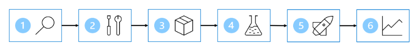
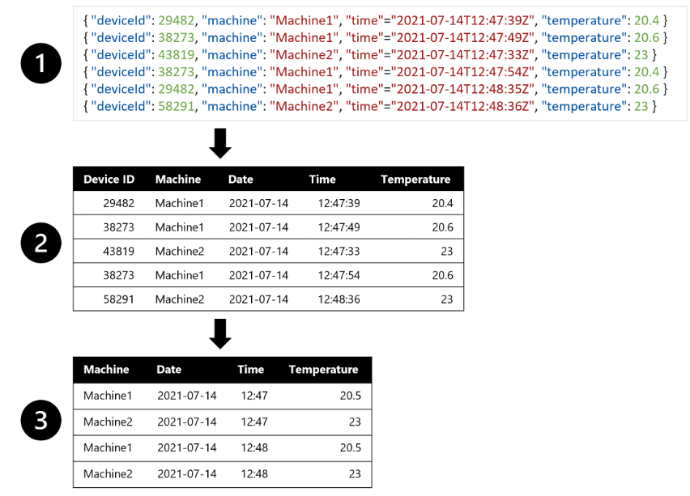
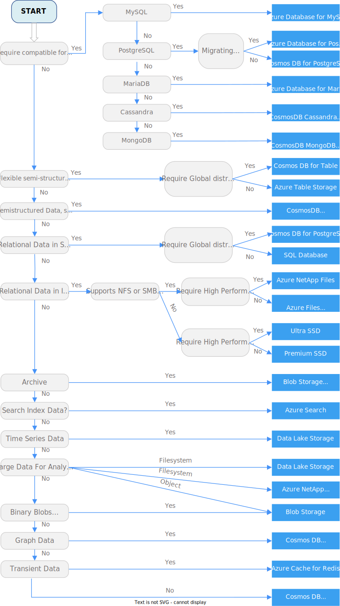
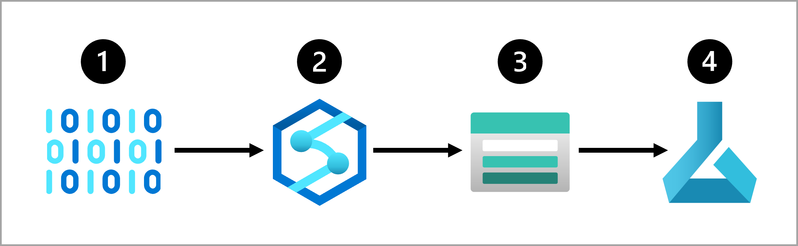

# Diseño de una estrategia de ingesta de datos para proyectos de aprendizaje automático

Los datos son la base del aprendizaje automático. Tanto la cantidad como la calidad de los datos afectarán a la precisión del modelo.

Para entrenar un modelo de Machine Learning, necesita acceso a los datos que planea usar. Por lo tanto, antes de empezar a experimentar con modelos de Machine Learning, asegúrese de identificar los orígenes de datos y saber qué herramientas desea usar para cargar y transformar los datos.

En este módulo, aprenderá a diseñar una estrategia de ingesta de datos para proyectos de aprendizaje automático.

## Identificación del origen de datos y el formato

Los datos son la entrada más importante para los modelos de Machine Learning. Necesitará acceso a los datos al entrenar modelos de Machine Learning y el modelo entrenado necesita datos como entrada para generar predicciones.

Imagine que es científico de datos y que se le ha pedido que entrene un modelo de Machine Learning.

Tiene como objetivo seguir los seis pasos siguientes para planear, entrenar, implementar y supervisar el modelo:



1. Definir el problema: decida qué debe predecir el modelo y cuándo lo hace correctamente.
2. Obtener los datos: busque orígenes de datos y obtenga acceso.
3. Preparar los datos: explore los datos. Limpie y transforme los datos en función de los requisitos del modelo.
4. Entrenar el modelo: elija un algoritmo y valores de hiperparámetros en función de prueba y error.
5. Integrar el modelo: implemente el modelo en un punto de conexión para generar predicciones.
6. Supervisar el modelo: realice un seguimiento del rendimiento del modelo.

> **Nota:** El diagrama es una representación simplificada del proceso de aprendizaje automático. Normalmente, el proceso es iterativo y continuo. Por ejemplo, al supervisar el modelo, puede decidir volver atrás y volver a entrenar el modelo.

En general, se recomienda extraer datos de su origen antes de analizarlos. Tanto si usa los datos para la ingeniería de datos, el análisis de datos o la ciencia de datos, querrá extraer los datos de su origen, transformarlos y cargarlos en una capa de servicio. Este proceso también se conoce como Extracción, transformación y carga (ETL) o Extracción, carga y transformación (ELT). La capa de servicio hace que los datos estén disponibles para el servicio que usará para el procesamiento de datos adicionales, como el entrenamiento de modelos de Machine Learning.

Antes de poder diseñar el proceso ETL o ELT, deberá identificar el origen y el formato de datos.

## Identificación del origen de datos

Cuando empiece con un nuevo proyecto de aprendizaje automático, identifique primero _dónde se almacenan los datos que desea usar._

Es posible que los datos necesarios para el modelo de Machine Learning ya estén almacenados en una base de datos o que una aplicación los genere. Por ejemplo, los datos se pueden almacenar en un sistema de administración de relaciones con el cliente (CRM), en una base de datos transaccional como una base de datos SQL o se pueden generar mediante un dispositivo de Internet de las cosas (IoT).

Es decir, es posible que su organización ya tenga procesos empresariales implementados que generan y almacenan los datos. Si no tiene acceso a los datos que necesita, hay métodos alternativos. Puede recopilar datos nuevos mediante la implementación de un proceso nuevo, adquirir datos nuevos mediante conjuntos de datos disponibles públicamente o comprar conjuntos de datos mantenidos.

## Identificación del formato de datos

En función del origen de los datos, se pueden almacenar en un formato específico. Debe reconocer el formato actual de los datos y determinar el formato necesario para sus cargas de trabajo de aprendizaje automático.

Normalmente, nos referimos a tres formatos diferentes:

- **Datos tabulares o estructurados:** todos los datos tienen los mismos campos o propiedades, que se definen en un esquema. Los datos tabulares se representan a menudo en una o varias tablas donde las columnas representan características y las filas representan puntos de datos. Por ejemplo, un archivo de Excel o CSV se puede interpretar como datos tabulares:

| Id. de paciente | Pregnancies | Presión arterial diastólica | BMI      | Pedigrí con relación a diabetes | Age | Diabético |
| --------------- | ----------- | --------------------------- | -------- | ------------------------------- | --- | --------- |
| 1354778         | 0           | 80                          | 43,50973 | 1.213191                        | 21  | 0         |
| 1147438         | 8           | 93                          | 21,24058 | 0,158365                        | 23  | 1         |

- **Datos semiestructurados:** no todos los datos tienen los mismos campos o propiedades. Cada punto de datos se representa mediante una colección de pares clave-valor. Las claves representan las características y los valores representan las propiedades del punto de datos individual. Por ejemplo, las aplicaciones en tiempo real, como los dispositivos de Internet de las cosas (IoT) generan un objeto JSON:

```JSON
{ "deviceId": 29482, "location": "Office1", "time":"2021-07-14T12:47:39Z", "temperature": 23 }
```

- **Datos no estructurados:** archivos que no cumplen ninguna regla en lo que respecta a la estructura. Por ejemplo, `los documentos, imágenes, archivos de audio y vídeo se consideran datos no estructurados`. Almacenarlos como archivos no estructurados garantiza que no tenga que definir ningún esquema o estructura, pero también significa que no puede consultar los datos de la base de datos. Deberá especificar cómo leer este tipo de archivo al consumir los datos.

## Identificación del formato de datos deseado

Al extraer los datos de un origen, es posible que desee transformarlos para cambiar el formato de datos y hacer que sea más adecuado para el entrenamiento del modelo.

Por ejemplo, puede que desee entrenar un modelo de previsión para realizar el mantenimiento predictivo en una máquina. Quiere usar características como la temperatura de la máquina para predecir un problema con esta. Si recibe una alerta de que se produce un problema, antes de que la máquina se estropee, puede ahorrar costos corrigiendo el problema con antelación.

Imagine que la máquina tiene un sensor que mide la temperatura cada minuto. Cada minuto, cada medida o entrada se puede almacenar como un objeto o archivo JSON.

Para entrenar el modelo de previsión, puede preferir una tabla en la que se combinan todas las medidas de temperatura de cada minuto. Es posible que desee crear agregados de los datos y tener una tabla de la temperatura media por hora. Para crear la tabla, querrá transformar a datos tabulares los datos semiestructurados ingeridos desde el dispositivo IoT.

Para crear un conjunto de datos que puede usar para entrenar el modelo de previsión, puede hacer lo siguiente:

1. Extraiga medidas de datos como objetos JSON de los dispositivos IoT.
2. Convierta los objetos JSON en una tabla.
3. Transforme los datos para obtener la temperatura por máquina por minuto.



Una vez que haya identificado el origen de datos, el formato de datos original y el formato de datos deseado, puede pensar en cómo desea servir los datos. Después, puede diseñar una canalización de ingesta de datos para extraer y transformar los datos que necesita de forma automática.

## Elección de cómo servir datos a flujos de trabajo de aprendizaje automático

Para acceder a los datos al entrenar modelos de aprendizaje automático, querrá servir los datos almacenándolos en un servicio de datos en la nube. Al almacenar los datos de forma independiente del proceso, _minimizará los costos y será más flexible._

## Proceso independiente del almacenamiento

Una de las ventajas de la nube es la capacidad de escalar o reducir verticalmente el proceso según sus necesidades. Además, puede apagar el proceso cuando no lo necesite y reiniciarlo cuando quiera usarlo de nuevo.

En especial cuando se entrenan modelos de aprendizaje automático, tendrá periodos de tiempo durante los cuales necesitará una gran cantidad de potencia de proceso y horas en las que no tenga esta necesidad. Al apagar el proceso que usa para entrenar modelos de aprendizaje automático, quiere asegurarse de que los datos no se pierden y se puede acceder a ellos para otros fines (como la generación de informes).

> Por lo tanto, un procedimiento recomendado consiste en almacenar los datos en una herramienta, que es independiente de otra herramienta que se usa para entrenar los modelos. La elección de la mejor herramienta o servicio para almacenar los datos depende de los datos que tenga y del servicio que use para el entrenamiento del modelo.

## Almacenamiento de datos para cargas de trabajo de entrenamiento de modelos

Al usar `Azure Machine Learning`, `Azure Databricks` o `Azure Synapse Analytics` para el entrenamiento del modelo, hay tres opciones comunes para almacenar datos, que se conectan fácilmente a los tres servicios:

- **Azure Blob Storage:** es la opción más barata para almacenar datos como datos no estructurados. Ideal para almacenar archivos como imágenes, texto y JSON. A menudo también se usa para almacenar datos como archivos .csv, ya que los científicos de datos prefieren trabajar con archivos .csv.
- **Azure Data Lake Storage (Gen 2):** es una versión más avanzada de Azure Blob Storage. También almacena archivos, como imágenes y archivos .csv, como datos no estructurados. Un lago de datos también implementa un espacio de nombres jerárquico, lo que significa que es más fácil conceder a alguien acceso a un archivo o carpeta específico. La capacidad de almacenamiento es prácticamente ilimitada, por lo que es ideal para almacenar datos de gran tamaño.
- **Azure SQL Database:** almacena los datos como datos estructurados. Los datos se leen como una tabla y el esquema se define cuando se crea una tabla en la base de datos. Ideal para los datos que no cambian a lo largo del tiempo.

## Selección de un almacén de datos de Azure para la aplicación



Al almacenar los datos en una de estas soluciones de almacenamiento de Azure, puede servir fácilmente los datos a cualquier servicio de Azure que use para cargas de trabajo de aprendizaje automático. Para cargar los datos en una de estas soluciones de almacenamiento, puede configurar una canalización para extraer, transformar y cargar los datos.

## Diseño de una solución de ingesta de datos

Para mover y transformar datos, puede usar una canalización de ingesta de datos. Una canalización de ingesta de datos es una secuencia de tareas que mueven y transforman los datos. Al crear una canalización, puede elegir desencadenar las tareas manualmente o programar la canalización cuando desee automatizarlas.

## Creación de una canalización de ingesta de datos

Para crear una canalización de ingesta de datos, puede elegir qué servicio de Azure usar.

## Azure Synapse Analytics

Un enfoque que se usa habitualmente para crear y ejecutar canalizaciones para la ingesta de datos es la característica de integración de datos de Azure Synapse Analytics, también conocida como canalizaciones de Azure Synapse. Con canalizaciones de Azure Synapse, puede crear y programar canalizaciones de ingesta de datos mediante la interfaz de usuario fácil de usar o la definición de la canalización en formato JSON.

Al crear una canalización de Azure Synapse, puede copiar fácilmente datos de un origen a un almacén mediante uno de los muchos conectores estándar.

[Actividad de copia en Azure Data Factory y Azure Synapse Analytics](https://learn.microsoft.com/es-es/azure/data-factory/copy-activity-overview)

Para agregar una tarea de transformación de datos a la canalización, puede usar una herramienta de interfaz de usuario como el flujo de datos de asignación o usar un lenguaje como SQL, Python o R.

Azure Synapse Analytics permite elegir entre diferentes tipos de proceso que pueden controlar grandes transformaciones de datos a escala: grupos de SQL sin servidor, grupos de SQL dedicados o grupos de Spark.

[Integración de datos a escala con Azure Data Factory o canalización de Azure Synapse](https://learn.microsoft.com/es-es/training/paths/data-integration-scale-azure-data-factory/)

## Azure Databricks

Siempre que prefiera una herramienta de código primero y usar SQL, Python o R para crear las canalizaciones, también puede usar Azure Databricks. Azure Databricks permite definir las canalizaciones en un cuaderno, que puede programar para que se ejecute.

Azure Databricks usa clústeres de Spark, que distribuyen el proceso para transformar grandes cantidades de datos en menos tiempo que cuando no se usa el proceso distribuido.

[Ingeniería de Datos con Azure Databricks](https://learn.microsoft.com/es-es/training/paths/data-engineer-azure-databricks/)
[Entrenamiento de un modelo de Machine Learning en Azure Databricks](https://learn.microsoft.com/es-es/training/modules/machine-learning-azure-databricks/)

## Azure Machine Learning

Azure Machine Learning proporciona clústeres de proceso, que se escalan y reducen verticalmente de forma automática cuando es necesario. Puede crear una canalización con el Diseñador o mediante la creación de una colección de scripts. Aunque las canalizaciones de Azure Machine Learning se usan normalmente para entrenar modelos de aprendizaje automático, también puede usarla para extraer, transformar y almacenar los datos como preparación para entrenar un modelo de Machine Learning.

Siempre que quiera realizar todas las tareas dentro de la misma herramienta, la creación y programación de una canalización de Azure Machine Learning para ejecutarse con el clúster de proceso a petición puede adaptarse mejor a sus necesidades.

Pero Azure Synapse Analytics y Azure Databricks ofrecen un proceso más escalable que permite que las transformaciones se distribuyan entre nodos de proceso. Por lo tanto, las transformaciones de datos pueden funcionar mejor al ejecutarlas con Azure Synapse Analytics o Azure Databricks que con Azure Machine Learning.

## Diseño de una solución de ingesta de datos

Una ventaja de usar tecnologías en la nube es la flexibilidad de crear y usar los servicios que mejor se adapten a sus necesidades. Para crear una solución, puede vincular los servicios entre sí y representar la solución en una arquitectura.

Por ejemplo, un enfoque común para una solución de ingesta de datos es el siguiente:

1. Extraer los datos sin procesar de su origen (como un sistema CRM o un dispositivo IoT).
2. Copiar y transformar los datos con Azure Synapse Analytics.
3. Almacenar los datos preparados en Azure Blob Storage.
4. Entrenar el modelo con Azure Machine Learning.



Se recomienda pensar en la arquitectura de una solución de ingesta de datos antes de entrenar el modelo. Pensar en cómo los datos se extraen y preparan de forma automática para el entrenamiento del modelo le ayudará a prepararse cuando el modelo esté listo para ir a producción.

[EJERCICIO](https://microsoftlearning.github.io/mslearn-aml-design/Instructions/start-01-data.html)
