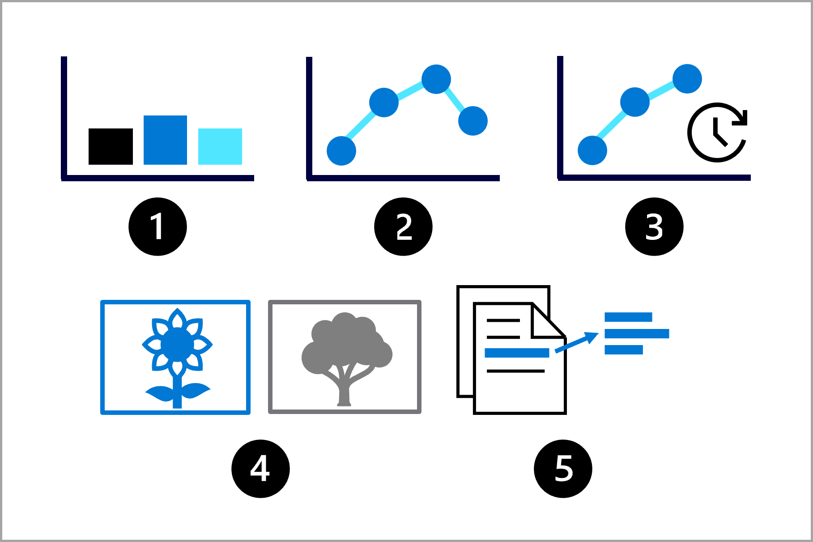
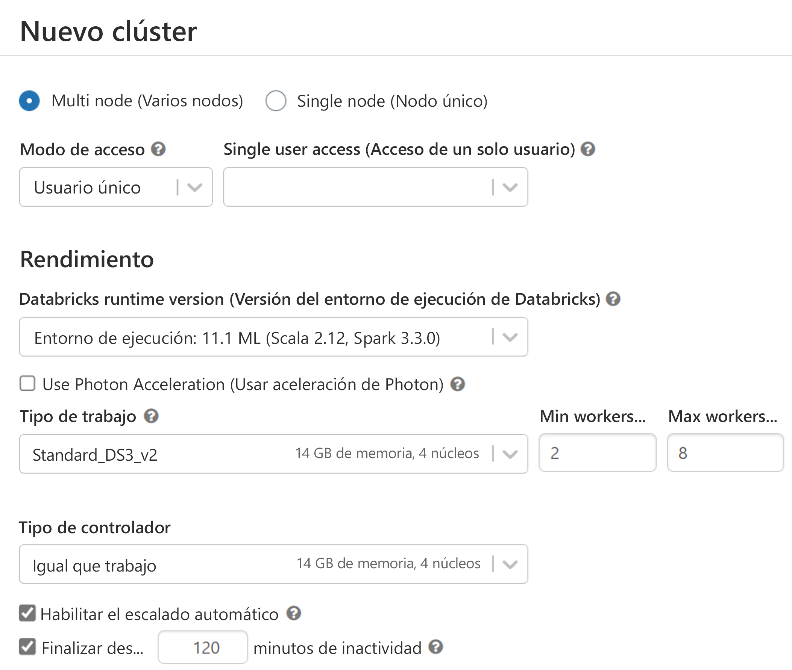

# Diseño de una solución de entrenamiento de modelos de Machine Learning

En este módulo aprenderá a:

- Identificación de tareas de Machine Learning
- Elección de un servicio para entrenar un modelo
- Elección entre opciones de proceso

## Identificación de tareas de Machine Learning

Imagine que es científico de datos y que se le ha pedido que entrene un modelo de Machine Learning.

Tiene como objetivo seguir los seis pasos siguientes para planear, entrenar, implementar y supervisar el modelo:

1. Definir el problema: decida qué debe predecir el modelo y cuándo lo hace correctamente.
2. Obtener los datos: busque orígenes de datos y obtenga acceso.
3. Preparar los datos: explore los datos. Limpie y transforme los datos en función de los requisitos del modelo.
4. Entrenar el modelo: elija un algoritmo y valores de hiperparámetros en función de prueba y error.
5. Integrar el modelo: implemente el modelo en un punto de conexión para generar predicciones.
6. Supervisar el modelo: realice un seguimiento del rendimiento del modelo.

En el primer paso, quiere definir el problema que resolverá el modelo mediante la comprensión de lo siguiente:

- Cuál debe ser la salida del modelo.
- Qué tipo de tarea de Machine Learning usará.
- Qué criterios hacen que un modelo sea correcto.

Según los datos que tenga y la salida esperada del modelo, puede identificar la tarea de Machine Learning. La tarea determinará qué tipos de algoritmos puede usar para entrenar el modelo.

Algunas tareas comunes de Machine Learning son las siguientes:

1. Clasificación: predicción de un valor categórico.
2. Regresión: predicción de un valor numérico.
3. Previsión de series temporales: predicción de valores numéricos futuros basados en datos de serie temporal.
4. Computer Vision: clasificación de imágenes o detección de objetos en imágenes.
5. Procesamiento del lenguaje natural (NLP): extracción de información del texto.

Para entrenar un modelo, hay un conjunto de algoritmos que puede usar, en función de la tarea que desee realizar. Para evaluar el modelo, puede calcular las métricas de rendimiento, como la exactitud o la precisión. Las métricas disponibles también dependerán de la tarea que el modelo necesite realizar y le ayudarán a decidir si un modelo es adecuado para su tarea.

## Elección de un servicio para entrenar un modelo de Machine Learning

Hay muchos servicios disponibles para entrenar modelos de Machine Learning. El servicio que use depende de factores como:

- El tipo de modelo que necesita entrenar.
- Si necesita un control total sobre el entrenamiento del modelo.
- El tiempo que desea invertir en el entrenamiento del modelo.
- Los servicios que ya están dentro de su organización.
- El lenguaje de programación con el que se siente cómodo.

> Dentro de **Azure**, hay varios servicios disponibles para entrenar modelos de Machine Learning. Cuando decida trabajar con Azure en lugar de entrenar un modelo en un dispositivo local, tendrá acceso a un proceso escalable y rentable. Por ejemplo, podrá usar el proceso solo durante el tiempo necesario para entrenar un modelo y no pagar por el proceso cuando no se use.

Algunos servicios usados habitualmente en Azure para entrenar modelos de Machine Learning son:

<table aria-label="Tabla 1" class="table">
<thead>
<tr>
<th>Icono</th>
<th>Descripción</th>
</tr>
</thead>
<tbody>
<tr>
<td></td>
<td><strong>Azure Machine Learning</strong> ofrece muchas opciones diferentes para entrenar y administrar los modelos de Machine Learning. Puede optar por trabajar con Studio para obtener una experiencia basada en la interfaz de usuario o administrar las cargas de trabajo de aprendizaje automático con el SDK de Python o la CLI para obtener una experiencia orientada al código. Más información sobre <a href="https://learn.microsoft.com/es-es/azure/machine-learning/overview-what-is-azure-machine-learning" data-linktype="absolute-path" target="az-portal" class="has-external-link-indicator">Azure Machine Learning</a>.</td>
</tr>
<tr>
<td></td>
<td><strong>Azure Databricks</strong> es una plataforma de análisis de datos que puede usar para la ingeniería de datos y la ciencia de datos. Azure Databricks usa el proceso distribuido de Spark para procesar los datos de forma eficaz. Puede optar por entrenar y administrar modelos con Azure Databricks o mediante la integración de Azure Databricks con otros servicios como Azure Machine Learning. Obtenga más información sobre <a href="https://learn.microsoft.com/es-es/azure/databricks/what-is-databricks" data-linktype="absolute-path" target="az-portal" class="has-external-link-indicator">Azure Databricks</a>.</td>
</tr>
<tr>
<td></td>
<td><strong>Azure Synapse Analytics</strong> es un servicio de análisis, que usa el proceso distribuido para el análisis de macrodatos. Azure Synapse Analytics está diseñado principalmente para ingerir y transformar datos a gran escala, pero también incluye varias funcionalidades de aprendizaje automático. Para entrenar modelos con Azure Synapse Analytics, puede entrenar modelos en grupos de Spark con MLlib o usar la característica de aprendizaje automático automatizado integrada de Azure Machine Learning. Obtenga más información sobre <a href="https://learn.microsoft.com/es-es/azure/synapse-analytics/overview-what-is" data-linktype="absolute-path" target="az-portal" class="has-external-link-indicator">Azure Synapse Analytics</a> y, específicamente, sobre <a href="https://learn.microsoft.com/es-es/azure/synapse-analytics/machine-learning/what-is-machine-learning" data-linktype="absolute-path" target="az-portal" class="has-external-link-indicator">las funcionalidades de aprendizaje automático de Azure Synapse Analytics</a>.</td>
</tr>
<tr>
<td></td>
<td><strong>Servicios de Azure AI</strong> es una colección de modelos de Machine Learning creados previamente que puede usar para tareas comunes de aprendizaje automático, como la detección de objetos en imágenes. Los modelos se ofrecen como una interfaz de programación de aplicaciones (API), por lo que puede integrar fácilmente un modelo con la aplicación. Algunos modelos se pueden personalizar con sus propios datos de entrenamiento, lo que ahorra tiempo y recursos para entrenar un nuevo modelo desde cero. Obtenga más información sobre <a href="https://learn.microsoft.com/es-es/azure/cognitive-services/what-are-cognitive-services" data-linktype="absolute-path" target="az-portal" class="has-external-link-indicator">Servicios de Azure AI.</a></td>
</tr>
</tbody>
</table>

## Diferencia entre los servicios

Elegir un servicio que se va a usar para entrenar los modelos de Machine Learning puede ser difícil. Muchas veces, hay varios servicios que se ajustarían a su escenario. A continuación se mencionan algunas directrices generales para ayudarlo:

- Use Servicios de Azure AI siempre que uno de los modelos precompilados personalizables se adapte a sus requisitos, para ahorrar tiempo y esfuerzo.
- Use Azure Synapse Analytics o Azure Databricks si desea mantener todos los proyectos relacionados con los datos (ingeniería de datos y ciencia de datos) dentro del mismo servicio.
- Use Azure Synapse Analytics o Azure Databricks si necesita un proceso distribuido para trabajar con grandes conjuntos de datos (los conjuntos de datos son grandes cuando experimenta restricciones de capacidad con el proceso estándar). Deberá trabajar con PySpark para usar el proceso distribuido.
- Use Azure Machine Learning o Azure Databricks cuando desee tener el control total sobre el entrenamiento y la administración del modelo.
- Use Azure Machine Learning cuando Python sea su lenguaje de programación preferido.
- Use Azure Machine Learning cuando desee una interfaz de usuario intuitiva para administrar el ciclo de vida de aprendizaje automático.

## Elección entre opciones de proceso

---

## CPU o GPU

Una decisión importante que debe tomar al configurar el proceso es si desea usar una unidad de procesamiento central (CPU) o una unidad de procesamiento gráfico (GPU). Para conjuntos de datos tabulares más pequeños, será suficiente y más económico usar la CPU. Cada vez que trabaje con datos no estructurados como imágenes o texto, las GPU serán más versátiles y eficaces.

## Uso general o optimización de memoria

Al crear recursos de proceso para cargas de trabajo de aprendizaje automático, hay dos tipos comunes de tamaños de máquina virtual entre los que puede elegir:

- **Uso general:** las máquinas virtuales de uso general tienen una relación equilibrada entre CPU y memoria. Son ideales para pruebas y desarrollo con conjuntos de datos más pequeños.
- **Optimización para memoria:** ofrece una relación más alta entre memoria y CPU. Es la opción más conveniente para el análisis en memoria, que es ideal cuando tiene conjuntos de datos más grandes o cuando trabaja en cuadernos.

## Spark

Un clúster de Spark consta de un nodo de controlador y nodos de trabajo. El código se comunicará inicialmente con el nodo de controlador. A continuación, el trabajo se distribuye entre los nodos de trabajo. Cuando se usa un servicio que distribuye el trabajo, se pueden ejecutar partes de la carga de trabajo en paralelo, lo que reduce el tiempo de procesamiento. Por último, el trabajo se resume y el nodo del controlador le comunica el resultado.

> Para hacer un uso óptimo de un clúster de Spark, el código debe escribirse en un lenguaje compatible con Spark, como Scala, SQL, RSpark o PySpark, para distribuir la carga de trabajo. Si escribe en Python, solo usará el nodo de controlador y dejará los nodos de trabajo sin usar.

Al crear un clúster de Spark, tendrá que elegir si desea usar la CPU o el proceso de GPU. También tendrá que elegir el tamaño de la máquina virtual para los nodos de controlador y de trabajo.

## Supervisión del uso del proceso

La configuración de los recursos de proceso para entrenar un modelo de Machine Learning es un proceso iterativo. Cuando sepa cuántos datos tiene y cómo desea entrenar el modelo, tendrá una idea de qué opciones de proceso pueden ser más convenientes para entrenar el modelo.

Cada vez que entrena un modelo, debe supervisar cuánto tiempo se tarda en entrenar el modelo y cuánto proceso se usa para ejecutar el código. Al supervisar el uso del proceso, sabrá si es necesario escalar o reducir el proceso verticalmente. Si el entrenamiento del modelo tarda demasiado, incluso con el tamaño de proceso más grande, puede que sea conveniente usar GPU en lugar de CPU. Como alternativa, puede optar por distribuir el entrenamiento del modelo mediante el proceso de Spark, lo que puede requerir que reescriba los scripts de entrenamiento.

[EJERCICIO](https://microsoftlearning.github.io/mslearn-aml-design/Instructions/start-02-training.html)
