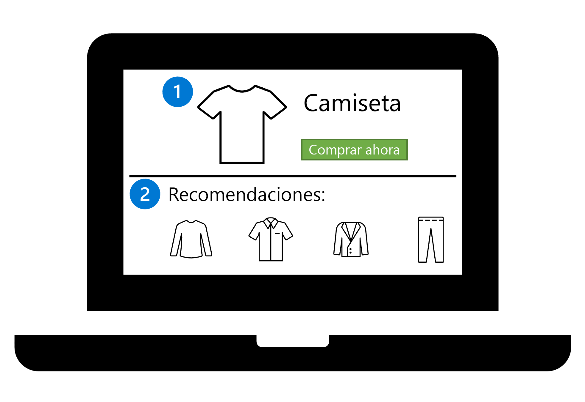

# Diseño de una solución de implementación de modelos

Para asegurarse de que el modelo lo use la audiencia de destino, debe implementar el modelo en un punto de conexión. El punto de conexión se puede integrar en un servicio o aplicación para atender a los usuarios del modelo. Debe diseñar una solución para implementar el modelo que mejor satisfaga las necesidades de los usuarios y tenga en cuenta los requisitos del modelo que se va a implementar.

## Comprender cómo se consumirá el modelo

1. Definir el problema: decida qué debe predecir el modelo y cuándo lo hace correctamente.
2. Obtener los datos: busque orígenes de datos y obtenga acceso.
3. Preparar los datos: explore los datos. Limpie y transforme los datos en función de los requisitos del modelo.
4. Entrenar el modelo: elija un algoritmo y valores de hiperparámetros en función de prueba y error.
5. Integrar el modelo: implemente el modelo en un punto de conexión para generar predicciones.
6. Supervisar el modelo: realice un seguimiento del rendimiento del modelo.

Debe planear cómo integrar el modelo, ya que puede afectar a cómo entrenar el modelo o qué datos de entrenamiento usa. Para integrar el modelo, debe implementar un modelo en un punto de conexión. Puede implementar un modelo en un punto de conexión para **predicciones por lotes** o en **tiempo real.**

## Implementación de un modelo en un punto de conexión

Al entrenar un modelo, el objetivo suele ser integrarlo en una aplicación.

Para integrar fácilmente un modelo en una aplicación, puede usar puntos de conexión. En pocas palabras, un punto de conexión puede ser una dirección web a la que una aplicación puede llamar para devolver un mensaje.

Con Azure Machine Learning, puede implementar el modelo en un punto de conexión. Después, puede integrar el punto de conexión en su propia aplicación y llamar al modelo para obtener las predicciones en la aplicación donde quiera visualizarlas.

Al implementar un modelo en un punto de conexión, tiene dos opciones:

- Obtener predicciones en tiempo real
- Obtener predicciones por lotes

## Obtención de predicciones en tiempo real

Si quiere que el modelo puntúe los datos nuevos tal y como lleguen, necesita predicciones en tiempo real.

Las predicciones en tiempo real suelen ser necesarias cuando una aplicación usa un modelo, como una aplicación móvil o un sitio web.

Imagine que tiene un sitio web que contiene un catálogo de productos:

1. Un cliente selecciona un producto en su sitio web, como una camisa.
2. En función de la selección del cliente, el modelo recomienda otros elementos del catálogo de productos inmediatamente. El sitio web muestra las recomendaciones del modelo.

Un cliente puede seleccionar un producto en la tienda web en cualquier momento. Quiere que el modelo encuentre las recomendaciones casi inmediatamente. `El tiempo que tarda la página web en cargarse y mostrar los detalles de la camisa es el tiempo que debe tardar en obtener las recomendaciones o predicciones`. A continuación, cuando se muestra la camisa, también se pueden mostrar las recomendaciones.

## Obtención de predicciones por lotes

Si quiere que el modelo puntúe nuevos datos por lotes y guarde los resultados como un archivo o en una base de datos, necesita predicciones por lotes.

Por ejemplo, puede entrenar un modelo que prediga las ventas de zumo de naranja para cada semana futura. Al predecir las ventas de zumos de naranja, puede asegurarse de que el suministro sea suficiente para satisfacer la demanda esperada.

Imagine que está visualizando todos los datos históricos de ventas en un informe. Querrá incluir las ventas previstas en el mismo informe.

Aunque el zumo de naranja se vende a lo largo del día, solo quiere calcular la previsión una vez a la semana. Puede recopilar los datos de ventas a lo largo de la semana y llamar al modelo solo cuando tenga los datos de ventas de una semana entera. Una colección de puntos de datos se conoce como un lote.

## Decidir la implementación por lotes o en tiempo real

Para decidir si diseñar una solución de implementación por lotes o en tiempo real, debe tener en cuenta las siguientes preguntas:

- ¿Con qué frecuencia se deben generar las predicciones?
- ¿Con qué puntualidad se necesitan los resultados?
- ¿Se deben generar predicciones de forma individual o por lotes?
- ¿Cuánta capacidad de proceso se necesita para ejecutar el modelo?

## Identificación de la frecuencia necesaria de puntuación

Un escenario habitual es usar un modelo para puntuar nuevos datos. Para poder obtener predicciones en tiempo real o por lotes, primero debe recopilar los nuevos datos.

Hay varias maneras de generar o recopilar datos. Los nuevos datos también se pueden recopilar a intervalos de tiempo diferentes.

> Por ejemplo, puede recopilar datos de temperatura de un dispositivo de Internet de las cosas (IoT) cada minuto. Puede obtener datos transaccionales cada vez que un cliente compra un producto de su tienda web. También puede extraer datos financieros de una base de datos cada tres meses.

Por lo general, hay dos tipos de casos de uso:

1. Necesita el modelo para puntuar los nuevos datos tan pronto como lleguen.
2. Puede programar o desencadenar el modelo para puntuar los nuevos datos que ha recopilado con el tiempo.

Tanto si quiere realizar predicciones en tiempo real o por lotes, _no depende necesariamente de la frecuencia con la que se recopilan nuevos datos_. En su lugar, depende de la frecuencia y la rapidez con la que se necesitan las predicciones que se van a generar.

> Si necesita las predicciones del modelo inmediatamente cuando se recopilan nuevos datos, necesita predicciones en tiempo real. Si las predicciones del modelo solo se consumen en determinados momentos, necesita predicciones por lotes.

## Decisión del número de predicciones

Otra pregunta importante que debe plantearse es si necesita que las predicciones se generen individualmente o por lotes.

Una manera sencilla de ilustrar la diferencia entre las predicciones individuales y por lotes es imaginar una tabla. Supongamos que tiene una tabla de datos de cliente donde cada fila representa a un cliente. Para cada cliente, tiene algunos datos demográficos y datos de comportamiento, como cuántos productos han comprado de su tienda web y cuándo fue su última compra.

En función de estos datos, puede predecir el abandono de clientes: si un cliente volverá a comprar de su tienda web o no.

Una vez que haya entrenado el modelo, puede decidir si quiere generar predicciones:

- **Individualmente:** el modelo recibe una sola fila de datos y devuelve si ese cliente individual volverá a comprar.
- **Por lotes:** el modelo recibe varias filas de datos en una tabla y devuelve si cada cliente volverá a comprar o no. Los resultados se cotejan en una tabla que contiene todas las predicciones.

También puede generar predicciones individuales o por lotes al trabajar con archivos. Por ejemplo, al trabajar con un modelo de Computer Vision, es posible que tenga que puntuar una sola imagen individualmente o una colección de imágenes en un lote.

## Consideración del costo del proceso

Además de usar el proceso al entrenar un modelo, también necesita el proceso al implementar un modelo. En función de si implementa el modelo en un punto de conexión en tiempo real o por lotes, usará diferentes tipos de proceso. Para decidir si implementar el modelo en un punto de conexión en tiempo real o por lotes, debe tener en cuenta el costo de cada tipo de proceso.

Si necesita **predicciones en tiempo real**, necesita un proceso que siempre esté disponible y pueda devolver los resultados (casi) inmediatamente. Las tecnologías de contenedor como `Azure Container Instance (ACI) y Azure Kubernetes Service (AKS)` son ideales para estos escenarios, ya que proporcionan una _infraestructura ligera_ para el modelo implementado.

Sin embargo, al implementar un modelo en un punto de conexión en tiempo real y usar dicha tecnología de contenedor, _el proceso siempre está activado_. Una vez implementado un modelo, paga continuamente por el proceso, ya que no se puede pausar o detener el proceso, ya que el modelo siempre debe estar disponible para predicciones inmediatas.

Como alternativa, si necesita **predicciones por lotes**, necesita un proceso que pueda controlar una carga de trabajo grande. Lo ideal es usar un `clúster de proceso` que pueda puntuar los datos en _lotes paralelos mediante varios nodos_.

Al trabajar con clústeres de proceso que pueden procesar datos en lotes paralelos, el proceso se aprovisiona por parte del área de trabajo cuando se desencadena la puntuación por lotes y reducirse verticalmente a 0 nodos cuando no hay datos nuevos que procesar. _Al permitir que el área de trabajo reduzca verticalmente un clúster de proceso inactivo, puede ahorrar costos significativos._

## Decidir la implementación por lotes o en tiempo real

Elegir una estrategia de implementación para los modelos de aprendizaje automático puede ser difícil, ya que diferentes factores pueden influir en la decisión.

En general, si necesita predicciones individuales inmediatamente cuando se recopilan nuevos datos, necesita predicciones en tiempo real.

Si necesita que el modelo puntúe nuevos datos cuando haya disponible un lote de datos, debería usar predicciones por lotes.

Hay escenarios en los que se espera que necesite predicciones en tiempo real cuando las predicciones por lotes pueden ser más rentables. Recuerde que está pagando continuamente por el proceso con implementaciones en tiempo real, incluso cuando no se generan nuevas predicciones.

Si se puede permitir un retraso de 5 a 10 minutos al necesitar predicciones inmediatas, puede optar por implementar el modelo en un punto de conexión por lotes. El retraso se produce en el momento en que necesita iniciar el clúster de proceso después de que se desencadene el punto de conexión. Sin embargo, el clúster de proceso también se detendrá después de generar la predicción, lo que minimiza los costos y podría ser una solución más rentable.

Por último, también debe tener en cuenta el proceso necesario para que el modelo puntúe nuevos datos. Los modelos más sencillos requieren menos costos y tiempo para generar predicciones. Los modelos más complejos pueden requerir más potencia de proceso y tiempo de procesamiento para generar predicciones. Por lo tanto, debe tener en cuenta cómo implementará el modelo antes de decidir cómo entrenar el modelo.

## [EJERCICIO](https://learn.microsoft.com/es-es/training/modules/design-model-deployment-solution/4-knowledge-check)
