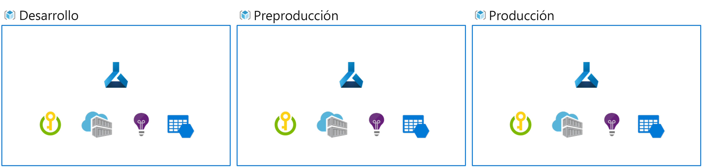

# Diseño de una solución de operaciones de aprendizaje automático

Las operaciones de aprendizaje automático o MLOps le ayudan a escalar el modelo de una prueba de concepto o un proyecto piloto a producción. Un modelo en producción está listo para la implementación a gran escala y se puede volver a entrenar e implementar cuando sea necesario.

La implementación de MLOps le ayuda a hacer que las cargas de trabajo de aprendizaje automático sean sólidas y reproducibles.

Conocerá una arquitectura típica de MLOps y lo que debe tener en cuenta para llevar un modelo a producción.

## Exploración de una arquitectura de MLOps

En general, una vez entrenado un modelo de aprendizaje automático, le interesa preparar el modelo a escala empresarial. Para preparar el modelo y hacerlo funcionar, quiere hacer lo siguiente:

- Convertir el entrenamiento del modelo en una canalización sólida y reproducible.
- Probar el código y el modelo en un entorno de desarrollo.
- Implementar el modelo en un entorno de producción.
- Automatizar el proceso de un extremo a otro.

## Configuración de entornos para desarrollo y producción

En MLOps, de manera similar a DevOps, un entorno hace referencia a una colección de recursos. Estos recursos se usan para implementar una aplicación o para implementar un modelo mediante proyectos de aprendizaje automático.

> En este módulo, se hace referencia a la interpretación de entornos de DevOps. Tenga en cuenta que Azure Machine Learning también usa el término "entornos" para describir una colección de paquetes de Python necesarios para ejecutar un script. Estos dos conceptos de entornos son independientes entre sí.

El número de entornos con los que trabaja depende de su organización. Por lo general, hay al menos dos entornos: desarrollo o dev y producción o prod. Además, puede agregar entornos intermedios, como un entorno de almacenamiento provisional o de preproducción (preprod).

Un enfoque típico consiste en:

- Experimente con el entrenamiento del modelo en el entorno de desarrollo.
- Lleve el mejor modelo al entorno de almacenamiento provisional o de preproducción para implementarlo y probarlo.
- Por último, lleve el modelo al entorno de producción para implementarlo y que los usuarios finales puedan usarlo.

## Organización de los entornos de Azure ML

Al implementar MLOps y trabajar con modelos de aprendizaje automático a gran escala, se recomienda trabajar con entornos independientes en las diferentes fases.

Imagine que su equipo usa un entorno de desarrollo, preproducción y producción. No todos los miembros del equipo deben tener acceso a todos los entornos. Los científicos de datos solo pueden trabajar en el entorno de desarrollo con datos que no sean de producción, mientras que los ingenieros de aprendizaje automático deben trabajar en la implementación del modelo en el entorno de tipo preprod y prod con los datos de producción.

Tener entornos independientes facilita el control del acceso a los recursos. A continuación, cada entorno se puede asociar a un área de trabajo de Azure Machine Learning independiente.

En Azure, usará el **control de acceso basado en rol (RBAC)** para proporcionar a sus compañeros el nivel adecuado de acceso al subconjunto de recursos con los que necesitan trabajar.

Como alternativa, solo puede usar un área de trabajo de Azure Machine Learning. Al usar un área de trabajo para desarrollo y producción, tendrá una superficie de Azure más pequeña y menos sobrecarga de administración. Sin embargo, RBAC se aplica tanto a entornos de desarrollo como de producción, lo que puede significar que se esté dando a la gente demasiado o demasiado poco acceso a los recursos.

[procedimientos recomendados para organizar los recursos de Azure Machine Learning.](https://learn.microsoft.com/es-es/azure/cloud-adoption-framework/ready/azure-best-practices/ai-machine-learning-resource-organization)

## Diseño de una arquitectura de MLOps

La incorporación de un modelo a la producción significa que necesita escalar la solución y trabajar conjuntamente con otros equipos. Junto con otros científicos de datos, los ingenieros de datos y el equipo de infraestructura, ha decidido usar el siguiente enfoque:

- Almacene todos los datos en una instancia de Azure Blob Storage, administrados por el ingeniero de datos.
- El equipo de infraestructura crea los recursos de Azure necesarios, como el área de trabajo de Azure Machine Learning.
- Los científicos de datos se centran en lo que mejor saben hacer: desarrollar y entrenar el modelo (bucle interno).
- Los ingenieros de aprendizaje automático implementan los modelos entrenados (bucle externo).

Como resultado, la arquitectura de MLOps incluye las siguientes partes:

1. **Configuración:** creación de todos los recursos de Azure necesarios para la solución.
2. **Desarrollo de modelos (bucle interno):** análisis y procesamiento de los datos para entrenar y evaluar el modelo.
3. **Integración continua:** empaquetado y registro del modelo.
4. **Implementación de modelos (bucle externo):** implementación del modelo.
5. **Implementación continua:** prueba del modelo y promoción al entorno de producción.
6. **Supervisión:** supervisión del rendimiento del modelo y del punto de conexión.

Cuando trabaja con equipos más grandes, no espera, como científico de datos, ser responsable de todas las partes de la arquitectura de MLOps. Sin embargo, para preparar el modelo para MLOps, debe pensar en cómo diseñar los pasos de supervisión y reentrenamiento.

## Diseño de la supervisión

Como parte de una arquitectura de operaciones de aprendizaje automático (MLOps), debe pensar en cómo supervisar la solución de aprendizaje automático.

La supervisión es beneficiosa en cualquier entorno de MLOps. Le interesará supervisar _el modelo, los datos y la infraestructura_ para recopilar métricas que le ayuden a decidir los pasos siguientes necesarios.

## Supervisión del modelo

Lo habitual es que quiera supervisar el rendimiento del modelo. Durante el desarrollo, se usa MLflow para entrenar los modelos de aprendizaje automático y realizar un seguimiento de ellos. En función del modelo que entrene, hay diferentes métricas que puede usar para evaluar si el modelo funciona según lo esperado.

Para supervisar un modelo en producción, puede usar el modelo entrenado para generar predicciones sobre un pequeño subconjunto de nuevos datos entrantes. Al generar métricas de rendimiento de esos datos de prueba, puede comprobar si el modelo sigue logrando su objetivo.

Además, también puede supervisar los problemas de inteligencia artificial (IA) responsables. Por ejemplo, si el modelo hace predicciones justas.

Para poder supervisar un modelo, es importante decidir qué métricas de rendimiento quiere supervisar y cuál debe ser el punto de referencia de cada métrica. ¿Cuándo hay que avisar de que el modelo ya no es exacto?

## Supervisión de los datos

Normalmente los modelos de aprendizaje automático se entrenan con un conjunto de datos histórico que es representativo de los nuevos datos que el modelo recibe cuando se implementa. Pero con el tiempo puede haber tendencias que cambien el perfil de los datos, lo que hará que el modelo sea menos preciso.

Por ejemplo, supongamos que un modelo está entrenado para predecir la previsión de consumo de combustible por kilómetro de un vehículo en función de su cilindrada, tamaño, peso y otras características. Con el tiempo, a medida que las tecnologías de motor y fabricación de automóviles progresan, es posible que la autonomía habitual de los vehículos mejore drásticamente, con lo que las predicciones realizadas por el modelo entrenado con datos más antiguos son menos precisas.

Este cambio en los perfiles de datos entre los datos actuales y los de entrenamiento se conoce como "desfase de datos" y puede ser un problema importante para los modelos predictivos que se usan en producción. Por tanto, es importante poder supervisar el desfase de datos en el tiempo y volver a entrenar los modelos si es necesario para mantener la precisión de las predicciones.

## Supervisión de infraestructura

Junto a la supervisión del modelo y los datos, también debe supervisar la infraestructura para minimizar el costo y optimizar el rendimiento.

A lo largo del ciclo de vida de aprendizaje automático, se usa el proceso para entrenar e implementar modelos. Con los proyectos de aprendizaje automático en la nube, el proceso puede suponer uno de los mayores gastos. Por lo tanto, desea supervisar si usa el proceso de forma eficaz.

Por ejemplo, puede supervisar el uso del proceso durante el entrenamiento y durante la implementación. Al revisar el uso de proceso, se sabe si se puede reducir verticalmente el proceso aprovisionado o si es necesario escalarlo horizontalmente para evitar restricciones de capacidad.

## Diseño del reentrenamiento

Por lo general, hay dos enfoques para cuando quiera volver a entrenar un modelo:

- Con arreglo a una programación: si sabe que siempre necesitará la versión más reciente del modelo, puede decidir volver a entrenarlo cada semana o cada mes, según una programación.
- En función de algunas métricas: si solo quiere volver a entrenar el modelo cuando sea necesario, puede supervisar el rendimiento y el desfase de datos del modelo para decidir cuándo necesita volver a entrenarlo.

En cualquier caso, en el diseño debe tener en cuenta la posibilidad de tener que volver a entrenar el modelo. Para volver a entrenar fácilmente el modelo, debe preparar el código para la automatización.

## Preparación del código

Lo más conveniente es entrenar modelos con scripts en lugar de cuadernos. Los scripts son más adecuados para la automatización. Puede agregar parámetros a un script y cambiar los parámetros de entrada, como los datos de entrenamiento o los valores de hiperparámetros. Al parametrizar los scripts, puede volver a entrenar fácilmente el modelo con nuevos datos si es necesario.

Otro aspecto importante para preparar el código es hospedarlo en un repositorio central. Un repositorio hace referencia a la ubicación donde se pueden almacenar todos los archivos pertinentes de un proyecto. Con los proyectos de aprendizaje automático, los repositorios basados en Git son idóneos para lograr el control de código fuente.

Al aplicar el control de código fuente al proyecto, puede colaborar fácilmente en un proyecto. Puede encargar a alguien que mejore el modelo actualizando el código. Podrá ver todos los cambios anteriores y revisar los cambios antes de confirmarlos en el repositorio principal.

## Automatización del código

Cuando quiera ejecutar automáticamente el código, puede configurar trabajos de Azure Machine Learning para ejecutar scripts. En Azure Machine Learning, también puede crear y programar canalizaciones para ejecutar scripts.

Si quiere que los scripts se ejecuten en función de un desencadenador o evento que se produzca fuera de Azure Machine Learning, es posible que quiera desencadenar el trabajo de Azure Machine Learning con otra herramienta.

Dos herramientas que se usan normalmente en proyectos de MLOps son Azure DevOps y GitHub (Acciones). Ambas herramientas permiten crear canalizaciones de automatización y pueden desencadenar canalizaciones de Azure Machine Learning.

Como científico de datos, es posible que prefiera trabajar con el SDK para Python de Azure Machine Learning. Sin embargo, al trabajar con herramientas como Azure DevOps y GitHub, es posible que prefiera mejor configurar los recursos y trabajos necesarios con la extensión de la CLI de Azure Machine Learning. La CLI de Azure está diseñada para automatizar tareas y puede ser más fácil de usar con Azure DevOps y GitHub.
