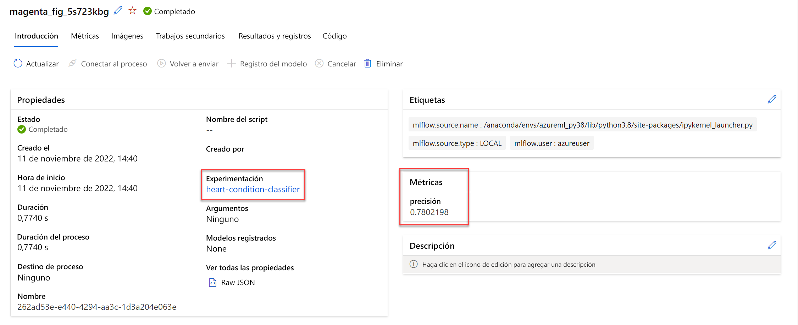

# Seguimiento del entrenamiento de modelos en cuadernos de Jupyter Notebook con MLflow

En este módulo aprenderá a:

- Configuración de MLflow para su uso en cuadernos
- Uso de MLflow para el seguimiento de modelos en cuadernos

## Configuración de MLflow para el seguimiento de modelos en cuadernos

MLflow es una biblioteca de código abierto para hacer el seguimiento de los experimentos de aprendizaje automático y administrarlos. En concreto, el **seguimiento de MLflow** es un componente de MLflow que registra todo lo relacionado con el modelo que entrena, como los parámetros, las métricas y los artefactos.

Para usar MLflow en cuadernos del área de trabajo de Azure Machine Learning, deberá instalar las bibliotecas necesarias y establecer Azure Machine Learning como el almacén de seguimiento. Una vez que configure MLflow, puede empezar a usarlo al entrenar modelos en cuadernos.

## Configuración de MLflow en cuadernos

Puede crear y editar cuadernos en Azure Machine Learning o en un dispositivo local

## Uso de cuadernos de Azure Machine Learning

En el área de trabajo de Azure Machine Learning, puede crear cuadernos y conectarlos a una instancia de proceso administrada de Azure Machine Learning.

Al ejecutar un cuaderno en una instancia de proceso, MLflow ya está configurado y listo para usarse.

Para comprobar que los paquetes necesarios están instalados, puede ejecutar el código siguiente:

```Bash
pip show mlflow
pip show azureml-mlflow
```

El paquete `mlflow` es la biblioteca de código abierto. El paquete `azureml-mlflow` contiene el código de integración de Azure Machine Learning con MLflow.

## Uso de MLflow en un dispositivo local

Si prefiere trabajar en cuadernos en un dispositivo local, también puede usar MLflow. Para configurar MLflow, complete estos pasos:

1. Instale los paquetes `mlflow` y `azureml-flow`

```Bash
pip install mlflow
pip install azureml-mlflow
```

2. Vaya al Estudio de Azure Machine Learning.
3. Seleccione el nombre del área de trabajo en la que trabaja en la esquina superior derecha del Estudio.
4. Seleccione Ver todas las propiedades en Azure Portal. Se abrirá una pestaña nueva que lo llevará a Azure Machine Learning Service en Azure Portal.
5. Copie el valor del URI de seguimiento de MLflow.
6. Use el código siguiente en el cuaderno local para configurar MLflow para que apunte al área de trabajo de Azure Machine Learning y establézcalo en el URI de seguimiento del área de trabajo.

```Python
mlflow.set_tracking_uri = "MLFLOW-TRACKING-URI"
```

> Obtenga información sobre los enfoques alternativos para [configurar el entorno de seguimiento al trabajar en un dispositivo local](https://learn.microsoft.com/es-es/azure/machine-learning/how-to-use-mlflow-cli-runs?view=azureml-api-2&tabs=interactive%2Ccli). Por ejemplo, también puede usar el SDK de Azure Machine Learning v2 para Python, junto con el archivo de configuración del área de trabajo, para establecer el URI de seguimiento.

## Entrenamiento y seguimiento de modelos en cuadernos

Como científico de datos, usa cuadernos para `experimentar y entrenar modelos`. Para agrupar los resultados de entrenamiento de los modelos, `usará experimentos`. Para realizar un seguimiento de las métricas de los modelos con MLflow al entrenar un modelo en un cuaderno, puede usar las funcionalidades de `registro de MLflow`.

## Creación de un experimento de MLflow

Puede crear un experimento de MLflow, que le permite agrupar ejecuciones. Si no crea un experimento, MLflow tomará el experimento predeterminado con el nombre `Default`.

Para crear un experimento, ejecute el siguiente comando en un cuaderno:

```Python
import mlflow

mlflow.set_experiment(experiment_name="heart-condition-classifier")
```

## Resultados de registro con MLflow

Ya está listo para entrenar el modelo. Para iniciar una ejecución con seguimiento de MLflow, usará `start_run()`. A continuación, para realizar un seguimiento del modelo, puede hacer lo siguiente:

- Habilitar el registro automático.
- Usar el registro personalizado.

## Habilitación del registro automático

MLflow admite el registro automático en bibliotecas de aprendizaje automático populares. Si usa una biblioteca compatible con el registro automático, MLflow indica al marco que usa para registrar todas las métricas, los parámetros, los artefactos y los modelos que el marco considera pertinentes.

Puede activar el registro automático mediante el método `autolog` correspondiente al marco que use. Por ejemplo, para habilitar el registro automático en los modelos **XGBoost**, puede usar `mlflow.xgboost.autolog()`.

Una celda de cuaderno que entrena y realiza un seguimiento de un modelo de clasificación mediante el registro automático puede ser similar al ejemplo de código siguiente:

```Python
from xgboost import XGBClassifier

with mlflow.start_run():
    mlflow.xgboost.autolog()

    model = XGBClassifier(use_label_encoder=False, eval_metric="logloss")
    model.fit(X_train, y_train, eval_set=[(X_test, y_test)], verbose=False)
```

En cuanto se llame a `mlflow.xgboost.autolog()`, MLflow iniciará una ejecución dentro de un experimento en Azure Machine Learning para iniciar el seguimiento de la ejecución del experimento.

Una vez completado el trabajo, puede revisar todas las métricas registradas en Estudio.


## Uso del registro personalizado

Además, puede registrar manualmente el modelo con MLflow. Los modelos de registro manual son útiles cuando se desea registrar información complementaria o personalizada que no se registra a través del registro automático.

> Puede optar por usar solo el registro personalizado o usar el registro personalizado en combinación con el automático.

Las funciones comunes que se usan con el registro personalizado son:

- `mlflow.log_param()`: registra un solo parámetro de clave-valor. Use esta función para un parámetro de entrada que desee registrar.
- `mlflow.log_metric()`: registra una sola métrica de clave-valor. El valor debe ser un número. Use esta función para cualquier salida que desee almacenar con la ejecución.
- `mlflow.log_artifact()`: registra un archivo. Use esta función para cualquier trazado que desee registrar y guárdelo primero como archivo de imagen.
- `mlflow.log_model()`: registra un modelo. Use esta función para crear un modelo de MLflow, que puede incluir una firma personalizada, un entorno y ejemplos de entrada.

> Obtenga más información sobre cómo realizar un seguimiento de los modelos con MLflow consultando la [documentación oficial de MLflow](https://www.mlflow.org/docs/latest/tracking.html) o la [documentación de Azure Machine Learning](https://learn.microsoft.com/es-es/azure/machine-learning/how-to-log-view-metrics?view=azureml-api-2&tabs=interactive).

Para usar el registro personalizado en un cuaderno, inicie una ejecución y registre cualquire métrica que desee:

```Python
from xgboost import XGBClassifier
from sklearn.metrics import accuracy_score

with mlflow.start_run():
    model = XGBClassifier(use_label_encoder=False, eval_metric="logloss")
    model.fit(X_train, y_train, eval_set=[(X_test, y_test)], verbose=False)
    y_pred = model.predict(X_test)

    accuracy = accuracy_score(y_test, y_pred)
    mlflow.log_metric("accuracy", accuracy)
```

El registro personalizado proporciona más flexibilidad, pero también crea más trabajo, ya que tendrá que definir cualquier parámetro, métrica o artefacto que quiera registrar.

Una vez completado el trabajo, puede revisar todas las métricas registradas en Estudio.



## [EJERCICIO](https://microsoftlearning.github.io/mslearn-azure-ml/Instructions/07-Notebooks-mlflow-tracking.html)
