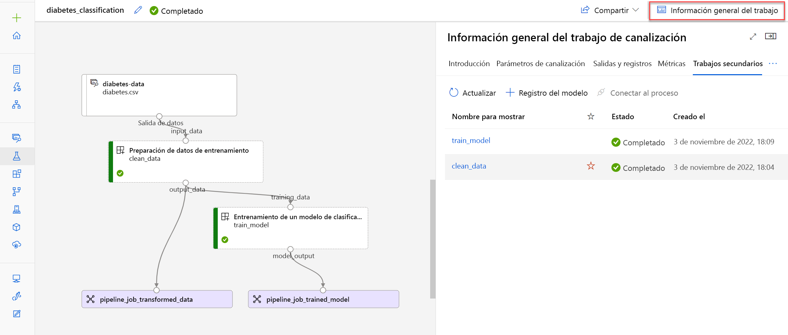

# Ejecución de canalizaciones en Azure Machine Learning

En Azure Machine Learning, puede experimentar en cuadernos y entrenar (y volver a entrenar) modelos de aprendizaje automático mediante la ejecución de scripts como trabajos.

En un proceso de ciencia de datos empresarial, querrá separar el proceso global en tareas individuales. Puede agrupar tareas como canalizaciones. Las canalizaciones son clave para implementar una solución eficaz de operaciones de **aprendizaje automático (MLOps)** en Azure.

Aprenderá a crear **componentes** de tareas individuales, lo que facilita la reutilización y el uso compartido de código. A continuación, combinará los componentes en una canalización de Azure Machine Learning, que se ejecutará como un **trabajo de canalización.**

> El término canalización se usa ampliamente en varios dominios, incluido el aprendizaje automático y la ingeniería de software. En Azure Machine Learning, una canalización contiene pasos relacionados con el entrenamiento de un modelo de Machine Learning. En Azure DevOps o GitHub, una canalización puede hacer referencia a una canalización de compilación o versión, que realiza las tareas de compilación y configuración necesarias para entregar software. En Azure Synapse Analytics, se usa una canalización para definir el proceso de ingesta y transformación de datos. Este módulo se centra en las canalizaciones de Azure Machine Learning. Sin embargo, tenga en cuenta que es posible que las canalizaciones entre los servicios interactúen entre sí. **Por ejemplo, una canalización de Azure DevOps o Azure Synapse Analytics puede desencadenar una canalización de Azure Machine Learning.**

## Crear un componente

Los componentes permiten crear scripts reutilizables que se pueden compartir fácilmente entre los usuarios dentro de la misma área de trabajo de Azure Machine Learning. También puede usar componentes para compilar una canalización de Azure Machine Learning.

## Uso de un componente

Hay dos razones principales por las que usaría componentes:

- Para compilar una canalización.
- Para compartir código listo para usar.

Querrá crear componentes al preparar el código para la escala. Cuando haya terminado de experimentar y desarrollar, y esté listo para mover el modelo a producción.

En Azure Machine Learning, puede crear un componente para almacenar código (en el lenguaje preferido) dentro del área de trabajo. Lo ideal es diseñar un componente para realizar una acción específica que sea pertinente en el flujo de trabajo de aprendizaje automático.

Por ejemplo, un componente puede constar de un script de Python que normaliza los datos, entrena un modelo de aprendizaje automático o evalúa un modelo.

Los componentes se pueden compartir fácilmente con otros usuarios de Azure Machine Learning, que pueden reutilizar componentes en sus propias canalizaciones de Azure Machine Learning.


## Crear un componente

Un componente consta de tres partes:

- **Metadatos:** incluye el nombre, la versión, etc. del componente.
- **Interfaz:** incluye los parámetros de entrada esperados (como un conjunto de datos o hiperparámetros) y la salida esperada (como métricas y artefactos).
- **Comando, código y entorno:** especifica cómo ejecutar el código.

Para crear un componente, necesita dos archivos:

- `Script` que contiene el flujo de trabajo que desea ejecutar.
- Un `archivo YAML` para definir los metadatos, la interfaz y el comando, el código y el entorno del componente.

Puede crear el archivo YAML o usar la función `command_component()` como decorador para crear el archivo YAML.

> Aquí nos centraremos en la creación de un archivo YAML para crear un componente. Como alternativa, obtenga más información sobre [cómo crear componentes mediante command_component().](https://learn.microsoft.com/es-es/azure/machine-learning/how-to-create-component-pipeline-python?view=azureml-api-2)

Por ejemplo, puede tener un script de Python `prep.py` que prepare los datos quitando los valores que faltan y normalizando los datos:

```Python
# import libraries
import argparse
import pandas as pd
import numpy as np
from pathlib import Path
from sklearn.preprocessing import MinMaxScaler

# setup arg parser
parser = argparse.ArgumentParser()

# add arguments
parser.add_argument("--input_data", dest='input_data',
                    type=str)
parser.add_argument("--output_data", dest='output_data',
                    type=str)

# parse args
args = parser.parse_args()

# read the data
df = pd.read_csv(args.input_data)

# remove missing values
df = df.dropna()

# normalize the data
scaler = MinMaxScaler()
num_cols = ['feature1','feature2','feature3','feature4']
df[num_cols] = scaler.fit_transform(df[num_cols])

# save the data as a csv
output_df = df.to_csv(
    (Path(args.output_data) / "prepped-data.csv"),
    index = False
)
```

Para crear un componente para el script `prep.py`, necesitará un archivo YAML `prep.yml`:

```YML
$schema: https://azuremlschemas.azureedge.net/latest/commandComponent.schema.json
name: prep_data
display_name: Prepare training data
version: 1
type: command
inputs:
  input_data:
    type: uri_file
outputs:
  output_data:
    type: uri_file
code: ./src
environment: azureml:AzureML-sklearn-0.24-ubuntu18.04-py37-cpu@latest
command: >-
  python prep.py
  --input_data ${{inputs.input_data}}
  --output_data ${{outputs.output_data}}
```

Observe que el archivo YAML hace referencia al script `prep.py`, que se almacena en la carpeta `src`. Puede cargar el componente con el código siguiente:

```Python
from azure.ai.ml import load_component
parent_dir = ""

loaded_component_prep = load_component(source=parent_dir + "./prep.yml")
```

Cuando haya cargado el componente, puede usarlo en una canalización o registrar el componente.

## Registro de un componente

Para usar componentes en una canalización, necesitará el script y el archivo YAML. Para que los componentes sean accesibles para otros usuarios del área de trabajo, también puede registrar componentes en el área de trabajo de Azure Machine Learning.

Puede registrar un componente con el código siguiente:

```Python
prep = ml_client.components.create_or_update(prepare_data_component)
```

## Crear una canalización

En Azure Machine Learning, una canalización es un flujo de trabajo de tareas de aprendizaje automático en las que cada tarea se define como un **componente**.

Los componentes se pueden organizar de forma secuencial o en paralelo, lo que permite crear una sofisticada lógica de flujo para orquestar las operaciones de aprendizaje automático. Cada componente puede ejecutarse en un destino de proceso específico; gracias a ello, es posible combinar diferentes tipos de procesamiento según sea necesario para lograr un objetivo general.

Una canalización se puede ejecutar como un proceso mediante la ejecución de la canalización como un **trabajo de canalización**. Cada componente se ejecuta como un trabajo secundario como parte del trabajo de canalización general.

## Compilación de una canalización

Una canalización de Azure Machine Learning se define en un archivo YAML. El archivo YAML incluye el nombre del trabajo de canalización, las entradas, las salidas y la configuración.

Puede crear el archivo YAML o usar la función `@pipeline()` para crear el archivo YAML.

Revise la [documentación de referencia de la función @pipeline().](https://learn.microsoft.com/es-es/python/api/azure-ai-ml/azure.ai.ml.dsl?view=azure-python)

Por ejemplo, si desea compilar una canalización que prepare primero los datos y, a continuación, entrene el modelo, puede usar el código siguiente:

```Python
from azure.ai.ml.dsl import pipeline

@pipeline()
def pipeline_function_name(pipeline_job_input):
    prep_data = loaded_component_prep(input_data=pipeline_job_input)
    train_model = loaded_component_train(training_data=prep_data.outputs.output_data)

    return {
        "pipeline_job_transformed_data": prep_data.outputs.output_data,
        "pipeline_job_trained_model": train_model.outputs.model_output,
    }
```

Para pasar un recurso de datos registrado como entrada del trabajo de canalización, puede llamar a la función que creó con el recurso de datos como entrada:

```Python
from azure.ai.ml import Input
from azure.ai.ml.constants import AssetTypes

pipeline_job = pipeline_function_name(
    Input(type=AssetTypes.URI_FILE,
    path="azureml:data:1"
))
```

La función `@pipeline()` crea una canalización que consta de dos pasos secuenciales, representados por los dos componentes cargados.

Para comprender la canalización integrada en el ejemplo, vamos a explorarla paso a paso:

1. La canalización se crea mediante la definición de la función `pipeline_function_name`.
2. La función de canalización espera `pipeline_job_input` como entrada de canalización general.
3. El primer paso de canalización requiere un valor para el parámetro de entrada `input_data`. El valor de la entrada será el valor de `pipeline_job_input`.
4. El primer paso de canalización se define mediante el componente cargado para `prep_data`.
5. El valor de `output_data` del primer paso de canalización se usa para la entrada `training_data` esperada del segundo paso de canalización.
6. El segundo paso de canalización se define mediante el componente cargado para `train_model` y da como resultado un modelo entrenado al que `model_output` hace referencia.
7. Las salidas de canalización se definen devolviendo variables de la función de canalización. Hay dos salidas:
   - `pipeline_job_transformed_data` con el valor de `prep_data.outputs.output_data`
   - `pipeline_job_trained_model` con el valor de `train_model.outputs.model_output`


El resultado de ejecutar la función `@pipeline()` es un archivo YAML que puede revisar imprimiendo el objeto `pipeline_job` que creó al llamar a la función:

```Python
print(pipeline_job)
```

La salida adoptará el formato de un archivo YAML, que incluye la configuración de la canalización y sus componentes. Algunos parámetros incluidos en el archivo YAML se muestran en el siguiente ejemplo.

```YML
display_name: pipeline_function_name
type: pipeline
inputs:
  pipeline_job_input:
    type: uri_file
    path: azureml:data:1
outputs:
  pipeline_job_transformed_data: null
  pipeline_job_trained_model: null
jobs:
  prep_data:
    type: command
    inputs:
      input_data:
        path: ${{parent.inputs.pipeline_job_input}}
    outputs:
      output_data: ${{parent.outputs.pipeline_job_transformed_data}}
  train_model:
    type: command
    inputs:
      input_data:
        path: ${{parent.outputs.pipeline_job_transformed_data}}
    outputs:
      output_model: ${{parent.outputs.pipeline_job_trained_model}}
tags: {}
properties: {}
settings: {}
```

> Obtenga más información sobre el [esquema YAML del trabajo de canalización para explorar qué parámetros se incluyen al compilar una canalización basada en componentes.](https://learn.microsoft.com/es-es/azure/machine-learning/reference-yaml-job-pipeline?view=azureml-api-2)

## Ejecución de un trabajo de canalización

Cuando haya creado una canalización basada en componentes en Azure Machine Learning, puede ejecutar el flujo de trabajo como un **trabajo de canalización**.

## Configuración de un trabajo de canalización

Una canalización se define en un archivo YAML, que también puede crear mediante la función `@pipeline()`. Después de usar la función, puede editar las configuraciones de canalización especificando qué parámetros desea cambiar y el nuevo valor.

Por ejemplo, puede que desee cambiar el modo de salida para las salidas del trabajo de canalización:

```Python
# change the output mode
pipeline_job.outputs.pipeline_job_transformed_data.mode = "upload"
pipeline_job.outputs.pipeline_job_trained_model.mode = "upload"
```

O bien, puede que desee establecer el proceso de canalización predeterminado. Cuando no se especifica un proceso para un componente, usará el proceso predeterminado en su lugar:

```Python
# set pipeline level compute
pipeline_job.settings.default_compute = "aml-cluster"
```

También puede cambiar el almacén de datos predeterminado a donde se almacenarán todas las salidas:

```Python
# set pipeline level datastore
pipeline_job.settings.default_datastore = "workspaceblobstore"
```

Para revisar la configuración de la canalización, puede imprimir el objeto de trabajo de canalización:

```Python
print(pipeline_job)
```

## Ejecución de un trabajo de canalización

Cuando haya configurado la canalización, estará listo para ejecutar el flujo de trabajo como un trabajo de canalización.

Para enviar el trabajo de canalización, ejecute el código siguiente:

```Python
# submit job to workspace
pipeline_job = ml_client.jobs.create_or_update(
    pipeline_job, experiment_name="pipeline_job"
)
```

Después de enviar un trabajo de canalización, se creará un nuevo trabajo en el área de trabajo de Azure Machine Learning. Un trabajo de canalización también contiene trabajos secundarios, que representan la ejecución de los componentes individuales. Estudio de Azure Machine Learning crea una representación gráfica de la canalización. Puede expandir la información general del trabajo para explorar los parámetros de canalización, las salidas y los trabajos secundarios:



Para solucionar problemas de una canalización con errores, puede comprobar las salidas y los registros del trabajo de canalización y sus trabajos secundarios.

- Si hay un problema con la configuración de la propia canalización, encontrará más información en las salidas y registros del trabajo de canalización.
- Si hay un problema con la configuración de un componente, encontrará más información en las salidas y registros del trabajo secundario del componente con errores.

## Programación de un trabajo de canalización

Una canalización es ideal si quiere preparar el modelo para producción. Las canalizaciones son especialmente útiles para automatizar el reentrenamiento de un modelo de Machine Learning. Para automatizar el reentrenamiento de un modelo, puede programar una canalización.

Para programar un trabajo de canalización, usará la clase `JobSchedule` para asociar una programación a un trabajo de canalización.

Existen varias maneras de crear una programación. Un enfoque sencillo consiste en crear una programación basada en el tiempo mediante la clase `RecurrenceTrigger` con los parámetros siguientes:

- `frequency`: unidad de tiempo para describir la frecuencia con la que se desencadena la programación. El valor puede ser `minute`, `hour`, `day`, `week` o `month`.
- `interval`: número de unidades de frecuencia para describir la frecuencia con la que se desencadena la programación. El valor debe ser un entero.

Para crear una programación que se active cada minuto, ejecute el código siguiente:

```Python
from azure.ai.ml.entities import RecurrenceTrigger

schedule_name = "run_every_minute"

recurrence_trigger = RecurrenceTrigger(
    frequency="minute",
    interval=1,
)
```

Para programar una canalización, necesitará `pipeline_job` para representar la canalización que ha compilado:

```Python
from azure.ai.ml.entities import JobSchedule

job_schedule = JobSchedule(
    name=schedule_name, trigger=recurrence_trigger, create_job=pipeline_job
)

job_schedule = ml_client.schedules.begin_create_or_update(
    schedule=job_schedule
).result()
```

Los nombres para mostrar de los trabajos desencadenados por la programación tendrán como prefijo el nombre de la programación. Puede revisar los trabajos en Estudio de Azure Machine Learning:


Para eliminar una programación, primero debe deshabilitarla:

```Python
ml_client.schedules.begin_disable(name=schedule_name).result()
ml_client.schedules.begin_delete(name=schedule_name).result()
```

> Obtenga más información sobre [las programaciones que puede crear para desencadenar trabajos de canalización en Azure Machine Learning](https://learn.microsoft.com/es-es/azure/machine-learning/how-to-schedule-pipeline-job?view=azureml-api-2&tabs=cliv2). O bien, explore un [cuaderno de ejemplo para aprender a trabajar con programaciones.](https://github.com/Azure/azureml-examples/blob/main/sdk/python/schedules/job-schedule.ipynb)

## [EJERCICIO](https://microsoftlearning.github.io/mslearn-azure-ml/Instructions/09-Run-pipelines.html)
