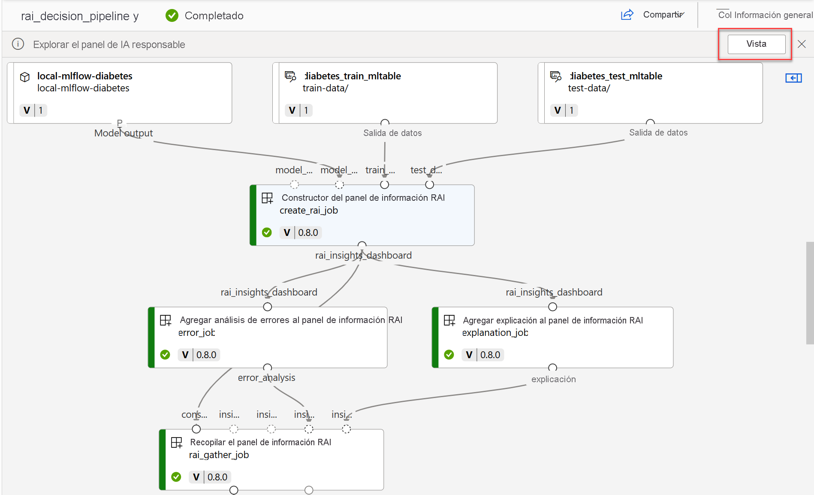
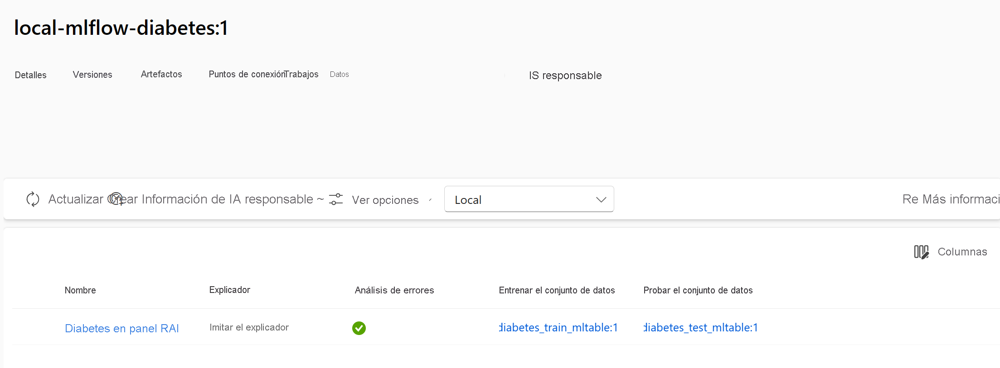
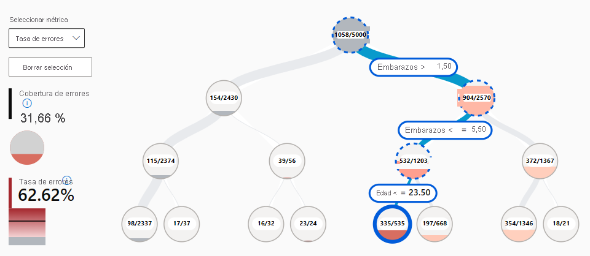
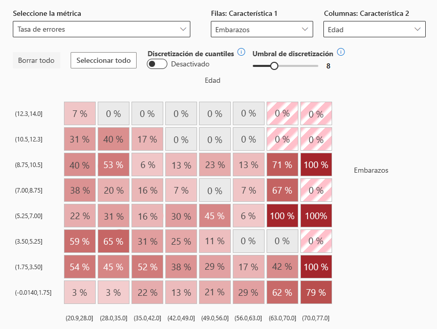
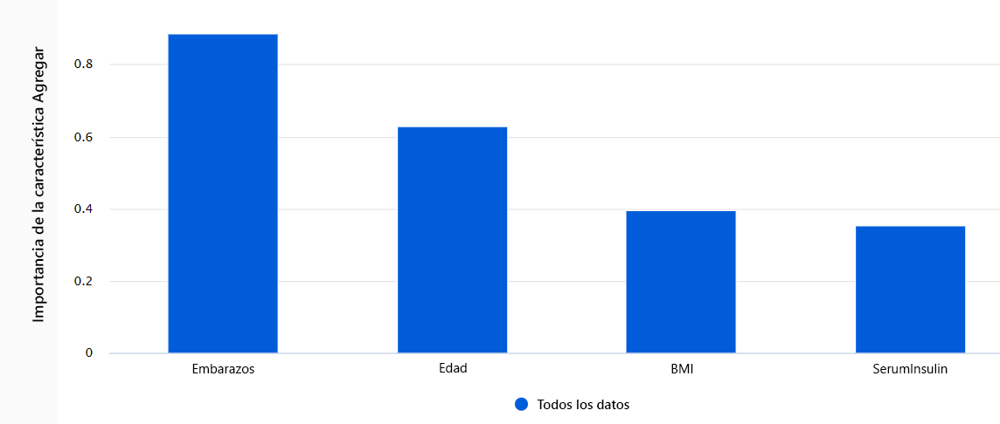
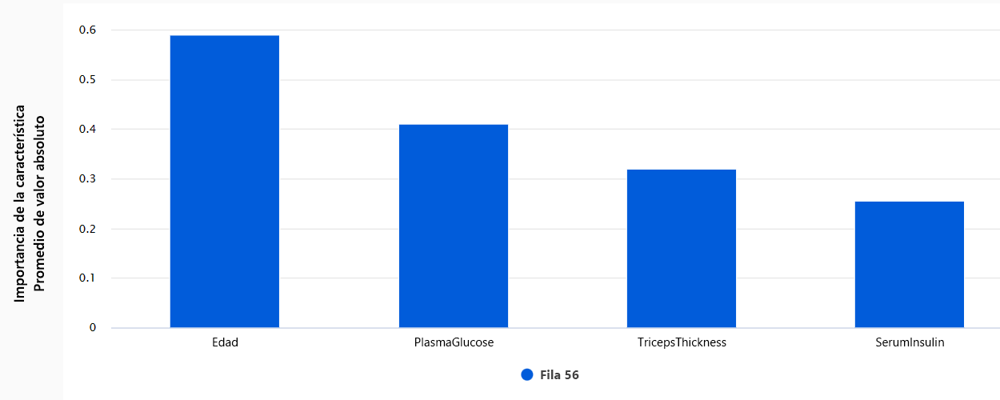

# Crear y explorar el panel de inteligencia artificial responsable para un modelo en Azure Machine Learning

Al entrenar un modelo de aprendizaje automático, puede experimentar con varios modelos para encontrar el que mejor se adapte a los datos. Para comparar y evaluar modelos, puede revisar las métricas de rendimiento pertinentes. Junto a las métricas de rendimiento, también debe revisar si los modelos se ajustan a los principios de inteligencia artificial (IA) responsable. La IA responsable es un enfoque para desarrollar, evaluar e implementar modelos de manera segura, confiable y ética.

Para ayudarle a implementar una inteligencia artificial responsable, Azure Machine Learning ofrece **el panel de IA responsable**. Puede crear y personalizar el panel de inteligencia artificial responsable para explorar los datos y el modelo.

## Descripción de la inteligencia artificial responsable

Como científico de datos, podría entrenar modelos de aprendizaje automático para predecir si alguien será capaz de pagar un préstamo o si un candidato sería adecuado para una vacante de trabajo. A medida que los modelos se usan a menudo para la toma de decisiones, es importante que sean imparciales y transparentes.

Sea lo que sea para lo que use un modelo, debería tener en cuenta los principios de **inteligencia artificial responsable (IA responsable)**. En función del caso de uso, podría centrarse en principios específicos. Sin embargo, se recomienda tener en cuenta todos los principios para asegurarse de que esté solucionando cualquier problema que pudiera tener el modelo.

Microsoft ha enumerado cinco principios de inteligencia artificial responsable:

- `Equidad e inclusión`: los modelos deberían tratar a todos de forma justa y evitar diferentes tratamientos para grupos similares.
- `Confiabilidad y seguridad`: los modelos deberían ser confiables, seguros y coherentes. Querrá que un modelo funcione según lo previsto, controle bien las situaciones inesperadas y resista ante manipulación pudiera hacer daño.
- `Privacidad y seguridad`: sea transparente sobre la recopilación, el uso y el almacenamiento de datos, para capacitar a los usuarios para que tengan control sobre sus datos. Trate los datos con cuidado para garantizar la privacidad de las personas.
- `Transparencia`: cuando los modelos influyen en decisiones importantes que afectan a la vida de las personas, las personas deben comprender cómo se tomaron esas decisiones y cómo funciona el modelo.
- `Responsabilidad`: tome la responsabilidad de aquellas decisiones en las que los modelos pudieran influir y mantenga el control humano.

> Aprenda sobre el [estándar de inteligencia artificial responsable](https://blogs.microsoft.com/wp-content/uploads/prod/sites/5/2022/06/Microsoft-Responsible-AI-Standard-v2-General-Requirements-3.pdf) para la creación de sistemas de inteligencia artificial que estén de acuerdo con los seis principios clave.

## Crear el panel de IA responsable

Para ayudarle a implementar los principios de **inteligencia artificial responsable (IA responsable)** en Azure Machine Learning, puede crear el panel de IA responsable.

El panel de IA responsable le permite elegir la información que necesita para evaluar si su modelo es seguro, confiable y ético.

Azure Machine Learning tiene **componentes** integrados que pueden generar información de IA responsable para usted. A continuación, los datos se recopilan en un panel interactivo que puede explorar. También puede generar un cuadro de mandos como PDF para compartir fácilmente la información con sus compañeros para evaluar los modelos.

## Creación de un panel de IA responsable

Para crear un panel de IA responsable (RAI), es necesario crear una **canalización** utilizando los componentes integrado. La canalización debe:

1. Comience con el `RAI Insights dashboard constructor`.
2. Incluir uno de los **componentes de la herramienta RAI**.
3. Termine con `Gather RAI Insights dashboard` para recopilar todos los datos en un panel.
4. _Opcionalmente_, también puede agregar el `Gather RAI Insights score card` al final de su canalización.

## Explore los componentes de la IA responsable

Los componentes de la herramienta disponibles y la información que puede usar son:

- `Add Explanation to RAI Insights dashboard`: interpretar modelos generando explicaciones. Las explicaciones muestran cuántas características influyen en la predicción.
- `Add Causal to RAI Insights dashboard`: use datos históricos para ver los efectos causales de las características en los resultados.
- `Add Counterfactuals to RAI Insights dashboard`: explore cómo un cambio en la entrada cambiaría la salida del modelo.
- `Add Error Analysis to RAI Insights dashboard`: explore la distribución de sus datos e identifique subgrupos de datos erróneos.

## Compile y ejecute la canalización para crear el panel de IA responsable

Para crear el panel de IA responsable, se compila una canalización con los componentes seleccionados. Al ejecutar la canalización, se genera un panel responsable (y un cuadro de mandos) y se asocia con el modelo.

Después de entrenar y registrar un modelo en el área de trabajo de Azure Machine Learning, puede crear el panel de IA responsable de tres maneras:

- Uso de la extensión interfaz de línea de comandos (CLI) para Azure Machine Learning.
- Uso del kit de desarrollo de software (SDK) de Python.
- Uso del estudio Azure Machine Learning para una experiencia sin código.

## Uso del SDK de Python para compilar y ejecutar la canalización

Para generar un panel de IA responsable, es necesario:

- Registre los conjuntos de datos de entrenamiento y prueba como recursos de datos de MLtable.
- Registre el modelo.
- Recupere los componentes integrados que desee utilizar.
- Compilar la canalización.
- Ejecución de la canalización

Si desea compilar la canalización utilizando el SDK de Python, primero tiene que recuperar los componentes que desea utilizar.

Debe iniciar la canalización con el componente `RAI Insights dashboard constructor`:

```Python
rai_constructor_component = ml_client_registry.components.get(
    name="microsoft_azureml_rai_tabular_insight_constructor", label="latest"
)
```

A continuación, puede agregar cualquiera de las informaciones disponibles, como las explicaciones, recuperando el `Add Explanation to RAI Insights dashboard component`:

```Python
rai_explanation_component = ml_client_registry.components.get(
    name="microsoft_azureml_rai_tabular_explanation", label="latest"
)
```

> Los parámetros y las entradas previstas varían según los componentes. [Explore el componente de la información específica](https://learn.microsoft.com/es-es/azure/machine-learning/how-to-responsible-ai-insights-sdk-cli?view=azureml-api-2&tabs=yaml) que desea agregar a su panel para encontrar las entradas que debe especificar.

Y, por último, la canalización debe terminar con un componente `Gather RAI Insights dashboard`:

```Python
rai_gather_component = ml_client_registry.components.get(
    name="microsoft_azureml_rai_tabular_insight_gather", label="latest"
)
```

Una vez que tenga los componentes, puede compilar la canalización:

```Python
from azure.ai.ml import Input, dsl
from azure.ai.ml.constants import AssetTypes

@dsl.pipeline(
    compute="aml-cluster",
    experiment_name="Create RAI Dashboard",
)
def rai_decision_pipeline(
    target_column_name, train_data, test_data
):
    # Initiate the RAIInsights
    create_rai_job = rai_constructor_component(
        title="RAI dashboard diabetes",
        task_type="classification",
        model_info=expected_model_id,
        model_input=Input(type=AssetTypes.MLFLOW_MODEL, path=azureml_model_id),
        train_dataset=train_data,
        test_dataset=test_data,
        target_column_name="Predictions",
    )
    create_rai_job.set_limits(timeout=30)

    # Add explanations
    explanation_job = rai_explanation_component(
        rai_insights_dashboard=create_rai_job.outputs.rai_insights_dashboard,
        comment="add explanation",
    )
    explanation_job.set_limits(timeout=10)

    # Combine everything
    rai_gather_job = rai_gather_component(
        constructor=create_rai_job.outputs.rai_insights_dashboard,
        insight=explanation_job.outputs.explanation,
    )
    rai_gather_job.set_limits(timeout=10)

    rai_gather_job.outputs.dashboard.mode = "upload"

    return {
        "dashboard": rai_gather_job.outputs.dashboard,
    }
```

## Explore el panel de IA responsable

Después de compilar la canalización, debe ejecutarla para generar el panel de IA responsable. Cuando la canalización se haya completado correctamente, puede seleccionar ver el panel de IA responsable desde la vista general de la canalización.



Alternativamente, puede encontrar el panel de IA responsable en la pestaña de **IA responsable** del modelo registrado.



## Evaluar el panel de IA responsable

Cuando se genere su panel de IA responsable, puede explorar su contenido en el estudio de Azure Machine Learning para evaluar su modelo.

Cuando abres el panel de IA responsable, el estudio intenta conectarlo automáticamente a una instancia de proceso. La instancia de proceso proporciona el proceso necesario para la exploración interactiva en el panel.

La salida de cada componente que agregó a la canalización se refleja en el panel. En función de los componentes seleccionados, puede encontrar la siguiente información en el panel de IA responsable:

- Análisis de errores
- Explicaciones
- Contrafactuales
- Análisis causal

Vamos a explorar lo que podemos revisar para cada una de estas conclusiones.

## Explorar el análisis de errores

Se espera que un modelo realice predicciones falsas o errores. Con la característica de análisis de errores en el panel de IA responsable, puede revisar y comprender cómo se distribuyen los errores en el conjunto de datos. Por ejemplo, ¿hay subgrupos específicos, o cohortes, en su conjunto de datos para los que el modelo hace más predicciones falsas?

Al incluir el análisis de errores, hay dos tipos de objetos visuales que puede explorar en el panel de IA responsable:

- **Mapa de árbol de errores:** permite explorar qué combinación de subgrupos hace que el modelo realice más predicciones falsas.



- **Mapa térmico de errores:** presenta una visión general cuadriculada de los errores de un modelo a escala de una o dos características.



## Exploración de explicaciones

Siempre que se utiliza un modelo para la toma de decisiones, se desea comprender cómo llega un modelo a una predicción determinada. Siempre que haya entrenado un modelo demasiado complejo para entenderlo, puede ejecutar _explicadores de modelos_ para calcular la **importancia de las características**. En otras palabras, quiere comprender cómo cada una de las características de entrada influye en la predicción del modelo.

Existen [varias técnicas estadísticas](https://learn.microsoft.com/es-es/azure/machine-learning/how-to-machine-learning-interpretability?view=azureml-api-2#supported-model-interpretability-techniques) que se pueden utilizar para explicar los modelos. Lo más habitual es que el explicador **mímico** entrene un modelo interpretable simple con los mismos datos y la misma tarea. Como resultado, puede explorar dos tipos de importancia de las características:

- **Importancia agregada de las características:** Muestra cómo influye cada característica de los datos de prueba en las predicciones generales del modelo.



- **Importancia de características individuales:** muestra cómo afecta cada característica a una predicción individual.



## Explorar contrafactuales

Las explicaciones pueden darle una conclusión de la importancia relativa de las características en las predicciones del modelo. A veces, es posible que desee ir un paso más allá y comprender si las predicciones del modelo cambiarían si la entrada fuera diferente. Para explorar cómo cambiaría la salida del modelo en función de un cambio en la entrada, puedes utilizar **contrafactuales**.

Puede elegir explorar ejemplos _hipotéticos contrafactuales_ seleccionando un punto de datos y la predicción del modelo deseado para ese punto. Al crear un escenario hipotético, el panel abre una ventana para ayudarle a comprender qué entrada daría lugar a la predicción deseada.

## Explorar el análisis causal

Las explicaciones y contrafactuales ayudan a comprender las predicciones del modelo y los efectos de las características en las predicciones. Aunque la interpretabilidad del modelo puede ser ya un objetivo en sí mismo, es posible que también necesite más información que le ayude a mejorar la toma de decisiones.

El Análisis causal usa técnicas estadísticas para estimar el efecto medio de una característica en una predicción deseada. Analiza cómo determinadas intervenciones o tratamientos pueden dar lugar a un mejor resultado, en el conjunto de una población o para un individuo concreto.

Hay tres pestañas disponibles en el panel de IA responsable al incluir el análisis causal:

- **Efectos causales agregados:** muestra los efectos causales medios para características de tratamiento predefinidas (las características que desea cambiar para optimizar las predicciones del modelo).
- **Efectos causales individuales:** muestra puntos de datos individuales y permite cambiar las características del tratamiento para explorar su influencia en la predicción.
- **Directiva de tratamiento:** muestra qué partes de sus puntos de datos se benefician más de un tratamiento.

## [EJERCICIO](https://microsoftlearning.github.io/mslearn-azure-ml/Instructions/10-Compare-models.html)
