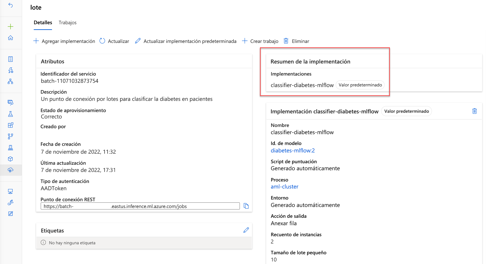
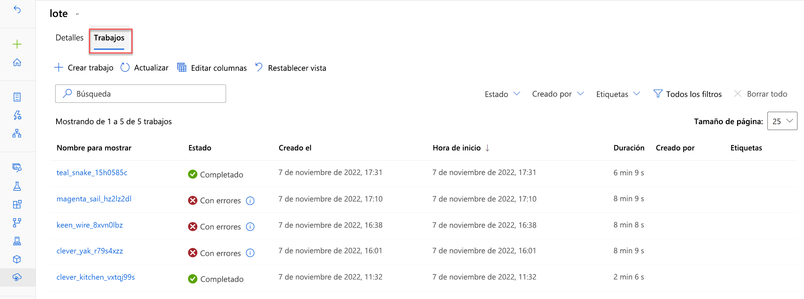
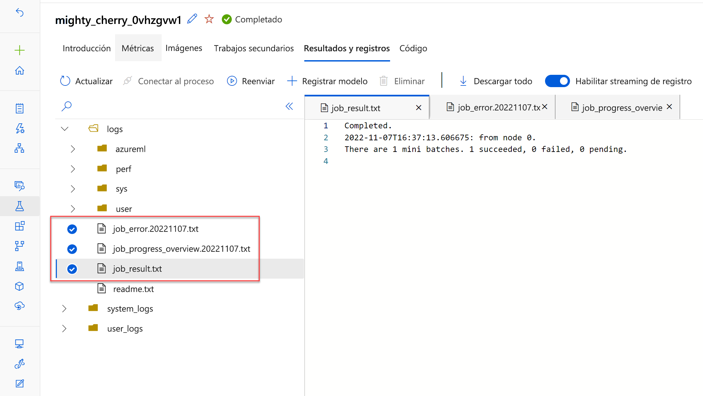

# Implementación de un modelo en un punto de conexión por lotes

Imagine que ha entrenado un modelo para predecir las ventas de productos. Se ha entrenado y realizado un seguimiento del modelo en Azure Machine Learning. Cada mes, quiere usar el modelo para predecir las ventas del próximo mes.

En muchos escenarios de producción, las tareas de ejecución prolongada que tratan con grandes cantidades de datos se realizan como operaciones por lotes. En el aprendizaje automático, la **inferencia por lotes** se usa para aplicar un modelo predictivo a varios casos de forma asincrónica y escribir los resultados en un archivo o base de datos.


## Descripción y creación de puntos de conexión por lotes

Para obtener un modelo para generar predicciones por lotes, puede implementar el modelo en un punto de conexión por lotes.

Aprenderá a usar puntos de conexión por lotes para la puntuación por lotes asincrónica.

## Predicción por lotes

Para obtener predicciones por lotes, puede implementar un modelo en un punto de conexión. Un punto de conexión es un punto de conexión HTTPS al que puede llamar para desencadenar un trabajo de puntuación por lotes. La ventaja de este punto de conexión es que puede desencadenar el trabajo de puntuación por lotes desde otro servicio, como Azure Synapse Analytics o Azure Databricks. Un punto de conexión por lotes permite integrar la puntuación por lotes con una canalización de ingesta y transformación de datos existente.

Cada vez que se invoca el punto de conexión, se envía un trabajo de puntuación por lotes al área de trabajo de Azure Machine Learning. Normalmente, el trabajo usa un clúster de proceso para puntuar varias entradas. Los resultados se pueden almacenar en un almacén de datos, conectado al área de trabajo de Azure Machine Learning.

## Creación de un punto de conexión por lotes

Para implementar un modelo en un punto de conexión por lotes, primero tendrá que crear el punto de conexión por lotes.

Para crear un punto de conexión por lotes, usará la clase BatchEndpoint. Los nombres de punto de conexión deben ser únicos dentro de una región de Azure.

Para crear un punto de conexión, use el siguiente comando:

```Python
# create a batch endpoint
endpoint = BatchEndpoint(
    name="endpoint-example",
    description="A batch endpoint",
)

ml_client.batch_endpoints.begin_create_or_update(endpoint)
```

> Explore la documentación de referencia para [crear un punto de conexión por lotes con el SDK v2 de Python](https://learn.microsoft.com/es-es/python/api/azure-ai-ml/azure.ai.ml.entities.batchendpoint?view=azure-python).

## Implementación de un modelo en un punto de conexión por lotes

Puede implementar varios modelos en un punto de conexión por lotes. Siempre que llame al punto de conexión por lotes, que desencadena un trabajo de puntuación por lotes, se usará la **implementación predeterminada**, a menos que se especifique lo contrario.



## Uso de clústeres de proceso para implementaciones por lotes

El proceso ideal para usar para las implementaciones por lotes es el clúster de proceso de Azure Machine Learning. Si desea que el trabajo de puntuación por lotes procese los nuevos datos en lotes paralelos, debe aprovisionar un clúster de proceso con más de una instancia máxima.

Para crear un clúster de proceso, puede usar la clase `AMLCompute`.

```Python
from azure.ai.ml.entities import AmlCompute

cpu_cluster = AmlCompute(
    name="aml-cluster",
    type="amlcompute",
    size="STANDARD_DS11_V2",
    min_instances=0,
    max_instances=4,
    idle_time_before_scale_down=120,
    tier="Dedicated",
)

cpu_cluster = ml_client.compute.begin_create_or_update(cpu_cluster)
```

## Implementación del modelo de MLflow en un punto de conexión por lotes

Una manera sencilla de implementar un modelo en un punto de conexión por lotes es usar un modelo de MLflow. Azure Machine Learning generará automáticamente el script de puntuación y el entorno para los modelos de MLflow.

> Para implementar un modelo de MLflow, debe haber creado un punto de conexión. A continuación, puede implementar el modelo en el punto de conexión.

## Registro de un modelo de MLflow

Para evitar la necesidad de un entorno y un script de puntuación, es necesario registrar un modelo de MLflow en el área de trabajo de Azure Machine Learning para poder implementarlo en un punto de conexión por lotes.

Para registrar un modelo de MLflow, usará la clase `Model`, mientras se especifica que el tipo de modelo sea `MLFLOW_MODEL`. Para registrar el modelo con el SDK de Python, puede usar el código siguiente:

```Python
from azure.ai.ml.entities import Model
from azure.ai.ml.constants import AssetTypes

model_name = 'mlflow-model'
model = ml_client.models.create_or_update(
    Model(name=model_name, path='./model', type=AssetTypes.MLFLOW_MODEL)
)
```

En este ejemplo, vamos a tomar los archivos de modelo de una ruta de acceso local. Todos los archivos se almacenan en una carpeta local denominada `model`. La carpeta debe incluir el archivo `MLmodel`, que describe cómo se puede cargar y usar el modelo.

> Obtenga más información sobre el [formato MLmodel.](https://learn.microsoft.com/es-es/azure/machine-learning/concept-mlflow-models?view=azureml-api-2#the-mlmodel-format?azure-portal=true)

## Implementación de un modelo de MLflow en un punto de conexión

Para implementar un modelo de MLflow en un punto de conexión por lotes, usará la clase `BatchDeployment`.

Al implementar un modelo, deberá especificar cómo desea que se comporte el trabajo de puntuación por lotes. La ventaja de usar un clúster de proceso para ejecutar el script de puntuación (generado automáticamente por Azure Machine Learning), es que puede ejecutar el script de puntuación en instancias independientes en paralelo.

Al configurar la implementación del modelo, puede especificar:

- `instance_count`: recuento de nodos de proceso que se van a usar para generar predicciones.
- `max_concurrency_per_instance`: número máximo de ejecuciones de script de puntuación en paralelo por nodo de proceso.
- `mini_batch_size`: número de archivos pasados en cada ejecución del script de puntuación.
- `output_action`: qué hacer con las predicciones (`summary_only` o `append_row`).
- `output_file_name`: archivo al que se anexarán las predicciones, si elige `append_row` para `output_action`.

Para implementar un modelo de MLflow en un punto de conexión por lotes, puede usar el código siguiente:

```Python
from azure.ai.ml.entities import BatchDeployment, BatchRetrySettings
from azure.ai.ml.constants import BatchDeploymentOutputAction

deployment = BatchDeployment(
    name="forecast-mlflow",
    description="A sales forecaster",
    endpoint_name=endpoint.name,
    model=model,
    compute="aml-cluster",
    instance_count=2,
    max_concurrency_per_instance=2,
    mini_batch_size=2,
    output_action=BatchDeploymentOutputAction.APPEND_ROW,
    output_file_name="predictions.csv",
    retry_settings=BatchRetrySettings(max_retries=3, timeout=300),
    logging_level="info",
)
ml_client.batch_deployments.begin_create_or_update(deployment)
```

## Implementación de un modelo personalizado en un punto de conexión por lotes

Si desea implementar un modelo en un punto de conexión por lotes sin usar el formato del modelo de MLflow, debe crear el script de puntuación y el entorno.

Para implementar un modelo, debe haber creado un punto de conexión. A continuación, puede implementar el modelo en el punto de conexión.

## Creación del script de puntuación

El script de puntuación es un archivo que lee los nuevos datos, carga el modelo y realiza la puntuación.

El script de puntuación debe incluir dos funciones:

- `init()`: se le llama una vez al principio del proceso, por lo que se usa para cualquier preparación costosa o común, como cargar el modelo.
- `run()`: se le llama para cada minilote para realizar la puntuación.

El método `run()` debe devolver un DataFrame de Pandas o una matriz o lista.

Un script de puntuación puede tener el siguiente aspecto:

```Python
import os
import mlflow
import pandas as pd


def init():
    global model

    # get the path to the registered model file and load it
    model_path = os.path.join(os.environ["AZUREML_MODEL_DIR"], "model")
    model = mlflow.pyfunc.load(model_path)


def run(mini_batch):
    print(f"run method start: {__file__}, run({len(mini_batch)} files)")
    resultList = []

    for file_path in mini_batch:
        data = pd.read_csv(file_path)
        pred = model.predict(data)

        df = pd.DataFrame(pred, columns=["predictions"])
        df["file"] = os.path.basename(file_path)
        resultList.extend(df.values)

    return resultList
```

Hay algunas cosas que se deben tener en cuenta en el script de ejemplo:

- `AZUREML_MODEL_DIR` es una variable de entorno que puede usar para buscar los archivos asociados al modelo.
- Use la variable `global` para que los recursos estén disponibles para puntuar los nuevos datos, como el modelo cargado.
- El tamaño de `mini_batch` se define en la configuración de implementación. Si los archivos del minilote son demasiado grandes para procesarse, debe dividir los archivos en archivos más pequeños.
- De forma predeterminada, las predicciones se escribirán en un único archivo.

> Obtenga más información sobre cómo [crear scripts de puntuación para implementaciones por lotes](https://learn.microsoft.com/es-es/azure/machine-learning/how-to-batch-scoring-script?view=azureml-api-2&tabs=cli).

## Creación de un entorno

La implementación requiere un entorno de ejecución en el que ejecutar el script de puntuación. Cualquier dependencia que requiera el código debe incluirse en el entorno.

Puede crear un entorno con una imagen de Docker con dependencias de Conda o con Dockerfile.

También tendrá que agregar la biblioteca `azureml-core`, ya que es necesaria para el funcionamiento de las implementaciones por lotes.

Para crear un entorno mediante una imagen base de Docker, puede definir las dependencias de Conda en un archivo `conda.yaml`:

```YML
name: basic-env-cpu
channels:
  - conda-forge
dependencies:
  - python=3.8
  - pandas
  - pip
  - pip:
      - azureml-core
      - mlflow
```

A continuación, para crear el entorno, ejecute el código siguiente:

```Python
from azure.ai.ml.entities import Environment

env = Environment(
    image="mcr.microsoft.com/azureml/openmpi3.1.2-ubuntu18.04",
    conda_file="./src/conda-env.yml",
    name="deployment-environment",
    description="Environment created from a Docker image plus Conda environment.",
)
ml_client.environments.create_or_update(env)
```

## Configuración y creación de la implementación

Por último, puede configurar y crear la implementación con la clase `BatchDeployment`.

```Python
from azure.ai.ml.entities import BatchDeployment, BatchRetrySettings
from azure.ai.ml.constants import BatchDeploymentOutputAction

deployment = BatchDeployment(
    name="forecast-mlflow",
    description="A sales forecaster",
    endpoint_name=endpoint.name,
    model=model,
    compute="aml-cluster",
    code_path="./code",
    scoring_script="score.py",
    environment=env,
    instance_count=2,
    max_concurrency_per_instance=2,
    mini_batch_size=2,
    output_action=BatchDeploymentOutputAction.APPEND_ROW,
    output_file_name="predictions.csv",
    retry_settings=BatchRetrySettings(max_retries=3, timeout=300),
    logging_level="info",
)
ml_client.batch_deployments.begin_create_or_update(deployment)
```

> Explore la documentación de referencia para [crear una implementación por lotes con el SDK v2 de Python](https://learn.microsoft.com/es-es/python/api/azure-ai-ml/azure.ai.ml.entities.batchdeployment?view=azure-python).

## Invocación y solución de problemas de puntos de conexión por lotes

Al invocar un punto de conexión por lotes, se desencadena un **trabajo de canalización** de Azure Machine Learning. El trabajo esperará un parámetro de entrada que apunte al conjunto de datos que desea puntuar.

## Desencadenamiento del trabajo de puntuación por lotes

Para preparar los datos para las predicciones por lotes, puede registrar una carpeta como un recurso de datos en el área de trabajo de Azure Machine Learning.

A continuación, puede usar el recurso de datos registrado como entrada al invocar el punto de conexión por lotes con el SDK de Python:

```Python
from azure.ai.ml import Input
from azure.ai.ml.constants import AssetTypes

input = Input(type=AssetTypes.URI_FOLDER, path="azureml:new-data:1")

job = ml_client.batch_endpoints.invoke(
    endpoint_name=endpoint.name,
    input=input)
```

Puede supervisar la ejecución del trabajo de canalización en Estudio de Azure Machine Learning. Todos los trabajos que se desencadenan invocando el punto de conexión por lotes se mostrarán en la pestaña **Trabajos** del punto de conexión por lotes.



Las predicciones se almacenarán en el almacén de datos predeterminado.

## Solución de problemas de un trabajo de puntuación por lotes

El trabajo de puntuación por lotes se ejecuta como un **trabajo de canalización**. Si desea solucionar problemas del trabajo de canalización, puede revisar sus detalles y los resultados y registros del propio trabajo de canalización.

Si desea solucionar problemas del script de puntuación, puede seleccionar el trabajo secundario y revisar sus salidas y registros.

Vaya a la pestaña Salidas y registros. La carpeta logs/user/ contiene tres archivos que le ayudarán a solucionar problemas:

- `job_error.txt`: resume los errores del script.
- `job_progress_overview.txt`: proporciona información detallada sobre el número de minilotes procesados hasta el momento.
- `job_result.txt`: muestra errores al llamar a la función `init()` y `run()` en el script de puntuación.



## [EJERCICIO](https://microsoftlearning.github.io/mslearn-azure-ml/Instructions/11-Deploy-batch-endpoint.html)
