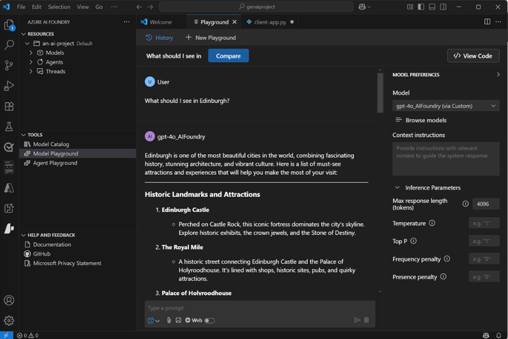

# Planeamiento y preparación para desarrollar soluciones de IA en Azure

Significa que los desarrolladores están cada vez más obligados a crear **soluciones completas de inteligencia artificial**. Estas soluciones deben combinar modelos de aprendizaje automático, servicios de inteligencia artificial, soluciones de ingeniería rápidas y código personalizado.

## ¿Qué es la inteligencia artificial?

- El término "Inteligencia artificial" (IA) abarca una amplia gama de funcionalidades de software que permiten a las aplicaciones mostrar un comportamiento similar al humano.
- En el panorama actual, las soluciones de inteligencia artificial se basan en el aprendizaje automático modelos que encapsulan relaciones semánticas encontradas en grandes cantidades de datos
- Entre las funcionalidades comunes de inteligencia artificial que los desarrolladores pueden integrar en una aplicación de software se incluyen:

| Capacidad                         | Descripción                                                                                                                                                                               |
| --------------------------------- | ----------------------------------------------------------------------------------------------------------------------------------------------------------------------------------------- |
| IA Generativa                     | La capacidad de generar respuestas originales a indicaciones en lenguaje natural                                                                                                          |
| Agentes                           | Aplicaciones de IA generativas que pueden responder a la entrada del usuario o evaluar situaciones de forma autónoma y tomar las medidas adecuadas                                        |
| Visión por computadora            | La capacidad de aceptar, interpretar y procesar entradas visuales de imágenes, vídeos y secuencias de cámara en directo                                                                   |
| Discurso                          | La capacidad de reconocer y sintetizar voz                                                                                                                                                |
| Procesamiento de lenguaje natural | La capacidad de procesar lenguaje natural en formato escrito o hablado, analizarlo, identificar puntos clave y generar resúmenes o categorizaciones                                       |
| Extracción de información         | La capacidad de usar computer vision, voz y procesamiento de lenguaje natural para extraer información clave de documentos, formularios, imágenes, grabaciones y otros tipos de contenido |
| Soporte de decisiones             | La capacidad de usar datos históricos y correlaciones aprendidas para realizar predicciones que admitan la toma de decisiones empresariales                                               |

## Un vistazo más detallado a la IA generativa

La inteligencia artificial generativa **usa modelos de lenguaje para responder a mensajes de lenguaje natural**, lo que le permite crear aplicaciones y agentes conversacionales que admiten la investigación, la creación de contenido y la automatización de tareas de maneras que antes eran inimaginables.

Los modelos de lenguaje que se usan en las soluciones de IA generativa pueden ser:
- LLM *(Modelos de lenguaje grandes)*
- SLA *(Modelos de lenguaje pequeños)*

> Recientemente tambien se encuentran modelos para controlar solicitudes de **imagen o voz** y responder mediante la generación de texto, código, voz o imágenes

---

## Servicios de Azure AI

Microsoft Azure proporciona una **amplia gama de servicios en la nube** que puede usar para desarrollar, implementar y administrar una solución de inteligencia artificial

| Servicio                                    | Descripción                                                                                                                                                                                                                                                                                                                                                                                                                   |
| ------------------------------------------- | ----------------------------------------------------------------------------------------------------------------------------------------------------------------------------------------------------------------------------------------------------------------------------------------------------------------------------------------------------------------------------------------------------------------------------- |
| Azure OpenAI                                | Azure OpenAI en **Foundry Models** proporciona acceso a los modelos de IA generativa de *OpenAI*, incluida la *familia GPT *de modelos de lenguaje grande y pequeño y *DALL-E* modelos de generación de imágenes dentro de un servicio en la nube escalable y protegible en Azure.                                                                                                                                            |
| Vision de Azure AI                          | El servicio Azure AI Vision proporciona un conjunto de modelos y API que puede usar para implementar la funcionalidad común de Computer Vision en una aplicación                                                                                                                                                                                                                                                              |
| Voz de Azure AI                             | El servicio de Voz de Azure AI proporciona API que puede usar para implementar **texto a voz y voz a texto**, así como funcionalidades especializadas basadas en voz, como el **reconocimiento de locutores y la traducción**.                                                                                                                                                                                                |
| Lenguaje de Azure AI                        | El servicio Azure AI Language proporciona modelos y API que puede usar para analizar texto de **lenguaje natural** y realizar tareas como la **extracción de entidades**, el **análisis de sentimiento** y el **resumen**                                                                                                                                                                                                     |
| Seguridad del contenido de Azure AI Foundry | La seguridad del contenido de Azure AI Foundry proporciona a los desarrolladores acceso a algoritmos avanzados para procesar imágenes y texto y **marcar contenido potencialmente ofensivo, arriesgado o no deseado**.                                                                                                                                                                                                        |
| Traductor de Azure AI                       | El servicio Azure AI Translator usa modelos de lenguaje de última generación para traducir texto entre un **gran número de idiomas.**                                                                                                                                                                                                                                                                                         |
| Azure AI Face                               | Es una implementación de computer vision especializada que puede **detectar, analizar y reconocer caras humanas**, el acceso a algunas características del servicio AI Face están restringidos a los clientes aprobados.                                                                                                                                                                                                      |
| Azure AI Custom                             | El servicio Custom Vision de Azure AI permite **entrenar y usar modelos de Computer Vision personalizados** para la clasificación de imágenes y la detección de objetos                                                                                                                                                                                                                                                       |
| Inteligencia de Documentos de Azure AI      | Puede usar modelos predefinidos o personalizados para **extraer campos de documentos complejos, como facturas, recibos y formularios.**                                                                                                                                                                                                                                                                                       |
| Descripción del contenido de Azure AI       | El servicio Azure AI *Content Understanding* proporciona funcionalidades de análisis de contenido multi modal que permiten crear modelos para **extraer datos de formularios y documentos, imágenes, vídeos y secuencias de audio**.                                                                                                                                                                                          |
| Azure AI Search                             | Usa una canalización de aptitudes de inteligencia artificial *basada en otros servicios de Azure AI* y código personalizado para extraer información del contenido y **crear un índice que se puede buscar**. se usa normalmente para crear índices vectoriales para los datos que se pueden usar para fundamentar las solicitudes enviadas a modelos generativos de lenguaje de IA, como los proporcionados en Azure OpenAI. |

## Consideraciones para los recursos de los servicios de Azure AI

Para usar los servicios de Azure AI, **cree uno o varios recursos de Azure AI en una suscripción de Azure** e **implemente código** en aplicaciones cliente para consumirlos. En algunos casos, los servicios de inteligencia artificial *incluyen interfaces visuales basadas en web* que puede usar para configurar y probar los recursos

> en la mayoría de los escenarios de desarrollo a gran escala, es mejor aprovisionar recursos de servicios de Azure AI como parte de un centrode Azure Foundry: centralizar el control de acceso y la administración de costos, y facilitar la administración del uso compartido de recursos en función de los proyectos de desarrollo de IA

## ¿Un único servicio o un recurso de varios servicios?

los servicios independientes de Azure AI suelen incluir una SKU de nivel gratuito con funcionalidad limitada, lo que le permite evaluar y desarrollar con el servicio sin costo alguno. Como alternativa, puede aprovisionar un **servicio múltiple servicios** de Azure AI recurso que encapsula los siguientes servicios en un único recurso de Azure:

- Azure OpenAI
- Voz de Azure AI
- Azure AI Vision
- Lenguaje de Azure AI
- Seguridad del contenido de Azure AI Foundry
- Azure AI Traductor
- Inteligencia de documentos de Azure AI
- Descripción del contenido de Azure AI

## Disponibilidad Regional

Algunos servicios y modelos solo están disponibles en un subconjunto de regiones de Azure. Considere la disponibilidad del servicio y las restricciones de cuota regionales de la suscripción al aprovisionar servicios de Azure AI. Use la [tabla de disponibilidad del producto](https://azure.microsoft.com/explore/global-infrastructure/products-by-region/table) para comprobar la disponibilidad regional de los servicios de Azure

## Costos

A medida que planee una solución de inteligencia artificial en Azure, use la documentación de precios de los servicios de Azure AI de para comprender los precios de los servicios de inteligencia artificial que quiere incorporar a la aplicación. Puede usar la [calculadora de precios de Azure](https://azure.microsoft.com/es-es/pricing/calculator?cdn=disable) para calcular los costos que incurrirá el uso esperado.

---

## Azure AI Foundry

Plataforma para el desarrollo de inteligencia artificial en Microsoft Azure. La organización del proyecto, la administración de recursos y las funcionalidades de desarrollo de inteligencia artificial de Azure AI Foundry hace que sea la manera recomendada de crear todas las soluciones más sencillas.

Azure AI Foundry proporciona el *portal de Azure AI Foundry*, una **interfaz visual basada en web** para trabajar con proyectos de INTELIGENCIA ARTIFICIAL. También proporciona la *SDK de Azure AI Foundry*, que puede usar para crear soluciones de inteligencia artificial mediante programación.

## Proyectos de Azure AI Foundry

En Azure AI Foundry, administrará las conexiones de recursos, los datos, el código y otros elementos de la solución de inteligencia artificial en proyectos. Hay dos tipos de proyecto:

### Proyectos de fundición

- Están asociados a un recurso de Azure AI Foundry en una suscripción de Azure
- Compatibilidad con:
  - Los modelos de Azure AI Foundry (incluidos los modelos openAI)
  - El servicio agente de Azure AI Foundry
  - Los servicios de Azure AI
  - Las herramientas para la evaluación y el desarrollo responsable de la inteligencia artificial

> En la mayoría de los casos, el uso de un proyecto Foundry proporciona el nivel adecuado de centralización de recursos y funcionalidades con una cantidad mínima de administración de recursos administrativos.

### Proyectos basados en centros

- Proyectos *basados en hub* están asociados a un recurso del hub de Azure AI en una suscripción de Azure
- Incluyen
  - Un recurso de Azure Foundry
  - Computación administrada
  - Soporte para el desarrollo de *Prompt Flow*
  - Recursos conectados de *Azure Storage* y *Azure Key Vault*

También puede usar recursos del centro de Inteligencia artificial de Azure en el portal de **Azure AI Foundry y en el portal de Azure Machine Learning**, lo que facilita el trabajo en **proyectos colaborativos** que implican a científicos de datos y especialistas en aprendizaje automático, así como a desarrolladores e ingenieros de software de inteligencia artificial.

**¿Qué tipo de proyecto necesito?**

- En general, debería usar un proyecto Foundry si desea desarrollar agentes o trabajar con modelos.
- Use un proyecto basado en concentrador cuando necesite características que no estén disponibles en un proyecto foundry. Consulte la tabla siguiente para obtener más información sobre la disponibilidad de características.

---

## Herramientas y SDK de desarrollo

Aunque puede realizar muchas de las tareas necesarias para desarrollar una solución de inteligencia artificial directamente en el portal de Azure AI Foundry, los desarrolladores también deben escribir, probar e implementar código.

## Herramientas y entornos de desarrollo

los desarrolladores deben elegir uno que admita los lenguajes, los SDK y las API con los que necesitan trabajar y con los que son más cómodos.
- Un desarrollador que se centra en **compilar aplicaciones para Windows con .NET Framework** podría preferir trabajar en un entorno de desarrollo integrado (IDE), como *Microsoft Visual Studio*
- Un desarrollador de **aplicaciones web** que trabaja con una amplia gama de lenguajes y bibliotecas de código abierto podría preferir usar un editor de código como *Visual Studio Code (VS Code)*

## Extensión Azure AI Foundry para Vscode

Puede usar la **extensión Azure AI Foundry** para Visual Studio Code para simplificar las tareas clave en el flujo de trabajo, entre las que se incluyen:
- Creación de un proyecto.
- Selección e implementación de un modelo.
- Prueba de un modelo en el área de juegos.
- Creación de un agente.

## GitHub y GitHub Copilot

Visual Studio y VS Code proporcionan integración nativa con GitHub y acceso a GitHub Copilot; asistente de inteligencia artificial que puede mejorar significativamente la productividad y la eficacia de los desarrolladores.

## Lenguajes de programación, API y SDK

Puede desarrollar aplicaciones de inteligencia artificial con muchos lenguajes de programación y marcos comunes, como **Microsoft C#, Python, Node, TypeScript, Java y otros**. Al compilar soluciones de IA en Azure, algunos SDK comunes que debe considerar instalar y utilizar incluyen:

- La [SDK de Azure AI Foundry](https://learn.microsoft.com/es-es/azure/ai-studio/how-to/develop/sdk-overview?tabs=sync&pivots=programming-language-python) le permite escribir código para **conectarse a proyectos de Azure AI Foundry** y acceder a las conexiones de recursos
- La [API de modelos de Azure AI Foundry](https://learn.microsoft.com/es-es/rest/api/aifoundry/modelinference/) que proporciona una interfaz para trabajar con **puntos de conexión** de modelo de IA generativos hospedados en Azure AI Foundry
- Azure [OpenAI en Azure AI Foundry Models API](https://learn.microsoft.com/es-es/azure/ai-services/openai/reference), que permite crear **aplicaciones de chat** basadas en modelos de OpenAI alojados en Azure AI Foundry.
- [SDK de Azure AI Services](https://learn.microsoft.com/es-es/azure/ai-services/reference/sdk-package-resources?pivots=programming-language-csharp): **bibliotecas específicas** del servicio ai para varios lenguajes de programación y marcos que le permiten consumir recursos de Azure AI Services en su suscripción. También puede usar los Servicios de IA de Azure a través de sus API REST.
- Azure [AI Foundry Agent Service](https://learn.microsoft.com/es-es/azure/ai-foundry/agents/overview), al que se accede a través del SDK de Azure AI Foundry y se puede integrar con marcos como [El kernel semántico](https://learn.microsoft.com/es-es/semantic-kernel/overview/) para crear soluciones completas de agente de IA.

---

## Inteligencia Artificial Responsable

Analicemos algunos principios básicos de la inteligencia artificial responsable que se han adoptado en Microsoft.

### Imparcialidad

**Los sistemas de inteligencia artificial deben tratar a todas las personas de forma justa**. Por ejemplo, supongamos que crea un modelo de aprendizaje automático para admitir una solicitud de aprobación de préstamos para un banco. El modelo debe hacer predicciones sobre si el préstamo debe aprobarse o no sin incorporar ningún sesgo basado en el género, la etnicidad u otros factores que podrían dar lugar a una ventaja o desventaja desleal a grupos específicos de solicitantes.

### Confiabilidad y seguridad

**Los sistemas de inteligencia artificial deben funcionar de forma confiable y segura.** Por ejemplo, considere un sistema de software basado en inteligencia artificial para un vehículo autónomo; o un modelo de aprendizaje automático que diagnostica los síntomas del paciente y recomienda recetas. La inrelibilidad en estos tipos de sistema puede dar lugar a un riesgo considerable para la vida humana.

### Privacidad y seguridad

**Los sistemas de inteligencia artificial deben ser seguros y respetar la privacidad**. Los modelos de aprendizaje automático en los que los sistemas de inteligencia artificial se basan en grandes volúmenes de datos, que pueden contener detalles personales que se deben mantener privados.

### Inclusión

**Los sistemas de inteligencia artificial deben capacitar a todos los usuarios e interactuar con las personas**. La inteligencia artificial debe aportar beneficios a todas las partes de la sociedad, independientemente de la capacidad física, el género, la orientación sexual, la etnicidad u otros factores.

### Transparencia

**Los sistemas de inteligencia artificial deben ser comprensibles.** Los usuarios deben tener en cuenta plenamente el propósito del sistema, cómo funciona y qué limitaciones se pueden esperar.

### Responsabilidad

**Las personas deben ser responsables de los sistemas de inteligencia artificial.** Aunque muchos sistemas de inteligencia artificial parecen funcionar de forma autónoma, en última instancia es responsabilidad de los desarrolladores que entrenaron y validaron los modelos que usan y definieron la lógica que basa las decisiones sobre predicciones del modelo para asegurarse de que el sistema general cumple los requisitos de responsabilidad.

---

## [Ejercicio -  Prepare for an AI development project](https://microsoftlearning.github.io/mslearn-ai-studio/Instructions/01-Explore-ai-studio.html)

