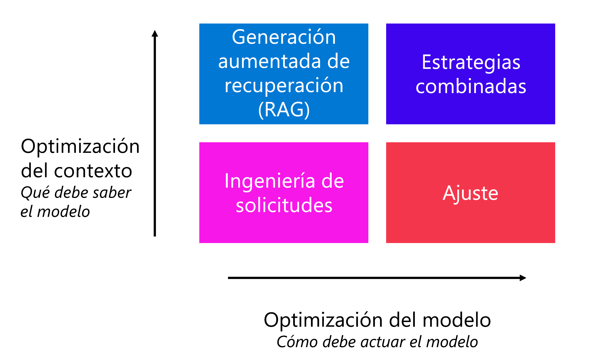

# Exploración e implementación de modelos desde el catálogo de modelos en el portal de Azure AI Foundry

Los modelos básicos, como GPT-4, son modelos de procesamiento del lenguaje natural de última generación diseñados para comprender el lenguaje humano, generarlo e interactuar con él.

## Descripción del procesamiento del lenguaje natural

- **Conversión de voz a texto y texto a voz**. Por ejemplo, al generar subtítulos para vídeos.
- **Traducción automática**. Por ejemplo, al traducir texto del inglés al japonés.
- **Clasificación de texto**. Por ejemplo, al etiquetar un correo electrónico como correo no deseado o correo deseado.
- **Extracción de entidades**. Por ejemplo, al extraer palabras clave o nombres de un documento.
- **Resumen de texto**. Por ejemplo, al generar un breve resumen de un párrafo a partir de un documento de varias páginas.
- **Respuesta a preguntas**. Por ejemplo, al proporcionar respuestas a preguntas como "¿Cuál es la capital de Francia?"
- **Razonamiento**. Por ejemplo, resuelva un problema matemático.

## Descripción de la importancia de la arquitectura *Transformer*

El último avance en el **procesamiento del lenguaje natural (NLP)** se debe al desarrollo de la arquitectura del **Transformador**.

Los transformadores fueron introducidos en [la ponencia Todo lo que necesita es atención de Vaswani, et al. de 2017.](https://arxiv.org/abs/1706.03762) La arquitectura Transformer proporcionó dos innovaciones a NLP que provocaron la aparición de los modelos básicos:

- En lugar de procesar las palabras secuencialmente, las arquitecturas Transformers **procesan cada palabra de forma independiente y en paralelo mediante la atención.**
- Junto a la similitud semántica entre palabras, las arquitecturas Transformers usan la **codificación posicional para incluir la información sobre la posición de una palabra en una oración**.

---

## Exploración de los modelos de lenguaje en el catálogo de modelos

Seleccionar un modelo de lenguaje para la aplicación de IA generativa es importante, ya que afecta al funcionamiento de la aplicación. Al desarrollar una aplicación de inteligencia artificial generativa con Azure AI Foundry, se **crea una aplicación de chat** que puede usar modelos de lenguaje con varios fines:
- Comprender la pregunta del usuario.
- Buscar el contexto pertinente.
- Generar una respuesta a la pregunta del usuario.

## Explorar el catálogo de modelos

En el portal de Azure AI Foundry, puede desplazarse al *catálogo de modelos* para explorar todos los modelos de lenguaje disponibles. Además, podrá importar cualquier modelo desde **la biblioteca de código abierto Hugging Face** al catálogo de modelos.

> Hugging Face es una comunidad de código abierto que hace que los modelos estén disponibles para el público. Ademas, la disponibilidad de los modelos depende en función de la ubicación, tambien denominada región.

## Exploración de los modelos de lenguaje

El modelo seleccionado depende del caso de uso y de las preferencias de implementación. En primer lugar, debe pensar en la tarea que desea que realice el modelo. Por ejemplo:
- Clasificación de textos
- Clasificación de tokens
- Respuesta a preguntas
- Resumen
- Traducción

Estos son algunos modelos de lenguaje que se usan habitualmente para varias tareas:

| Modelo                                                                  | Descripción                                                                                                                                                                                                                                                                                                                                                 |
| :---------------------------------------------------------------------- | :---------------------------------------------------------------------------------------------------------------------------------------------------------------------------------------------------------------------------------------------------------------------------------------------------------------------------------------------------------- |
| BERT (Representaciones de codificador bidireccional de Transformadores) | ** Se centra en la codificación de la información mediante el uso del contexto de antes y después de un token (bidireccional)**. Normalmente, se usa cuando se desea ajustar un modelo para realizar una tarea específica, como la clasificación de texto y la respuesta a preguntas.                                                                       |
| GPT (Transformador generativo previamente entrenado)                    | **Está entrenado para crear texto coherente y relevante contextualmente** y se usa normalmente para tareas como la generación de texto y las finalizaciones de chat.                                                                                                                                                                                        |
| LLaMA (Meta AI de modelos de lenguaje grandes)                          | Familia de modelos creados por Meta. Al entrenar modelos LLaMA, **el enfoque se centró en proporcionar más datos de entrenamiento que aumentar la complejidad de los modelos**. Puede usar modelos LLaMA para la generación de texto y las finalizaciones de chat.                                                                                          |
| Phi-3-mini (variación de parámetros 3.8B de los modelos PHI)            | **Un modelo liviano de última generación optimizado para entornos con restricción de recursos están restringidos e inferencia local (como en un teléfono)**, que admite mensajes de contexto largo de hasta 128 000 tokens. Se ha desarrollado pensando principalmente en la seguridad, la alineación y aprendizaje de refuerzo de los comentarios humanos. |

Después de seleccionar una tarea y filtrar los modelos disponibles adecuados para su objetivo, puede **examinar el resumen del modelo** en Azure AI Foundry para tener en cuenta otras consideraciones:

- **Funcionalidades del modelo:** Evalúe las funcionalidades del modelo de lenguaje y cómo se alinean con su tarea.
- **Datos de entrenamiento previo:** Considere el conjunto de datos que se usa para entrenar previamente el modelo de lenguaje
- **Limitaciones y rangos:** Tenga en cuenta las limitaciones o los sesgos que puedan existir en el modelo de lenguaje
- **Compatibilidad con idiomas:** explore qué modelos ofrecen compatibilidad con idiomas específicos o funcionalidad multilingüe que necesite para su caso de uso.

## Comparación de pruebas comparativas entre modelos

Al explorar modelos de lenguaje, también puede **comparar los bancos de pruebas de modelos disponibles** antes de implementar e integrar cualquiera de los modelos:
- Los bancos de pruebas son tarjetas de informe de los modelos de lenguaje
- Le ayudan a conocer el rendimiento de un modelo
- proporcionan una lista seleccionada de los modelos con un mejor rendimiento para una tarea determinada

Estas son algunas de las métricas que se usan habitualmente para evaluar el rendimiento de los modelos de lenguaje:

| Métrica       | Descripción                                                                                                                                                                                                                                                                                                                                                                           |
| ------------- | ------------------------------------------------------------------------------------------------------------------------------------------------------------------------------------------------------------------------------------------------------------------------------------------------------------------------------------------------------------------------------------- |
| Precisión     | Las puntuaciones de precisión están disponibles a nivel de conjunto de datos y modelo. A nivel de conjunto de datos, la puntuación es el valor medio de una métrica de precisión calculada sobre todos los ejemplos del conjunto de datos. La métrica de precisión usada coincide exactamente en todos los casos excepto en el conjunto de datos HumanEval que usa la métrica pass@1. |
| Coherencia    | La coherencia evalúa en qué medida **el modelo de lenguaje puede producir flujos de salida con facilidad**, que se lean con naturalidad y se asemejen al lenguaje humano.                                                                                                                                                                                                             |
| Fluidez       | La fluidez evalúa el dominio del **idioma de una respuesta predicha** de IA generativa.                                                                                                                                                                                                                                                                                               |
| GPTSimilarity | La similitud de GPT es una medida que **cuantifica la similitud entre una frase verdadera real (o documento) y la frase de predicción generada por un modelo de IA**. Se obtiene calculando primero la computación de inserciones de nivel de frase mediante la API de inserciones para la verdad real y la predicción del modelo.                                                    |
| Base          | La base evalúa el nivel de **alineación de las respuestas** generadas del modelo de lenguaje con la **información del origen** de entrada.                                                                                                                                                                                                                                            |
| Relevancia    | La relevancia evalúa la medida en que las respuestas generadas del modelo de lenguaje **son pertinentes y directamente relacionadas con las preguntas formuladas**.                                                                                                                                                                                                                   |

---

## Implementación de un modelo en un punto de conexión

Al desarrollar una aplicación de IA generativa, debe integrar modelos de lenguaje en la aplicación. Para poder usar un modelo de lenguaje, debe implementar el modelo.

## Descripción del motivo de la implementación de un modelo

Un punto de conexión es una dirección URL específica en la que se puede **acceder a un modelo o servicio implementados**. Actúa como una puerta de enlace para que los usuarios envíen sus solicitudes al modelo y reciban los resultados. Cada implementación de modelo suele tener su propio punto de conexión único, lo que permite que diferentes aplicaciones se comuniquen con el modelo mediante una API (interfaz de programación de aplicaciones).

Al implementar un modelo de lenguaje desde el catálogo de modelos con Azure AI Foundry, **obtendrá un punto de conexión**, que consta de un *URI* de destino (Identificador uniforme de recursos) y una clave única. Por ejemplo, un URI de destino para un modelo GPT-3.5 implementado puede ser el siguiente:

`https://ai-aihubdevdemo.openai.azure.com/openai/deployments/gpt-35-turbo/chat/completions?api-version=2023-03-15-preview`

El URI incluye el **nombre del centro** de inteligencia artificial, el **nombre del modelo implementado** y **especifica lo que quiere que haga el modelo**. En el ejemplo, el modelo GPT-3.5 se usa para la finalización del chat.

Para **proteger los modelos implementados**, cada implementación incluye una **clave**. Solo tiene autorización para enviar y recibir solicitudes a y desde el URI de destino, si también proporciona la clave para autenticarse.

## Implementación de un modelo de lenguaje con Azure AI Foundry

Al implementar un modelo de lenguaje con Azure AI Foundry, tiene varios tipos disponibles, que dependen del modelo que desea implementar:

-Servicio Azure OpenAI para implementar [modelos de Azure OpenAI](https://learn.microsoft.com/es-es/azure/ai-services/openai/concepts/models?tabs=global-standard%2Cstandard-chat-completions).
- Inferencia de modelos de Azure AI para implementar [modelos y modelos de Azure OpenAI como servicio](https://learn.microsoft.com/es-es/azure/ai-foundry/foundry-models/concepts/models).
- API sin servidor para implementar modelos [como servicio](https://learn.microsoft.com/es-es/azure/ai-foundry/concepts/foundry-models-overview#content-safety-for-models-deployed-via-serverless-apis?azure-portal=true).
- Proceso administrado para implementar [modelos personalizados y de código abierto](https://learn.microsoft.com/es-es/azure/ai-foundry/concepts/foundry-models-overview#availability-of-models-for-deployment-as-managed-compute?azure-portal=true).

El costo asociado dependerá del tipo de modelo que implemente, la opción de implementación que elija y lo que está haciendo con el modelo:

| Actividad                    | Modelos de Azure OpenAI                                                             | Inferencia de modelos de Azure AI                                                   | Modelos implementados como API sin servidor (pago por uso)                  | Modelos implementados con proceso administrado por el usuario          |
| :--------------------------- | :---------------------------------------------------------------------------------- | :---------------------------------------------------------------------------------- | :-------------------------------------------------------------------------- | :--------------------------------------------------------------------- |
| Implementación del modelo    | No, no se le factura la implementación de un modelo de Azure OpenAI en el proyecto. | No, no se le factura la implementación de un modelo de Azure OpenAI en el proyecto. | Sí, se te factura mínimamente por la infraestructura del punto de conexión. | Sí, se te factura por minuto la infraestructura que hospeda el modelo. |
| Llamada al punto de conexión | Sí, se le factura según el uso del token.                                           | Sí, se le factura según el uso del token.                                           | Sí, se le factura según el uso del token.                                   | Ninguno.                                                               |

---

## Mejora del rendimiento de un modelo de lenguaje

Cuando quiera que el modelo se personalice en su caso de uso, hay varias estrategias de optimización que puede aplicar para mejorar el rendimiento del modelo. Vamos a explorar las distintas estrategias.

## Chatear con un modelo en el área de juegos

Puede usar el lenguaje de codificación preferido para realizar una llamada API al punto de conexión del modelo, o puede chatear con el modelo directamente en el área de juegos del portal de Azure AI Foundry. **El área de juegos de chat es una manera rápida y sencilla de experimentar y mejorar el rendimiento del modelo.**

El proceso de diseño y optimización de avisos para mejorar el rendimiento del modelo también se conoce como **ingeniería rápida**.

## Aplicar la ingeniería de mensajería

Al chatear con el modelo en el área de juegos, puede aplicar **varias técnicas de ingeniería** rápidas para explorar si mejora la salida del modelo:
- **Proporcionar instrucciones claras:** Sea específico sobre la salida que desee.
- **Dar formato a las instrucciones:** Use encabezados y delineadores para facilitar la lectura de la pregunta.
- **Usar indicaciones:** Proporcione palabras clave o indicadores para cómo debe iniciar el modelo su respuesta, como un lenguaje de codificación específico.

## Actualización del mensaje del sistema

En el área de juegos de chat, puede ver el JSON de la **conversación actual** seleccionando *Mostrar JSON*:

> El **mensaje del sistema** siempre forma parte de los datos de entrada. Aunque no es visible para los usuarios finales, el mensaje del sistema le permite como desarrollador personalizar el comportamiento del modelo proporcionando instrucciones para su comportamiento.

Algunas **técnicas comunes de ingeniería de avisos** para aplicar como desarrollador mediante la actualización del mensaje del sistema son:

- **Use una toma o pocas tomas:** Proporcione uno o varios ejemplos para ayudar al modelo a identificar un patrón deseado. Puede agregar una sección al mensaje del sistema para agregar uno o varios ejemplos.
- **Use una Cadena de pensamiento:** Guíe el modelo para razonar paso a paso instruyendo que piense en la tarea.
- **Agregar contexto:** Mejore la precisión del modelo proporcionando información contextual o en segundo plano relevante para la tarea. Puede proporcionar contexto a través de los datos de puesta a tierra proporcionados en el símbolo del sistema del usuario o conectando su propio origen de datos.

## Aplicación de estrategias de optimización de modelos

Como desarrollador, también puede aplicar otras estrategias de optimización para mejorar el rendimiento del modelo, sin tener que pedir al usuario final que escriba mensajes específicos. Junto a solicitar ingeniería, la estrategia que elija depende de sus requisitos:

- **Optimizar para contexto:** Cuando el modelo carece de conocimiento contextual y desea maximizar la precisión de las respuestas.
- **Optimice el modelo:** Cuando quiera mejorar el formato de respuesta, el estilo o la voz maximizando la coherencia del comportamiento.

Para optimizar el contexto, puede aplicar **un patrón de generación aumentada de recuperación (RAG)**. Con RAG, usted basa sus datos recuperando primero el contexto de una fuente de datos antes de generar una respuesta.

Cuando desee que el modelo responda en un estilo o formato específico, puede indicar al modelo que lo haga **agregando instrucciones en el mensaje del sistema**. Cuando observe que el comportamiento del modelo no es coherente, **puede aplicar más coherencia en el comportamiento ajustando un modelo**. Entrene un modelo de lenguaje base en un conjunto de datos antes de integrarlo en la aplicación.

---

## [Ejercicio - Exploración, Implementación y chat con modelos de lenguaje](https://microsoftlearning.github.io/mslearn-ai-studio/Instructions/02-Explore-model-catalog.html)