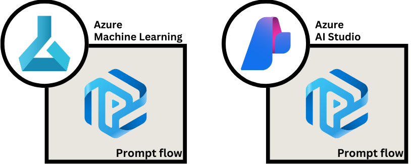
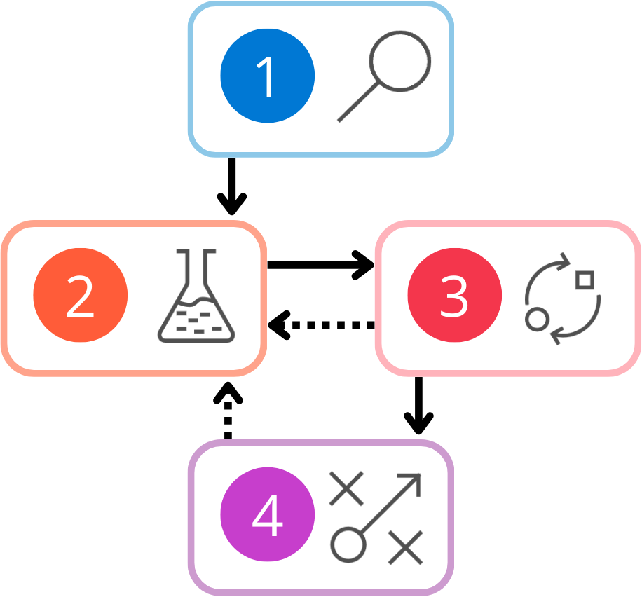
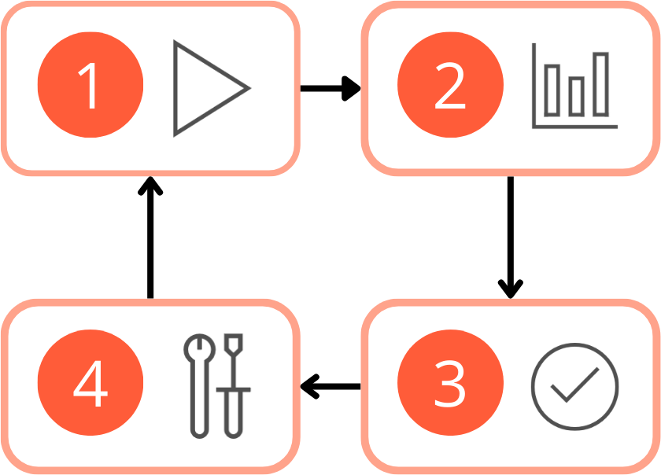
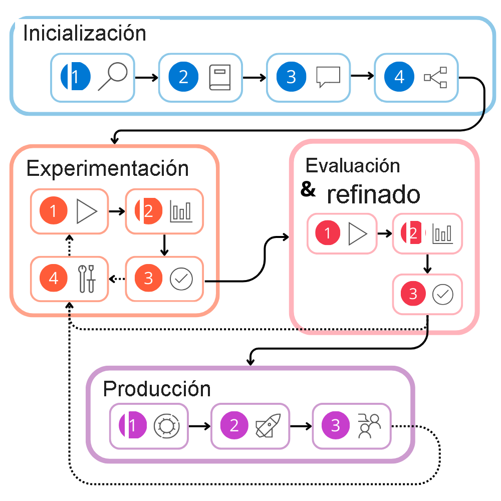
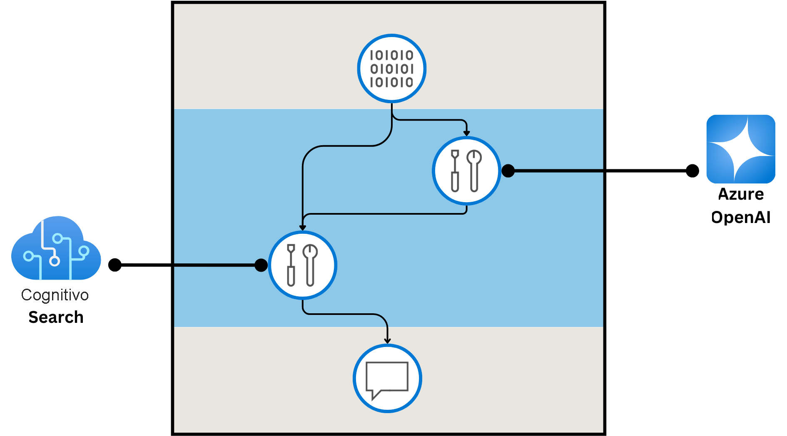
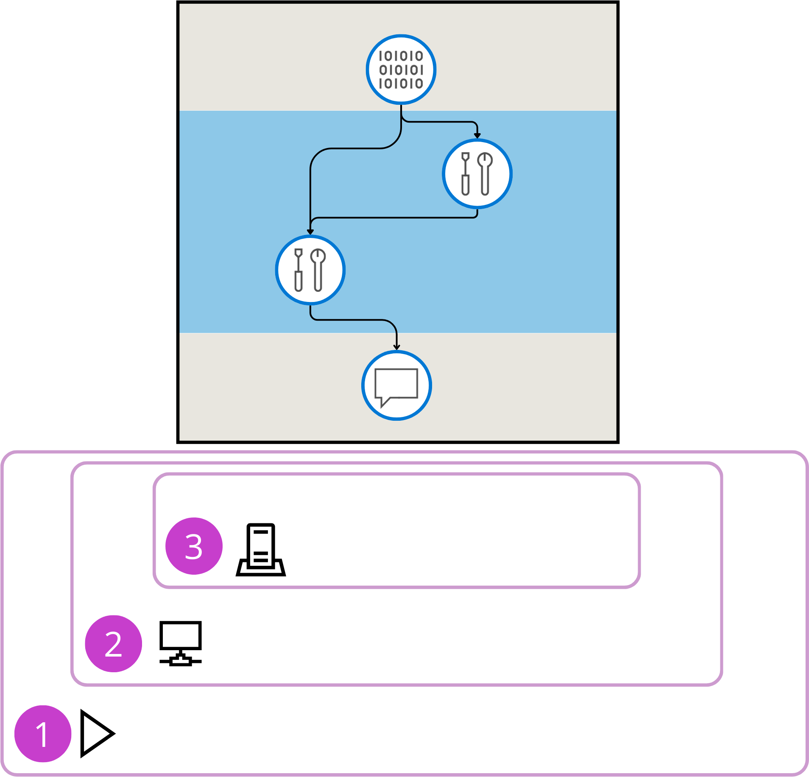

# Introducción al flujo de prompts para desarrollar aplicaciones de modelos lingüísticos en Inteligencia artificial de Azure Studio

**La verdadera eficacia de los modelos de lenguaje grande (LLM) se encuentra en su aplicación**. Tanto si quiere usar LLM para clasificar páginas web en categorías como para crear un bot de chat con los datos. Para aprovechar la eficacia de los LLM disponibles, debe crear una aplicación que combine los orígenes de datos con los LLM y genere la salida deseada. Para desarrollar, probar, ajustar e implementar con *LLM*, puedes usar el flujo de prompts, accesible en [Estudio de Azure Machine Learning](https://learn.microsoft.com/es-es/azure/machine-learning/prompt-flow/overview-what-is-prompt-flow?view=azureml-api-2) e [Inteligencia artificial de Azure Studio](https://learn.microsoft.com/es-es/azure/ai-foundry/concepts/prompt-flow)

El flujo de prompts toma una **solicitud como entrada**, que en el contexto de los LLM hace referencia a la **consulta proporcionada a la aplicación** LLM para generar una respuesta. **Es el texto o conjunto de instrucciones** que se proporcionan a la aplicación LLM, que pide a esta que genere la salida o realice una tarea específica.

## Descripción del ciclo de vida de desarrollo de una aplicación de modelo de lenguaje grande (LLM)

El ciclo de vida consta de las siguientes fases:

1. **Inicialización:** defina el caso de uso y diseñe la solución
2. **Experimentación:** desarrolle un flujo y pruebe con un conjunto de datos pequeño
3. **Evaluación y refinamiento:** evalúe el flujo con un conjunto de datos mayor
4. **Producción:** implemente y supervise el flujo y la aplicación

Durante la evaluación y el refinamiento y la producción, es posible que encuentre que la solución debe mejorarse.

### Inicialización

Imagine que desea diseñar y desarrollar una aplicación LLM para clasificar artículos de noticias. Antes de empezar a crear algo:
- Debe definir qué categorías desea como salida
- Debe comprender el aspecto de un artículo de noticias típico
- Cómo presentar el artículo como entrada a la aplicación
- Cómo la aplicación genera la salida deseada.

1. Definición del **objetivo**
2. Recopilación de un **conjunto de datos de ejemplo**
3. Construye un **prompt básico**
4. Diseño del **flujo**

### Experimentación

- **Ha recopilado un conjunto de datos** de ejemplo de artículos de noticias y ha decidido en qué categorías desea que los artículos se clasifiquen.
- **Diseñó un flujo** que toma un artículo de noticias como entrada y usa un LLM para clasificar el artículo.

Para probar si el flujo genera la salida esperada, ejecútelo en el conjunto de datos de ejemplo.

Este es un proceso iterativo hasta llegar a la satisfacción entre el modelo con su conjunto de datos.

### Evaluación y refinamiento

Puede evaluar el modelo con un conjunto de datos **mas grande**. De esta manera **generalizamos las respuestas del LLM**. Este punto permite identificar *cuellos de botella o areas de optimización o refinamiento*.

Al **editar el flujo, debe volver a probarlo con el conjunto de datos mas pequeño**, esto evitara sesgos en los análisis,

### Producción

Cuando este lista para producción...

Durante la producción, usted:

1. **Optimice** el flujo que clasifica los artículos entrantes para mejorar la eficiencia y la eficacia
2. **Implementar** el flujo en un **punto de conexión**
3. **Supervise** el rendimiento de la solución mediante **la recopilación de datos de uso y comentarios de los usuarios finales**

## Explora el ciclo de vida completo del desarrollo

---

## Comprender los componentes principales y exploración de los tipos de flujo

Para crear una aplicación de modelo de lenguaje grande (LLM) con un flujo de prompts, debe comprender los componentes principales del flujo de avisos.

## Comprender el flujo

Los flujos son flujos de trabajo ejecutables que a menudo constan de tres partes:

- **Entradas:** Representan los datos **pasados al flujo**. Pueden ser diferentes tipos de datos, como cadenas, enteros o booleanos.
- **Nodos:** Representa **herramientas** que realizan el procesamiento de datos, la ejecución de tareas o las operaciones algorítmicas.
- **Salidas:** Representa los **datos generados** por el flujo.

## Explorar las herramientas disponibles en el flujo de prompts

Tres herramientas comunes son:

- **Herramienta LLM:** Habilita la creación de prompts personalizados mediante modelos de lenguaje grande.
- **Herramienta Python:** Permite la ejecución de scripts personalizados de Python.
- **Herramienta de prompt:** Prepare prompts como cadenas para escenarios complejos o la integración con otras herramientas.

> Ademas, puede [crear su propia herramienta](https://microsoft.github.io/promptflow/how-to-guides/develop-a-tool/create-and-use-tool-package.html) en caso de no quedar satisfecho con las de por defecto

## Comprender los tipos de flujos

Hay tres tipos diferentes de flujos que puede crear con el flujo de avisos:

- **Flujo estándar:** Ideal para el **desarrollo general** de aplicaciones basadas en LLM, ya que ofrece una serie de herramientas versátiles.
- **Flujo de chat:** Diseñado para **aplicaciones conversacionales**, con compatibilidad mejorada para funcionalidades relacionadas con el chat.
- **Flujo de evaluación:** Centrado en la **evaluación del rendimiento, permite el análisis y la mejora de modelos o aplicaciones** a través de comentarios sobre ejecuciones anteriores.

---

## Exploración de conexiones y runtime

Al crear aplicaciones de modelo de lenguaje grande (LLM) con flujo de prompts, primero se deben configurar las conexiones y los runtime necesarios.

## Exploración de conexiones

Siempre que desee que el flujo se conecte al origen de datos externo, al servicio o a la API:
- Será necesario que **el flujo esté autorizado** para comunicarse con ese servicio externo.
- Cuando se crea una conexión, **se configura un vínculo seguro** entre el flujo de avisos y los servicios externos

> Los secretos necesarios no se exponen a los usuarios, sino que se almacenan en una instancia de Azure Key Vault.

Algunas herramientas integradas requieren que tenga configurada una conexión:

| Tipo de conexión | Herramientas Integradas                      |
| ---------------- | -------------------------------------------- |
| Azure OpenAI     | LLM o Python                                 |
| Open AI          | LLM o Python                                 |
| Cognitive Search | Búsqueda de base de datos vectorial o Python |
| Serp             | API de Serp o Python                         |
| Personalizado    | Python                                       |

- **Automatizan la administración de credenciales** de API, simplificando y protegiendo el control de información de acceso confidencial.
- **Permiten la transferencia de datos segura** desde varios orígenes, algo fundamental para mantener la integridad de los datos y la privacidad en distintos entornos.

## Exploración del runtime

Despues de crear el prompt y configurar las conexiones necesarias que usan las herramientas, ejecute el flujo. Para ello, **se necesita de un proceso**, que se ofrece a través de **runtime** de flujo de prompts

1. Combinación de una **instancia de proceso**
2. Proporciona recursos de proceso necesarios
3. **Entorno** que especifica paquetes y bibliotecas necesarias

> Cuando se usa runtime, se tiene un entorno controlado para la ejecución de flujos.

---

## Exploración de variantes y opciones de supervisión

Durante la producción, quiere optimizar e implementar el flujo. Por último, quiere supervisar los flujos para saber cuándo es necesario mejorarlos.

Para optimizar el flujo puede usar **variantes**, puede implementarlo en un **punto de conexión** y puede supervisarlo mediante la evaluación de **métricas clave**.

## Exploración de variantes

Las variantes de flujo de promtps **son versiones de un nodo de herramienta** con distintas configuraciones. Actualmente solo admitidas en herramientas *LLM*, donde la variante puede representar:
- contenido de solicitud
- configuración de conexión

Algunas ventajas de las variantes son:
- **Mejorar la calidad de la generación de LLM:** la creación de diversas variantes de un nodo LLM ayuda a encontrar la mejor solicitud y configuración para el contenido de alta calidad.
- **Ahorrar tiempo y esfuerzo:** las variantes permiten **administrar y comparar de forma sencilla diferentes versiones de solicitudes**, lo que simplifica el seguimiento histórico y reduce el trabajo para optimizarlas.
- **Aumentar la productividad:** las variantes **simplifican la optimización de los nodos LLM**, lo que permite crear y administrar de forma más rápida las variaciones y así obtener mejores resultados en menos tiempo.
- **Facilitar la comparación:** las variantes permiten **comparaciones de resultados en paralelo**, lo que ayuda a elegir la variante más eficaz en función de decisiones basadas por datos.

## Implementación del flujo en un punto de conexión

Cuando esté satisfecho con el rendimiento del flujo, puede optar por implementarlo en un **punto de conexión en línea**. Los puntos de conexión son direcciones *URL* que puede llamar desde cualquier aplicación. Al invocar el punto de conexión:
- Se ejecuta un flujo
- La salida se devuelve en tiempo real. 

## Supervisión de métricas de evaluación

Para saber si la aplicación satisface las necesidades prácticas:
- Puede recopilar comentarios del usuario final y evaluar la utilidad de esta.
- comparar las predicciones de LLM con las respuestas de **verificación en tierra** para medir la precisión y la relevancia

## Métricas

- **Fundamentación:** mide la alineación de la **salida** de la aplicación de LLM con el **origen de entrada** o la base de datos.
- **Relevancia:** evalúa cómo de **pertinente** es la salida de la aplicación de LLM para la entrada especificada.
- **Coherencia:** evalúa el **flujo lógico y la legibilidad del texto** de la aplicación de LLM.
- **Fluidez:** evalúa la **precisión gramatical y lingüística** de la salida de la aplicación de LLM.
- **Similitud:** cuantifica la **coincidencia contextual y semántica** entre la salida de la aplicación de LLM y la verificación en tierra.

---

## [Ejercicio - Intro al flujo de prompts](https://microsoftlearning.github.io/mslearn-ai-studio/Instructions/03-Use-prompt-flow-chat.html)