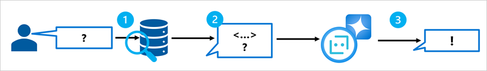
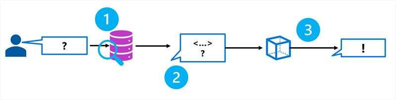
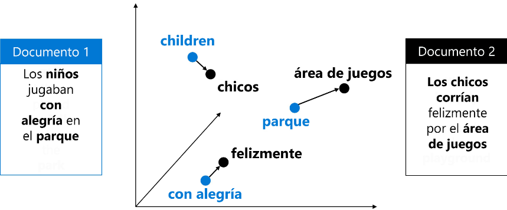
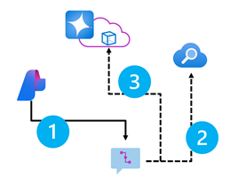
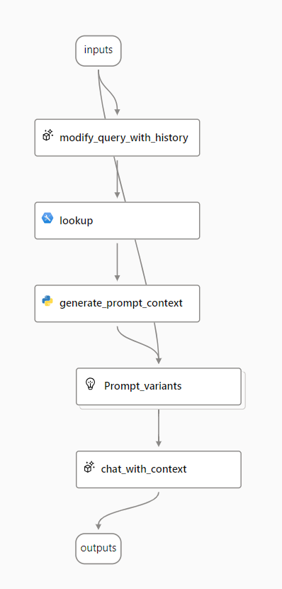

# Desarrollo de una solución basada en RAG con sus propios datos mediante Azure AI Foundry

Los modelos de lenguaje crecen en popularidad a medida que crean respuestas coherentes impresionantes a las preguntas de un usuario. Especialmente cuando un usuario interactúa con un modelo de lenguaje desde el chat, proporciona una manera intuitiva de obtener la información que necesita.

## Preguntas y respuestas sin fundamento

Un modelo de lenguaje se basa en **los datos en los que se entrenó**. Un gran volumen de **texto no contextualizado** de internet o de algún otro origen.

## Preguntas y respuestas con fundamento

Puede ser un **origen de datos para fundamentar la solicitud** con un contexto relevante.

---

## Comprender cómo fundamentar tu modelo de lenguaje

- Los LLM son ideales como base para los agentes, **por su generación de textos**.
- Los agentes generan aplicaciones intuitivas basadas en chat.

Para asegurarse que un agente tenga **acceso a los datos fundamentados** que se necesitan, puede usar la **Generación Aumentada de Recuperación *(RAG)***.

## Descripción de RAG

**Tecnica para establecer un modelo de lenguaje.** Recuperar información relevante, generalmente con el siguiente esquema



1. **Recuperar** datos de base en función de la solicitud inicial especificada por el usuario
2. **Aumentar** el mensaje con datos de base
3. **Usar** un modelo de lenguaje para **generar** una respuesta con base.

> Ayuda a reforzar las respuestas, no solo basandose en los datos de entrenamiento

## Agregar datos de base a un proyecto de Azure AI

Puede usar Azure AI Foundry para crear un agente personalizado que **use sus propios datos para las indicaciones de base.** Con las siguientes conexiones:

- Azure Blob Storage *(Servicio de almacenamiento de blobs de Azure)*
- Azure Data Lake Storage Gen2
- Microsoft OneLake

---

## Hacer que los datos se puedan encontrar

Al crear un agente con *Azure AI Foundry*, puede integrarse con *Azure AI Search* para recuperar el contexto pertinente en el flujo de chat.
- Permitiendo traer tus propios datos
- Indexar tus datos
- Consultar el índice para **recuperar información que necesites**



## Usando un índice vectorial

- Mejora la eficacia de busqueda mediante **vectores e inserciones** que representan los *tokens* de texto en el origen de datos.
- Una **inserción** es un formato especial de representación de datos que un motor de busqueda usa para recuperar fácilmente información pertinente
- Una **inserción** es un vector de un números de punto flotante



La **similitud coseno** (distancia entre vectores) calcula la **similitud semántica entre documentos y consulta**

> Permite extracción pertinente de contextos de los datos

Cuando quieras poder usar el vector de búsqueda para buscar los datos, debes **crear inserciones** al crear el índice de búsqueda. Para crear **embeddings** para su índice de búsqueda, puede usar un modelo de embeddings de Azure OpenAI disponible en Azure AI Foundry.

## Creación de un índice de búsqueda

Un índice de búsqueda describe cómo se organiza el contenido para que se puedan realizar búsquedas en él. Mediante *Azure AI Foundry* se facilita la creación de un índice adecuado para los motores de lenguaje.

## Busqueda de un índice

Varias maneras de consultar información en un índice:

- **Búsqueda de palabras clave:** identifica los documentos o pasajes pertinentes en función de palabras clave o términos específicos proporcionados como entrada.
- **Búsqueda semántica:** recupera documentos o pasajes mediante la comprensión del significado de la consulta y su coincidencia con contenido relacionado semánticamente en lugar de confiar únicamente en coincidencias exactas de palabras clave.
- **Vector de búsqueda:** usa representaciones matemáticas del texto (vectores) para buscar documentos o pasajes similares en función de su significado semántico o contexto.
- **Búsqueda híbrida:** Combina cualquiera o todas las demás técnicas de búsqueda. Las consultas se ejecutan en paralelo y se devuelven en un conjunto de resultados unificado.

> Cuando los resultados de la búsqueda se usan en una aplicación de IA generativa, **la búsqueda híbrida proporciona los resultados más precisos.**

**La busqueda híbrida** es una combinación de palabras clave (y texto completo) y vector de búsqueda, a la que se agrega *opcionalmente la clasificación semántica*

---

## Creación de una aplicación cliente basada en RAG

el SDK de Azure OpenAI admite ampliar la solicitud con detalles de conexión para el índice. El patrón para usar este enfoque al trabajar con un proyecto de Azure AI Foundry se muestra en el diagrama siguiente.



1. Use un cliente de proyecto de *Azure AI Foundry* para **recuperar los detalles de conexión** del índice de *Azure AI Search* y un objeto **ChatClient** de *OpenAI*.
2. Agregue la información de conexión de índice a la configuración de **ChatClient** para que se pueda buscar datos de base en función del mensaje del usuario.
3. **Envíe el mensaje fundamentado** al modelo de *Azure OpenAI* para generar una respuesta contextualizada.

Como se implementaría con Python:

```Python
from openai import AzureOpenAI

# Get an Azure OpenAI chat client
chat_client = AzureOpenAI(
    api_version = "2024-12-01-preview",
    azure_endpoint = open_ai_endpoint,
    api_key = open_ai_key
)

# Initialize prompt with system message
prompt = [
    {"role": "system", "content": "You are a helpful AI assistant."}
]

# Add a user input message to the prompt
input_text = input("Enter a question: ")
prompt.append({"role": "user", "content": input_text})

# Additional parameters to apply RAG pattern using the AI Search index
rag_params = {
    "data_sources": [
        {
            "type": "azure_search",
            "parameters": {
                "endpoint": search_url,
                "index_name": "index_name",
                "authentication": {
                    "type": "api_key",
                    "key": search_key,
                }
            }
        }
    ],
}

# Submit the prompt with the index information
response = chat_client.chat.completions.create(
    model="<model_deployment_name>",
    messages=prompt,
    extra_body=rag_params
)

# Print the contextualized response
completion = response.choices[0].message.content
print(completion)
```

la búsqueda en el índice se basa en palabras clave, es decir, la consulta consta del texto de la entrada del usuario, que coincide con el texto de los documentos indexados.

Cuando se usa un índice que lo admite, un enfoque alternativo consiste en usar una **consulta basada en vectores** en la que el índice y la consulta:
- Usan vectores numéricos para representar tokens de texto.
- La búsqueda con vectores permite la coincidencia en función de la similitud semántica, así como las coincidencias de texto literal.

Para usarla se modifica la especificación de los detalles de origen de datos de *Azure AI Search*, para incluir el modelo de inserción:

```Python
rag_params = {
    "data_sources": [
        {
            "type": "azure_search",
            "parameters": {
                "endpoint": search_url,
                "index_name": "index_name",
                "authentication": {
                    "type": "api_key",
                    "key": search_key,
                },
                # Params for vector-based query
                "query_type": "vector",
                "embedding_dependency": {
                    "type": "deployment_name",
                    "deployment_name": "<embedding_model_deployment_name>",
                },
            }
        }
    ],
}
```

---

## Implementar RAG en un flujo de prompts

- Después de cargar datos en Azure AI Foundry y crear un índice en los datos mediante la integración con Búsqueda de Azure AI, **puede implementar el patrón RAG con el Prompt Flow para crear una aplicación de IA generativa.**
- Un flujo comienza con una o varias entradas, normalmente una pregunta o un aviso introducido por un usuario y, en el caso de conversaciones iterativas, el historial de chat hasta este punto.
- Después, el flujo se define como una serie de herramientas conectadas, cada una de las cuales realiza una operación específica en las entradas y otras variables de entorno.

Entre las herramientas se pueden tener tareas como:

- Ejecución de código de **Python** personalizado
- **Búsqueda** de valores de datos en un índice
- **Creación de variantes de prompt**: le permite definir varias versiones de un prompt para un modelo de lenguaje grande (LLM), diferentes mensajes del sistema o redacción de prompts, y comparar y evaluar los resultados de cada variante.
- **Envío** de un prompt a un LLM para generar resultados.

## Uso del patrón RAG en un flujo de prompts

Se usa la herramienta de **búsqueda de índices** para recuperar datos de un índice, asi las herramientas posteriores podran usar los resultados, para aumentar el prompt usado

## Uso de un ejemplo para crear un flujo del chat

Cuando quiera combinar RAG y un modelo de lenguaje en la aplicación, puede clonar el ejemplo Ronda múltiple de preguntas y respuestas en los datos.



1. **Anexe el historial** a la entrada de chat para definir un prompt como forma contextualizada de una pregunta.
2. **Busque información relevante** de tus datos mediante el índice de búsqueda.
3. **Genere el contexto** de la indicación mediante el uso de los datos recuperados del índice para mejorar la pregunta.
4. **Cree variantes** de prompt agregando un mensaje del sistema y estructurando el historial de chats.
5. **Envíe la indicación** a un modelo de lenguaje para generar una respuesta de lenguaje natural.

### Modificación de la consulta con historial

toma el historial de chat y la última pregunta del usuario y genera una nueva pregunta que incluye toda la información necesaria.

### Búsqueda de información relevante

Usará la herramienta *Index Lookup* para realizar consultas en el índice de búsqueda que creó con la característica integrada Búsqueda de *Azure AI* y encontrar la información relevante de su origen de datos

### Generación de contexto para la indicación

- **La salida de la herramienta Index Lookup es el contexto** recuperado que desea usar al generar una respuesta al usuario. Quiere usar la salida en una indicación que se envía a un modelo de lenguaje, lo que significa que desea analizar la salida en un formato más adecuado.
- Al generar el contexto de la indicación, puede usar un **nodo de Python** para iterar los documentos recuperados del origen de datos y combinar su contenido y orígenes en una cadena de documento.

### Definir variantes de la indicación

El objetivo es fundamentar las respuestas del bot de chat. Además de recuperar el contexto relevante de la fuente de datos, también puede influir en la fundamentación de la respuesta del chatbot al indicarle que utilice el contexto y procure ser factual.

### Chatear con contexto

Use un nodo LLM para enviar la indicación a un modelo de lenguaje para generar una respuesta mediante el contexto pertinente recuperado del origen de datos. La respuesta de este nodo también es la salida de todo el flujo.

Después de configurar el flujo de chat de ejemplo para usar los datos indexados y el modelo de lenguaje que elija, puede implementar el flujo e integrarlo con una aplicación para ofrecer a los usuarios una experiencia agente.

---

## [Ejercicio - Creación de una aplicación de IA generativa que use sus propios datos](https://microsoftlearning.github.io/mslearn-ai-studio/Instructions/04-Use-own-data.html)