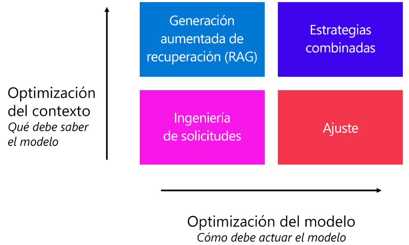

# Ajuste de un modelo de lenguaje con Azure AI Foundry

Hay varias estrategias para optimizar el comportamiento del modelo y el rendimiento de la aplicación de chat. **Una estrategia consiste en ajustar un modelo de lenguaje**, que puede integrar con la aplicación de chat. La ventaja de realizar un ajuste fino en lugar de entrenar un modelo de lenguaje propio es que **necesita menos tiempo**, recursos computacionales y datos para personalizar el modelo según sus necesidades.

## Comprender cuándo optimizar un modelo de lenguaje

Para mejorar la calidad de las respuestas que genera el modelo, puede probar varias estrategias. La estrategia más sencilla es aplicar la **ingeniería rápida.** Puede cambiar la forma en que da formato a la pregunta, pero también puede **actualizar el mensaje del sistema** que se envía junto con el mensaje al modelo de lenguaje.

Existen dos técnicas comunes que se usan:
- **Generación Aumentada mediante Recuperación (RAG):** Fundamente sus datos recuperando primero el contexto de un origen de datos antes de generar una respuesta.
- **Ajuste preciso:** Entrene un modelo de lenguaje base en un conjunto de datos antes de integrarlo en la aplicación



La forma en que el modelo debe actuar principalmente se relaciona con el estilo, el formato y el tono de las respuestas generadas por un modelo. Cuando desee que el modelo se ajuste a un estilo y formato específicos al responder, puede indicar al modelo que lo haga también a través de la ingeniería de indicaciones.

---

## Preparación de los datos para optimizar un modelo de finalización de chat

La calidad del conjunto de datos tiene un gran efecto en la calidad del modelo. **Aunque se necesitan menos datos que cuando se entrena un modelo lingüístico desde cero**, es posible que aún se necesiten datos suficientes para maximizar la coherencia del comportamiento del modelo deseado. La cantidad de datos que necesita depende de su caso de uso.

Los datos deben tener 3 componentes:
- Mensaje del sistema
- El mensaje del usuario
- La respuesta del asistente

Las tres variables se unen en un archivo `JSON Lines o JSONL`. Por ejemplo, una línea de este conjunto de datos podría ser similar a la siguiente:

```JSON
{"messages": 
    [
    {
        "role": "system",
        "content": "You are an Xbox customer support agent whose primary goal is to help users with issues they are experiencing with their Xbox devices. You are friendly and concise. You only provide factual answers to queries, and do not provide answers that are not related to Xbox."
    },
    {
        "role": "user",
        "content": "Is Xbox better than PlayStation?"
    }, 
    {
        "role": "assistant", 
        "content": "I apologize, but I cannot provide personal opinions. My primary job is to assist you with any issues related to your Xbox device. Do you have any Xbox-related issues that need addressing?"
    }
    ]
}
```

Algunas cosas que hay que tener en cuenta cuando se usan datos reales son:

- Quite cualquier información personal o confidencial.
- No solo hay que centrarse en crear un gran conjunto de datos de entrenamiento, sino también en asegurarse de que el conjunto de datos incluye un conjunto diverso de ejemplos.

Si desea optimizar solo mensajes del asistente específicos, puede usar opcionalmente el par clave-valor `weight`. **Cuando el peso se establece en 0, el mensaje se omite; cuando se establece en 1, el mensaje se incluye para el entrenamiento.**

Un ejemplo de un formato de archivo de chat de varios turnos con pasos:

```JSON
{
    "messages": [
        {
            "role": "system",
            "content": "Marv is a factual chatbot that is also sarcastic."
        }, 
        {
            "role": "user", 
            "content": "What's the capital of France?"
        }, 
        {
            "role": "assistant", 
            "content": "Paris", 
            "weight": 0
        }, 
        {
            "role": "user", 
            "content": "Can you be more sarcastic?"
        }, 
        {
            "role": "assistant", 
            "content": "Paris, as if everyone doesn't know that already.", 
            "weight": 1
        }
        ]
}
```

Al preparar el conjunto de datos para optimizar un modelo de lenguaje, debe comprender los comportamientos deseados del modelo, crear un conjunto de datos en formato JSONL y asegurarse de que los ejemplos que incluye son de alta calidad y diversos.

---

## Exploración de modelos de lenguaje de optimización de inteligencia artificial de Azure Studio

Cuando quiera optimizar un modelo de lenguaje, puede usar un modelo base que ya esté entrenado previamente sobre grandes cantidades de datos. Hay muchos modelos base disponibles mediante **el catálogo de modelos de Inteligencia artificial de Azure Studio**. Puede optimizar los modelos base en varias tareas:
- La clasificación de texto
- La traducción
- La realización de chats.

> Para optimizar un modelo de lenguaje del catálogo de modelos del portal de Azure AI Foundry, puede usar la interfaz de usuario proporcionada en el portal.

## Selección del modelo base

Puede filtrar los modelos disponibles en función de la tarea para la que desea ajustar un modelo. Estos son algunos aspectos que puede tener en cuenta a la hora de decidirse por un modelo base antes de optimizarlo:

- **Funcionalidad del modelo:** evalúe la funcionalidad del modelo base y hasta qué punto está en consonancia con la tarea. *Por ejemplo, un modelo como BERT es mejor para el reconocimiento de textos cortos.*
- **Datos del entrenamiento previo:** tenga en cuenta el conjunto de datos que se ha usado para entrenar previamente el modelo base. *Por ejemplo, GPT-2 se entrena con contenido de Internet sin filtrar que puede dar lugar a sesgos.*
- **Limitaciones y sesgos:** tenga en cuenta las limitaciones o sesgos que pueda haber en el modelo base.
- **Compatibilidad con idiomas:** explore qué modelos ofrecen compatibilidad con idiomas específicos o funcionalidad multilingüe que necesite para su caso de uso.

## Configuración del trabajo de optimización

1. Seleccione un modelo base.
2. Seleccione los datos de entrenamiento.
3. *(Opcional)* Seleccione los datos de validación.
4. Configure las opciones avanzadas.

Al enviar un modelo para optimizarlo, el modelo pasa por un entrenamiento adicional con los datos. Para configurar el trabajo de optimización o entrenamiento, puede especificar las siguientes **opciones avanzadas:**

| Nombre                     | Descripción                                                                                                                                                                                                                                                                                   |
| -------------------------- | --------------------------------------------------------------------------------------------------------------------------------------------------------------------------------------------------------------------------------------------------------------------------------------------- |
| `batch_size`               | El **tamaño del lote** a usar para el entrenamiento. El tamaño del lote es el número de ejemplos de entrenamiento usados para entrenar una sola pasada hacia adelante y hacia atrás. En general, los tamaños de lote más grandes tienden a funcionar mejor con conjuntos de datos más grandes |
| `learning_rate_multiplier` | El multiplicador de la **tasa de aprendizaje** que se usará para el entrenamiento. La velocidad de aprendizaje de optimización es la velocidad de aprendizaje original que se usa para el entrenamiento previo multiplicado por este valor.                                                   |
| `n_epochs`                 | El número de épocas para entrenar el modelo. **Una época se refiere a un ciclo completo** a través del conjunto de datos de entrenamiento.                                                                                                                                                    |
| `seed`                     | La inicialización controla la **reproducibilidad del trabajo.** Pasar los mismos parámetros de inicialización y trabajo debe generar los mismos resultados, pero puede diferir en raras ocasiones.                                                                                            |

- Después de enviar el trabajo de optimización, se crea un trabajo para entrenar el modelo. Puede revisar el estado del trabajo mientras se ejecuta.
- Si agregó un conjunto de datos de validación, puede revisar el rendimiento del modelo explorando cómo funcionó con el conjunto de datos de validación.

---

## [Ejercicio - Ajuste de un modelo base](https://microsoftlearning.github.io/mslearn-ai-studio/Instructions/05-Finetune-model.html)