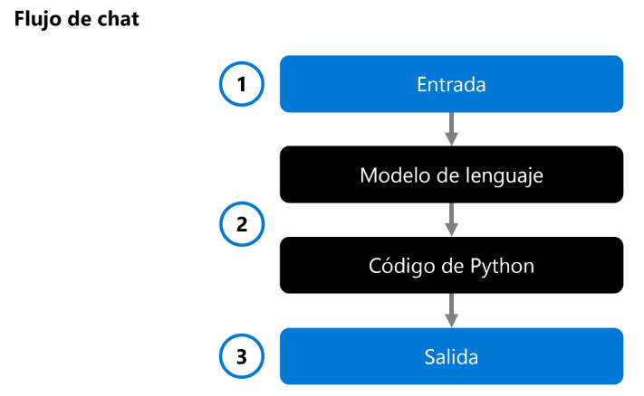

# Evaluación del rendimiento de la inteligencia artificial generativa en el porta de Azure AI Foundry

Al evaluar el rendimiento de su aplicación, puede identificar y solucionar cualquier problema, asegurándose de que proporciona respuestas precisas y relevantes. *Las respuestas de alta calidad llevan a mejorar la satisfacción del usuario.*

## Evaluación del rendimiento del modelo

Para ayudarle a **decidir qué modelo** desea integrar en la aplicación, puede evaluar el rendimiento de un modelo de lenguaje individual:

1. Se proporciona una entrada
2. A un modelo de Lenguaje
3. Genera una respuesta como salida

Se puede evaluar mediante el análisis de entrada, la salida, y opcionalmente, la comparación con la salida predefinida esperada. Al desarrolla la app de IA, puede integrar un modelo de lenguaje en un flujo de chat:

Un flujo de chat permite orquestar flujos ejecutables que pueden combinar **varios modelos de lenguaje y código de Python.** Vamos a explorar varios enfoques para evaluar el modelo y el flujo de chat, o la aplicación de inteligencia artificial generativa.

## Bancos de pruebas de modelos

- Son métricas disponibles públicamente entre modelos y conjuntos de datos.
- Ayudan a comprender cómo funciona el modelo en relación con otros usuarios

Algunos puntos de referencia usados habitualmente incluyen:
- **Exactitud:** Compara el texto generado por el modelo con la respuesta correcta según el conjunto de datos. El resultado es uno si el texto generado coincide exactamente con la respuesta y cero de lo contrario.
- **Coherencia:** Mide si la salida del modelo **fluye sin problemas**, lee de forma natural y se parece al lenguaje similar al humano.
- **Fluidez:** Evalúa la forma en que el texto generado cumple **las reglas gramaticales**, las estructuras sintácticas y el uso adecuado del vocabulario, lo que da lugar a respuestas lingüísticas correctas y de sonido natural.
- **Similitud GPT:** Cuantifica la **similitud semántica** entre una frase de verdad básica (o documento) y la frase de predicción generada por un modelo de IA.

## Evaluaciones manuales

Implican evaluadores humanos que evalúan la calidad de las respuestas del modelo. Este enfoque proporciona información sobre los aspectos que podrían perderse las métricas automatizadas, como la **relevancia del contexto y la satisfacción del usuario**.

## Métricas asistidas por IA

- **Métricas de calidad de generación:** Estas métricas evalúan la calidad general del texto generado, teniendo en cuenta factores como la creatividad, la coherencia y el cumplimiento del estilo o tono deseados.
- **Métricas de riesgo y seguridad:** Estas métricas evalúan los posibles riesgos y problemas de seguridad asociados a las salidas del modelo. Ayudan a garantizar que el modelo no genere contenido perjudicial o sesgado.

## Métricas de procesamiento de lenguaje natural

Una de estas métricas es la **puntuación F1**, que mide la **proporción del número de palabras compartidas** entre las **respuestas de verdad** fundamentada generadas. La puntuación F1 es útil para tareas como *la clasificación de texto y la recuperación de información*, donde la precisión y la recuperación son importantes. Otras métricas comunes de NLP incluyen:
- **BLEU:** Métrica del subestudio de evaluación bilingüe
- **METEOR:** Métrica para la evaluación de la traducción con ordenación explícita
- **ROUGE:** Subestudio orientado a la recuperación para la evaluación clave

---

## Evaluar manualmente el rendimiento de un modelo

Para evaluar fácilmente si el modelo de lenguaje seleccionado y la aplicación, creados con el flujo de avisos, cumplen sus requisitos, puede evaluar manualmente los modelos y flujos en el portal de Azure AI Foundry.

## Prepara tus indicaciones de prueba

Para comenzar el proceso de evaluación manual, es esencial preparar un conjunto diverso de prompts de prueba que reflejen el intervalo de consultas y tareas que se espera que la aplicación controle.

## Probar el modelo seleccionado en el área de juegos de chat

Al desarrollar una aplicación de chat, se usa un modelo de lenguaje para generar una respuesta. Para crear una aplicación de chat, desarrolle un flujo de prompts **que encapsula la lógica de la aplicación de chat**, que puede usar varios modelos de lenguaje para generar en última instancia una respuesta a una pregunta del usuario.

## Evaluación de varias solicitudes con evaluaciones manuales

El área de juegos de chat es una manera fácil de empezar. Cuando quiera evaluar manualmente varias solicitudes más rápidamente, puede usar la característica evaluaciones manuales. Esta característica permite **cargar un conjunto de datos con varias preguntas** y, opcionalmente, agregar una **respuesta esperada para evaluar el rendimiento** del modelo en un conjunto de datos de prueba mayor.

Puede evaluar las respuestas del modelo con la función de **pulgar arriba o abajo**. En función de la clasificación general, puede intentar mejorar el modelo cambiando el mensaje de entrada, el mensaje del sistema, el modelo o los parámetros del modelo.

---

## Evaluaciones automatizadas

Le permiten evaluar el rendimiento de calidad y seguridad del contenido de los modelos, conjuntos de datos o flujos de solicitud.

## Datos de evaluación

Para evaluar un modelo, necesita un conjunto de datos de solicitudes y respuestas (y, opcionalmente, las respuestas esperadas como "verdad básica"). Puede compilar este conjunto de datos manualmente o usar la salida de una aplicación existente; **pero una manera útil de empezar es usar un modelo de IA para generar un conjunto de mensajes y respuestas relacionados con un tema específico.**

## Métricas de evaluación

La evaluación automatizada le permite **elegir qué evaluadores** desea evaluar las respuestas del modelo y qué métricas deben calcular esos evaluadores. Hay evaluadores que le ayudan a medir:

- **Calidad de IA:** la calidad de las respuestas del modelo se mide mediante el **uso de modelos de IA** para evaluarlas en métricas como la coherencia y la relevancia, y mediante el uso de métricas estándar de NLP, como la **puntuación F1, BLEU, METEOR y ROUGE**, basándose en la verdad de referencia (en forma de texto esperado de respuesta)
- **Riesgo y seguridad:** evaluadores que evalúan las respuestas para **problemas de seguridad de contenido**, como la violencia, el odio, el contenido sexual y el contenido relacionado con el autolesión.

---

## [Ejercicio - Evaluación del rendimiento del modelo de IA generativo](https://microsoftlearning.github.io/mslearn-ai-studio/Instructions/07-Evaluate-prompt-flow.html)