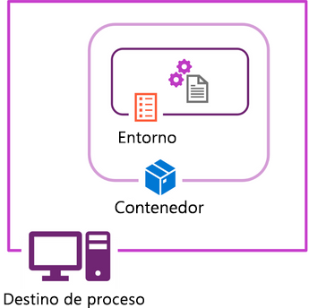

# Trabajo con entornos de Azure Machine Learning

Para ejecutar código, debe asegurarse de tener instalados las bibliotecas, las dependencias y los paquetes necesarios en el recurso de proceso que va a usar para ejecutar el código. En Azure Machine Learning, los entornos enumeran y almacenan los paquetes necesarios que puede reutilizar en los destinos de proceso.

## Información sobre los entornos

En una solución de aprendizaje automático para empresas, donde es posible que los experimentos se ejecuten en diversos contextos de proceso, puede ser importante tener en cuenta los entornos en los que se ejecuta el código del experimento. Puede usar los entornos de Azure Machine Learning para crear entornos y especificar la configuración en tiempo de ejecución de un experimento.

Cuando crea un área de trabajo de Azure Machine Learning, se crean entornos mantenidos automáticamente y se ponen a su disposición. También puede crear y administrar sus propios entornos personalizados y registrarlos en el área de trabajo. La creación y el registro de entornos personalizados permite definir contextos en tiempo de ejecución coherentes y reutilizables para los experimentos, independientemente de dónde se ejecute el script del experimento.

## ¿Qué es un entorno en Azure Machine Learning?

El código de Python se ejecuta en el contexto de un entorno virtual que define la versión del tiempo de ejecución de Python que se va a usar, así como los paquetes instalados disponibles para el código. En la mayoría de las instalaciones de Python, los paquetes se instalan y administran en entornos con `conda` o `pip`.

Para mejorar la portabilidad, normalmente se crean entornos en contenedores de Docker que, a su vez, se hospedan en destinos de proceso, como el equipo de desarrollo, máquinas virtuales o clústeres en la nube.



Azure Machine Learning compila definiciones de entorno en imágenes de Docker y entornos de Conda. Cuando usa un entorno, Azure Machine Learning crea el entorno en Azure Container Registry asociado al área de trabajo.

> Cuando crea un área de trabajo de Azure Machine Learning, puede elegir si desea usar una instancia de Azure Container Registry que ya existía o si quiere permitir que el área de trabajo cree un nuevo registro cuando sea necesario.

Para ver todos los entornos disponibles en el área de trabajo de Azure Machine Learning, puede enumerar los entornos en Estudio, mediante la CLI de Azure o con el SDK de Python.

Por ejemplo, para enumerar los entornos usando el SDK de Python:

```Python
envs = ml_client.environments.list()
for env in envs:
    print(env.name)
```

Para revisar los detalles de un entorno específico, puede recuperar el entorno por su nombre registrado:

```Python
env = ml_client.environments.get(name="my-environment", version="1")
print(env)
```

## Exploración y uso de entornos mantenidos

Los entornos mantenidos son entornos precompilados para las cargas de trabajo de aprendizaje automático más comunes y están disponibles en el área de trabajo de forma predeterminada.

Los entornos mantenidos usan el prefijo AzureML- y están diseñados para proporcionar scripts que usan herramientas y marcos de aprendizaje automático populares.

Por ejemplo, hay entornos mantenidos para cuando desea ejecutar un script que entrena un modelo de regresión, agrupación en clústeres o clasificación con scikit-learn.

Para explorar un entorno mantenido, puede verlo en Estudio, mediante la CLI de Azure o con el SDK de Python.

El siguiente comando permite recuperar la descripción y las etiquetas de un entorno mantenido con el SDK de Python:

```Python
env = ml_client.environments.get("AzureML-sklearn-0.24-ubuntu18.04-py37-cpu", version=44)
print(env. description, env.tags)
```

## Uso de un entorno mantenido

Normalmente, se usan entornos cuando se quiere ejecutar un script como un trabajo (de comando).

Para especificar qué entorno desea usar para ejecutar el script, haga referencia al entorno por su nombre y versión.

Por ejemplo, el siguiente código muestra cómo configurar un trabajo de comando con el SDK de Python, que usa un entorno mantenido, incluido scikit-learn:

```Python
from azure.ai.ml import command

# configure job
job = command(
    code="./src",
    command="python train.py",
    environment="AzureML-sklearn-0.24-ubuntu18.04-py37-cpu@latest",
    compute="aml-cluster",
    display_name="train-with-curated-environment",
    experiment_name="train-with-curated-environment"
)

# submit job
returned_job = ml_client.create_or_update(job)
```

## Prueba y solución de problemas de un entorno mantenido

Dado que los entornos mantenidos permiten una implementación más rápida, se recomienda explorar primero si se puede usar uno de los entornos mantenidos ya creados para ejecutar el código.

> Para comprobar si un entorno mantenido incluye todos los paquetes necesarios, revise sus detalles. A continuación, haga una prueba usando el entorno para ejecutar el script.

Si un entorno no incluye todos los paquetes necesarios para ejecutar el código, el trabajo da error.

Cuando un trabajo da error, puede revisar los registros de errores detallados en la pestaña Salidas y registros del trabajo en Estudio de Azure Machine Learning.

Un mensaje de error común que indica que el entorno está incompleto es: `ModuleNotFoundError`. El módulo que no se encuentra aparece en el mensaje de error. Al revisar el mensaje de error, puede actualizar el entorno para incluir las bibliotecas y asegurarse de que los paquetes necesarios están instalados en el destino de proceso antes de ejecutar el código.

Cuando necesite especificar otros paquetes necesarios, puede usar un entorno mantenido como referencia para sus propios entornos personalizados modificando los Dockerfiles que respaldan estos entornos mantenidos.

## Creación y uso de entornos personalizados

Cuando necesite crear su propio entorno en Azure Machine Learning para enumerar todos los paquetes, bibliotecas y dependencias necesarios para ejecutar los scripts, puede crear entornos personalizados.

Puede definir un entorno a partir de una imagen de Docker, un contexto de compilación de Docker y una especificación de Conda con la imagen de Docker.

## Creación de un entorno personalizado a partir de una imagen de Docker

Probablemente, el enfoque más sencillo es crear un entorno a partir de una imagen de Docker. Las imágenes de Docker se pueden hospedar en un registro público, como `Docker Hub` o de forma privada en una instancia de `Azure Container Registry`.

Muchos marcos de código abierto se encapsulan en imágenes públicas que están disponibles en Docker Hub. Por ejemplo, puede encontrar una imagen pública de Docker que contenga todos los paquetes necesarios para entrenar un modelo de aprendizaje profundo con PyTorch.

Para crear un entorno a partir de una imagen de Docker, puede usar el SDK de Python:

```Python
from azure.ai.ml.entities import Environment

env_docker_image = Environment(
    image="pytorch/pytorch:latest",
    name="public-docker-image-example",
    description="Environment created from a public Docker image.",
)
ml_client.environments.create_or_update(env_docker_image)
```

También puede usar las imágenes base de Azure Machine Learning para crear un entorno, que son similares a las imágenes que se usan en entornos mantenidos:

```Python
from azure.ai.ml.entities import Environment

env_docker_image = Environment(
    image="mcr.microsoft.com/azureml/openmpi3.1.2-ubuntu18.04",
    name="aml-docker-image-example",
    description="Environment created from a Azure ML Docker image.",
)
ml_client.environments.create_or_update(env_docker_image)
```

## Creación de un entorno personalizado con un archivo de especificación de Conda

Aunque las imágenes de Docker contienen todos los paquetes necesarios cuando se trabaja con un marco específico, es posible que tenga que incluir otros paquetes para ejecutar su código.

Por ejemplo, puede que quiera entrenar un modelo con PyTorch y hacer un seguimiento del modelo con MLflow.

Cuando necesite incluir otros paquetes o bibliotecas en el entorno, agregue un archivo de especificación de Conda a una imagen de Docker cuando cree el entorno.

Un archivo de especificación de Conda es un archivo YAML que enumera los paquetes que deben instalarse mediante conda o pip. El archivo YAML puede tener el siguiente aspecto:

```YML
name: basic-env-cpu
channels:
  - conda-forge
dependencies:
  - python=3.7
  - scikit-learn
  - pandas
  - numpy
  - matplotlib
```

### [Crear un entorno de conda manualmente](https://conda.io/projects/conda/en/latest/user-guide/tasks/manage-environments.html#creating-an-environment-file-manually?azure-portal=true)

- Create env

```Bash
conda create -n myenv python=3.9
```

- Create in specific location

```Bash
conda create --prefix ./envs jupyterlab=3.2 matplotlib=3.5 numpy=1.21
```

- Ejemplo

```YML
name: stats
dependencies:
  - numpy
  - pandas
```

Para crear un entorno a partir de una imagen base de Docker y un archivo de especificación de Conda, puede usar el siguiente código:

```Python
from azure.ai.ml.entities import Environment

env_docker_conda = Environment(
    image="mcr.microsoft.com/azureml/openmpi3.1.2-ubuntu18.04",
    conda_file="./conda-env.yml",
    name="docker-image-plus-conda-example",
    description="Environment created from a Docker image plus Conda environment.",
)
ml_client.environments.create_or_update(env_docker_conda)
```

> Puesto que todos los entornos mantenidos tienen el prefijo AzureML-, no se puede crear un entorno con el mismo prefijo.

## Uso de un entorno

Normalmente, se usan entornos cuando se quiere ejecutar un script como un trabajo (de comando).

Para especificar qué entorno desea usar para ejecutar el script, haga referencia a un entorno con la sintaxis `<curated-environment-name>:<version> o <curated-environment-name>@latest`.

Por ejemplo, el siguiente código muestra cómo configurar un trabajo de comando con el SDK de Python, que usa un entorno mantenido que incluye scikit-learn:

```Python
from azure.ai.ml import command

# configure job
job = command(
    code="./src",
    command="python train.py",
    environment="docker-image-plus-conda-example:1",
    compute="aml-cluster",
    display_name="train-custom-env",
    experiment_name="train-custom-env"
)

# submit job
returned_job = ml_client.create_or_update(job)
```

Al enviar el trabajo, se compila el entorno. La primera vez que se usa un entorno, se pueden tardar entre 10 y 15 minutos en compilarlo. Puede revisar los registros de la compilación del entorno en los registros del trabajo.

Cuando Azure Machine Learning compila un nuevo entorno, se agrega a la lista de entornos personalizados del área de trabajo. La imagen del entorno se hospeda en la instancia de Azure Container Registry asociada al área de trabajo. Siempre que use el mismo entorno para otro trabajo (y otro script), el entorno está listo para usarse y no es necesario volver a compilarlo.

## [EJERCICIO](https://microsoftlearning.github.io/mslearn-azure-ml/Instructions/04-Work-with-environments.html)

- [GitHub Ejercicio](https://github.com/MicrosoftLearning/mslearn-azure-ml/blob/main/Labs/04/Work%20with%20environments.ipynb)

## Convertir un Notebook a Script

Cuando haya usado cuadernos para la experimentación y el desarrollo, primero deberá convertir un cuaderno en un script. Como alternativa, puede optar por omitir el uso de cuadernos y trabajar solo con scripts. En cualquier caso, hay algunas recomendaciones al crear scripts para tener código listo para producción.

Los scripts son ideales para pruebas y automatización en el entorno de producción. Para crear un script listo para producción, deberá hacer lo siguiente:

- Quite el código no esencial.
- Refactorizar el código en funciones.
- Probar el script en el terminal.

### Refactorización del código en funciones

Al usar código en procesos empresariales, quiere que el código sea fácil de leer para que cualquier usuario pueda mantenerlo. Un enfoque común para facilitar la lectura y prueba del código es usar funciones.

Por ejemplo, puede haber usado el código de ejemplo siguiente en un cuaderno para leer y dividir los datos:

```Python
# read and visualize the data
print("Reading data...")
df = pd.read_csv('diabetes.csv')
df.head()

# split data
print("Splitting data...")
X, y = df[['Pregnancies','PlasmaGlucose','DiastolicBloodPressure','TricepsThickness','SerumInsulin','BMI','DiabetesPedigree','Age']].values, df['Diabetic'].values

from sklearn.model_selection import train_test_split

X_train, X_test, y_train, y_test = train_test_split(X, y, test_size=0.30, random_state=0)
```

Como las funciones también le permiten probar partes del código, puede que prefiera crear varias funciones más pequeñas, en lugar de una función grande. Si desea probar una parte del código, puede optar por probar solo una pequeña parte y evitar ejecutar más código del necesario.

Puede refactorizar el código que se muestra en el ejemplo en dos funciones:

- Lectura de los datos
- División de los datos

Un ejemplo de código refactorizado puede ser el siguiente:

```Python
def main(csv_file):
    # read data
    df = get_data(csv_file)

    # split data
    X_train, X_test, y_train, y_test = split_data(df)

# function that reads the data
def get_data(path):
    df = pd.read_csv(path)

    return df

# function that splits the data
def split_data(df):
    X, y = df[['Pregnancies','PlasmaGlucose','DiastolicBloodPressure','TricepsThickness',
    'SerumInsulin','BMI','DiabetesPedigree','Age']].values, df['Diabetic'].values

    X_train, X_test, y_train, y_test = train_test_split(X, y, test_size=0.30, random_state=0)

    return X_train, X_test, y_train, y_test
```

### Prueba el script

Antes de usar scripts en entornos de producción, por ejemplo, mediante la integración con canalizaciones de automatización, querrá probar si los scripts funcionan según lo previsto.

Una manera sencilla de probar el script es ejecutarlo en un terminal. En el área de trabajo de Azure Machine Learning, puede ejecutar rápidamente un script en el terminal de la instancia de proceso.

Al abrir un script en la página Cuadernos del Estudio de Azure Machine Learning, puede elegir save and run the script in the terminal (guardar y ejecutar el script en el terminal).

Como alternativa, puede navegar directamente al terminal de la instancia de proceso. Vaya a la página Proceso y seleccione el Terminal de la instancia de proceso que desea usar. Puede usar el siguiente comando para ejecutar un script de Python denominado train.py:

```Bash
python train.py
```

Las salidas de las instrucciones `print` se mostrarán en el terminal. Los posibles errores también aparecerán en el terminal.

### Ejecución de un script como trabajo de comando

Cuando tenga un script que entrene un modelo de Machine Learning, puede ejecutarlo como un trabajo de comando en Azure Machine Learning.

### Configuración y envío de un trabajo de comando

Para ejecutar un script como trabajo de comando, deberá configurar y enviar el trabajo.

Para configurar un trabajo de comando con el SDK de Python (v2), usará la función command. Para ejecutar un script, deberá especificar los valores para los parámetros siguientes:

- `code`: la carpeta que incluye el script que se va a ejecutar.
- `command`: especifica qué archivo se va a ejecutar.
- `environment`: los paquetes necesarios que se van a instalar en el proceso antes de ejecutar el comando.
- `compute`: proceso que se va a usar para ejecutar el comando.
- `display_name`: nombre del trabajo individual.
- `experiment_name`: nombre del experimento al que pertenece el trabajo.

- [Documentación Command](https://learn.microsoft.com/es-es/python/api/azure-ai-ml/azure.ai.ml?view=azure-python)

Puede configurar un trabajo de comando para ejecutar un archivo denominado `train.py`, en el clúster de proceso denominado `aml-cluster` con el código siguiente:

```Python
from azure.ai.ml import command

# configure job
job = command(
    code="./src",
    command="python train.py",
    environment="AzureML-sklearn-0.24-ubuntu18.04-py37-cpu@latest",
    compute="aml-cluster",
    display_name="train-model",
    experiment_name="train-classification-model"
    )
```

Cuando el trabajo esté configurado, puede enviarlo, lo que iniciará el trabajo y ejecutará el script:

```Python
# submit job
returned_job = ml_client.create_or_update(job)
```

Puede supervisar y revisar los trabajos en el Estudio de Azure Machine Learning. Todos los trabajos con el mismo nombre de experimento se agruparán en el mismo experimento. Puede encontrar un trabajo individual mediante un nombre para mostrar especificado.

Se realiza un seguimiento de todas las entradas y salidas de un trabajo de comando. Puede revisar qué comando especificó y qué proceso y entorno se usaron para ejecutar el script en el proceso especificado.

### Uso de parámetros en un trabajo de comando

Puede aumentar la flexibilidad de los scripts mediante parámetros. Por ejemplo, puede que haya creado un script que entrene un modelo de aprendizaje automático. Puede usar el mismo script para entrenar un modelo en diferentes conjuntos de datos o usar varios valores de hiperparámetros.

### Uso de argumentos de script

Para usar parámetros en un script, debe usar una biblioteca como `argparse` para leer los argumentos que se pasan al script y asignarlos a variables.

Por ejemplo, el siguiente script lee un argumento denominado `training_data`, que especifica la ruta de acceso a los datos de entrenamiento.

```Python
# import libraries
import argparse
import pandas as pd
from sklearn.linear_model import LogisticRegression

def main(args):
    # read data
    df = get_data(args.training_data)

# function that reads the data
def get_data(path):
    df = pd.read_csv(path)

    return df

def parse_args():
    # setup arg parser
    parser = argparse.ArgumentParser()

    # add arguments
    parser.add_argument("--training_data", dest='training_data',
                        type=str)

    # parse args
    args = parser.parse_args()

    # return args
    return args

# run script
if __name__ == "__main__":

    # parse args
    args = parse_args()

    # run main function
    main(args)
```

Los parámetros esperados deben definirse en el script. En el script, puede especificar qué tipo de valor espera para cada parámetro y si desea establecer un valor predeterminado.

### Paso de argumentos a un script

Para pasar valores de parámetro a un script, debe proporcionar el valor del argumento en el comando.

Por ejemplo, si pasara un valor de parámetro al ejecutar un script en un terminal, usaría el comando siguiente:

```BASH
python train.py --training_data diabetes.csv
```

En el ejemplo, `diabetes.csv` es un archivo local. Como alternativa, puede especificar la ruta de acceso a un recurso de datos creado en el área de trabajo de Azure Machine Learning.

Del mismo modo, cuando quiera pasar un valor de parámetro a un script que desea ejecutar como un trabajo de comando, especificará los valores en el comando :

```Python
from azure.ai.ml import command

# configure job
job = command(
    code="./src",
    command="python train.py --training_data diabetes.csv",
    environment="AzureML-sklearn-0.24-ubuntu18.04-py37-cpu@latest",
    compute="aml-cluster",
    display_name="train-model",
    experiment_name="train-classification-model"
    )
```
