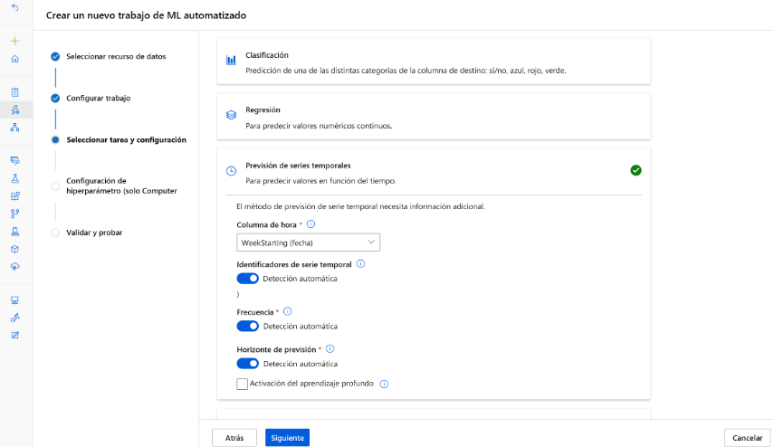
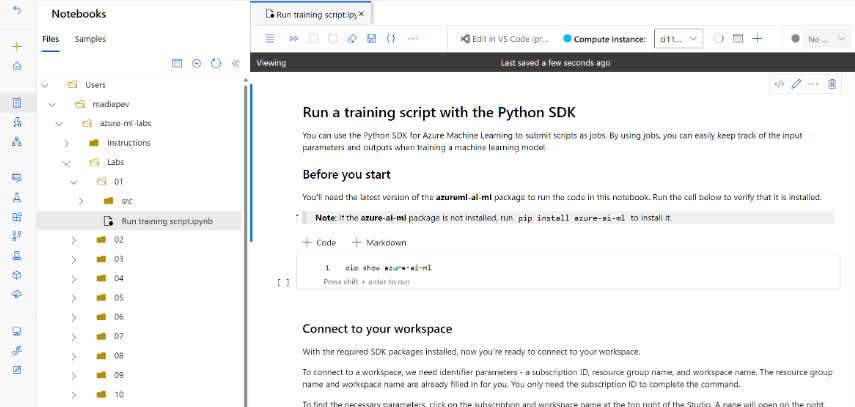
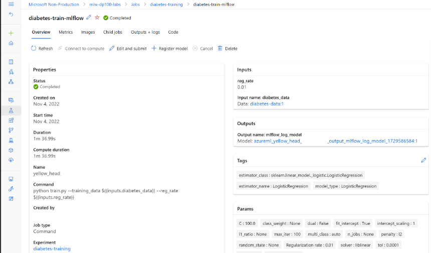

## Introducción

Azure Machine Learning proporciona una plataforma para que los científicos de datos entrenen, implementen y administren sus modelos de Machine Learning en la plataforma Microsoft Azure. Azure Machine Learning proporciona un conjunto completo de recursos y activos para entrenar e implementar modelos de Machine Learning eficaces.

## Creación de un área de trabajo de Azure Machine Learning

- Para obtener acceso a un **área de trabajo** de Azure Machine Learning, _primero debe crear Azure Machine Learning Service en su suscripción de Azure._
- El área de trabajo es un _lugar central donde puede trabajar con todos los recursos y activos disponibles para entrenar e implementar modelos de Machine Learning._ Para la reproducibilidad, el área de trabajo almacena un historial de todos los trabajos de entrenamiento, incluidos los registros, las métricas, las salidas y una instantánea del código.

### Entender Azure Machine Learning

Para crear un servicio Azure Machine Learning Service, tendrá que:

1. Obtener acceso a Azure, por ejemplo, a través de _Azure Portal_
2. Inicie sesión para obtener acceso a una suscripción de Azure
3. Cree un _grupo de recursos_ dentro de la suscripción
4. Cree un _servicio Azure ML Service_ para crear un área de trabajo.
   > Cuando se aprovisiona un área de trabajo, Azure creará automáticamente otros recursos de Azure en el mismo grupo de recursos para admitir el área de trabajo
5. Cuenta de _Azure Storage_: para almacenar archivos y cuadernos usados en el área de trabajo, así como metadatos de trabajos y modelos.
6. Azure _Key Vault_: para administrar de forma segura secretos como las claves de autenticación y las credenciales que se usan en el área de trabajo.
7. Application Insights: para supervisar los servicios predictivos en el área de trabajo
8. Azure Container Registry: se crea cuando es necesario para almacenar imágenes para entornos de Azure Machine Learning


### Creación del área de trabajo

Puede crear un área de trabajo de Azure ML de cualquiera de las maneras siguientes:

- Use la interfaz de usuario en _Azure Portal_ para crear un servicio de _Azure ML Service_
- Cree un plantilla de _Azure Resource Manager (ARM)_. enlace: https://github.com/Azure/azure-quickstart-templates/blob/master/quickstarts/microsoft.machinelearningservices/machine-learning-workspace-vnet/azuredeploy.json
- Use la interfaz de línea de comandos (CLI) de Azure con la extensión de la _CLI_ para Azure ML

  - Instalación de la CLI de Azure

  > Tambien se puede usar desde el navegador cloud shell que esta dentro de la interfaz de windows

  - Instalación Windows

    Ejecutable: https://learn.microsoft.com/es-es/cli/azure/install-azure-cli-windows?tabs=azure-cli

  - Instalación de la extensión AZ ML

    ```Azure CLI
    az extension add -n ml -y
    az ml -h
    ```

  - Estructura del equipo:

    - Área de trabajo por equipo: si todos los miembros del equipo necesitan el mismo nivel de acceso a los datos y a los recursos de experimentación
    - Área de trabajo por proyecto: Si necesita separar los datos y los recursos de experimentación por proyecto, elaboración de informes o presupuestos a nivel de proyecto
    - Área de trabajo única

  - Creación de un área de trabajo con la CLI (v2)

    - Creación de un grupo de recursos y su establecimiento predeterminado

    ```Azure CLI
    az group create --name "nombre-grupo" --location "eastus"
    ```

    enlace comandos: https://learn.microsoft.com/es-es/cli/azure/group?view=azure-cli-latest

    - Incluir grupo de recursos como predeterminado. Evitarme incluirlo cada vez

    ```Azure CLI
    az configure --defaults group="nombre-grupo"
    ```

    - Creación del área de trabajo Azure ML (con el grupo de recursos predeterminado)

    ```Azure CLI
    az ml workspace create --name "area-trabajo-nombre"
    ```

    - Establecer el área de trabajo como predeterminado

    ```Azure CLI
    az configure --defaults workspace="area-trabajo-nombre"
    ```

    - Para ejecución de notebooks o scripts necesita un _recurso de proceso_, para ello se muestra como crear una instancia de proceso:

    ```Azure CLI
    az ml compute create --name "nombre-instancia" --size STANDARD_DS11_V2 --type ComputeInstance
    ```

    ComputeInstance: Instancia de proceso
    Size: https://learn.microsoft.com/es-es/azure/machine-learning/concept-compute-target?view=azureml-api-2 Tamaño de VM que usará la Instancia de proceso

    - Para el cluster es similar:

    ```Azure CLI
    az ml compute create --name "nombre-cluster" --size STANDARD_DS11_V2 --max-instances 2 --type AmlCompute
    ```

    AmlCompute: cluster de proceso
    min-instances: número mínimo de nodos (predeterminado 0)
    max-instances: número máximo de nodos (predeterminado 4)

    - Creación de un entorno

    > Si necesita crear uno porque los que existen no le gustan:

    ```Azure CLI
    az ml environment create --file basic-env.yml
    ```

    Para crear un entorno dentro del área de trabajo que pueda reutilizar en cualquier momento, debe hacer referencia a un archivo YAML. En ese archivo puede especificar:

    - Nombre del entorno como se conocerá en el área de trabajo.
    - Versión del entorno.
    - Imagen base de Docker.
    - La ruta de acceso local al archivo de entorno de Conda que enumera los paquetes y bibliotecas que quiere usar.

    El archivo de entorno de Conda puede ser otro archivo YAML como este:

    ```yml
    name: basic-env-ml
    channels:
        - conda-forge
    dependencies:
        - python=3.8
        - pip
    - pip:
        - numpy
        - pandas
        - scikit-learn
        - matplotlib
        - azureml-mlflow
    ```

    El archivo YAML para crear el entorno, que hará referencia al archivo de entorno de Conda, tendrá el siguiente aspecto:

    ```yml
    $schema: https://azuremlschemas.azureedge.net/latest/environment.schema.json
    name: basic-env-scikit
    version: 1
    image: mcr.microsoft.com/azureml/openmpi3.1.2-ubuntu18.04
    conda_file: file:conda-envs/basic-env-ml.yml
    ```

    Ambos _YAML_ deben estar almacenados localmente en el mismo equipo desde el que ejecutará el comando para crear el entorno

    - Creación de un recurso de conjunto de datos

    Necesita crear un YAML y ejecutar `az ml dataset create`

    Almacene el archivo YAML y el conjunto de datos CSV en algún lugar del equipo: (Descripción opcional)

    ```yml
    $schema: https://azuremlschemas.azureedge.net/latest/asset.schema.json
    name: customer-churn-data
    version: 1
    local_path: customer-churn.csv
    description: Dataset pointing to customer churn CSV on local computer. Data will be uploaded to default datastore.
    ```

    vaya al lugar del archivo YAML y el CSV. ejecutará el comando para crear el conjunto de dato en el área de trabajo

    ```Azure CLI
    az ml dataset create --file data-local-path.yml
    ```

    - Enumeración de todos los conjuntos de datos dentro del área de trabajo

    ```Azure CLI
    az ml dataset list
    ```

- Use el _SDK_ de Azure ML para _Python_

```Python
from azure.ai.ml.entities import Workspace

workspace_name = "mlw-example" #Area de trabajo

ws_basic = Workspace(
    name=workspace_name,
    location="eastus",
    display_name="Basic workspace-example",
    description="This example shows how to create a basic workspace",
)
ml_client.workspaces.begin_create(ws_basic)
```

## Conceder acceso al área de trabajo de Azure ML

**RBAC (Control de acceso basado en rol)**

En la pestaña Control de acceso, puede administrar permisos para restringir las acciones que pueden realizar determinados usuarios o equipos. Por ejemplo, podría crear una directiva que solo permita a los usuarios del grupo de administradores de Azure crear destinos de proceso y almacenes de datos. Aunque los usuarios del grupo de científicos de datos pueden crear y ejecutar trabajos para entrenar modelos y registrar modelos.

Hay tres roles integrados generales que puede usar entre recursos y grupos de recursos para asignar permisos a otros usuarios:

- Propietario: obtiene acceso total a todos los recursos y puede conceder acceso a otros usuarios mediante el control de acceso.
- Colaborador: obtiene acceso total a todos los recursos, pero no puede conceder acceso a otros usuarios.
- Lector: solo puede ver el recurso, pero no se permite realizar ningún cambio.

Además, Azure Machine Learning tiene roles integrados específicos que puede usar:

- Científico de datos de AzureML: puede realizar todas las acciones dentro del área de trabajo, excepto para crear o eliminar recursos de proceso, o editar la configuración del área de trabajo.
- Operador de proceso de AzureML: se permite crear, cambiar y administrar el acceso a los recursos de proceso dentro de un área de trabajo.

```Azure CLI
az role assignment create --role "Contributor" --assignee "joe@contoso.com" --resource-group this-rg
```

## Creación y administración del área de trabajo

El área de trabajo es el recurso de nivel superior de Azure Machine Learning. Los científicos de datos necesitan acceso al área de trabajo para entrenar modelos y llevar un seguimiento de ellos y para implementar los modelos en puntos de conexión.

## Creación y administración de recursos de proceso

Existen cinco tipos de proceso en el área de trabajo de Azure ML

- Instancias de proceso: Similar a una máquina virtual en la nube, bajo la administración del área de trabajo. Ideal para usar como entorno de desarrollo para ejecutar cuadernos (Jupyter).
- Clústeres de proceso: Clústeres a petición de nodos de ejecución de CPU o GPU en la nube, bajo la administración del área de trabajo. Ideal para las cargas de trabajo de producción a medida que se escalan automáticamente en función de sus necesidades.
- Clústeres de Kubernetes: Le permite crear o adjuntar un clúster de Azure Kubernetes Service (AKS). Ideal para implementar modelos de aprendizaje automático entrenados en escenarios de producción.
- Procesos asociados: Le permite asociar otros recursos de proceso de Azure con el área de trabajo, como Azure Databricks o grupos de Spark de Synapse.
- Proceso sin servidor: Un proceso totalmente administrado a petición que puede usar para los trabajos de entrenamiento.

## Creación y administración de almacenes de datos

Cuando se crea un área de trabajo, se crea una cuenta de Azure Storage y se conecta automáticamente al área de trabajo. Como resultado, ya tendrá cuatro almacenes de datos agregados al área de trabajo:

- workspaceartifactstore: Se conecta al contenedor azureml de la cuenta de Azure Storage creada con el área de trabajo. Se usa para almacenar los registros de proceso y experimento al ejecutar trabajos.
- workspaceworkingdirectory: Se conecta al recurso compartido de archivos de la cuenta de Azure Storage creada con el área de trabajo que usa la sección Notebooks de Studio. Siempre que cargue archivos o carpetas para acceder desde una instancia de proceso, se carga en este recurso compartido de archivos.
- workspaceblobstore: se conecta a la instancia de Blob Storage de la cuenta de Azure Storage que se creó con el área de trabajo. Específicamente el contenedor de azureml-blobstore-.... Se establece como el almacén de datos predeterminado, lo que significa que cada vez que se crea un recurso de datos y se cargan los datos, se almacenan en este contenedor.
- workspacefilestore: se conecta al recurso compartido de archivos de la cuenta de Azure Storage que se creó con el área de trabajo. En concreto, el recurso compartido de archivos azureml-filestore-....
  Además, puede crear almacenes de datos para conectarse a otros servicios de datos de Azure. Por lo general, los almacenes de datos se conectarán a una cuenta de Azure Storage o a Azure Data Lake Storage (Gen2) como los servicios de datos que se usan con más frecuencia en los proyectos de ciencia de datos.

## Creación y administración de modelos

El producto final del entrenamiento de un modelo es el modelo en sí. Puede entrenar modelos de Machine Learning con varios marcos, como Scikit-learn o PyTorch. Una forma habitual de almacenar estos modelos es empaquetar el modelo como archivo pickle de Python (extensión .pkl).

Como alternativa, puede usar la plataforma de código abierto MLflow para almacenar el modelo con el formato MLModel.

- En Azure Machine Learning, el registro de modelos tiene las siguientes ventajas:
  - Puede implementarlos en puntos de conexión por lotes o en tiempo real sin proporcionar un script de puntuación ni un entorno.
  - Cuando se implementan, las implementaciones del modelo tienen una instancia de Swagger generada automáticamente y la función Prueba se puede - usar en Estudio de Azure Machine Learning.
  - Puede usar los modelos directamente como entradas de canalización.
  - Puede usar el panel de IA responsable con sus modelos.

## Creación y administración de entornos

Al trabajar con el proceso en la nube, es importante asegurarse de que el código se ejecuta en cualquier proceso que esté a su disposición. Tanto si quiere ejecutar un script en una instancia de proceso como en un clúster de proceso, el código debe ejecutarse correctamente.

Imagine que trabaja en Python o R con marcos de código abierto para entrenar un modelo en el dispositivo local. Si quiere usar una biblioteca como Scikit-learn o PyTorch, tendrá que instalarla en el dispositivo.

De forma similar, al escribir código que use marcos o bibliotecas, deberá asegurarse de que los componentes necesarios estén instalados en el proceso que ejecutará el código. Para enumerar todos los requisitos necesarios, puede crear entornos. Al crear un entorno, debe especificar el nombre y la versión.

Los entornos especifican los paquetes de software, las variables de entorno y la configuración de software para ejecutar scripts. _Un entorno se almacena como imagen en la instancia de Azure Container Registry_ creada con el área de trabajo cuando se usa por primera vez.

Siempre que quiera ejecutar un script, puede especificar el entorno que debe usar el destino de proceso. El entorno instalará todos los requisitos necesarios en el proceso antes de ejecutar el script, lo que hará que el código sea sólido y reutilizable en todos los destinos de proceso.

## Creación y administración de datos

Mientras que los almacenes de datos contienen la información de conexión con los servicios de almacenamiento de datos de Azure, los recursos de datos hacen referencia a un archivo o una carpeta específicos.

_Puede usar recursos de datos para acceder fácilmente a los datos en todo momento, sin tener que proporcionar autenticación cada vez que quiera acceder a ellos._

Al crear un recurso de datos en el área de trabajo, especificará la ruta de acceso para que apunte al archivo o carpeta, así como el nombre y la versión.

## Creación y administración de componentes

Para entrenar modelos de Machine Learning, debe escribir código. En todos los proyectos, _es posible que haya código que se pueda reutilizar. En lugar de escribir código desde cero_, puede reutilizar fragmentos de código de otros proyectos.

_Para facilitar el uso compartido del código, puede crear un componente en un área de trabajo. Para crear un componente, debe especificar el nombre, la versión, el código y el entorno que se necesitan para ejecutar el código._

Puede usar componentes al crear canalizaciones. Así pues, un componente a menudo representa un paso de una canalización, por ejemplo, para normalizar los datos, para entrenar un modelo de regresión o para probar el modelo entrenado en un conjunto de datos de validación.

## Entrenamiento de modelos en el área de trabajo

- Usar ML Automatizado
- Ejecute un cuaderno de Jupyter Notebook
- Ejecutar un script como trabajo

### Exploración de algoritmos y valores de hiperparámetros con ML automatizado

Cuando tiene un conjunto de datos de entrenamiento y se le asigna la tarea de encontrar qué modelo tiene el mejor rendimiento, puede experimentar con varios algoritmos y valores de hiperparámetros.

Experimentar manualmente con diferentes configuraciones para entrenar un modelo puede tardar mucho tiempo. Como alternativa, puede usar ML automatizado para acelerar el proceso.

Esta funcionalidad recorre en iteración los algoritmos emparejados con selecciones de características a fin de encontrar el modelo que tiene el mejor rendimiento para los datos.



### Ejecutar un cuaderno

Cuando prefiera desarrollar mediante la ejecución de código en cuadernos, puede usar la característica de cuaderno integrada en el área de trabajo.

La página Cuadernos del Estudio le permite editar y ejecutar cuadernos de Jupyter Notebook.


Todos los archivos que clona o crea en la sección Cuadernos se almacenan en el recurso compartido de archivos de la cuenta de Azure Storage que se creó con el área de trabajo.

Para ejecutar cuadernos, usará una instancia de proceso, ya que son ideales para el desarrollo y funcionan de manera similar a una máquina virtual.

También puede editar y ejecutar cuadernos en Visual Studio Code, a la vez que sigue usando una instancia de proceso para ejecutar los cuadernos.

### Ejecución de un script como trabajo

Cuando quiera preparar el código para que esté listo para producción, es mejor que use scripts. Puede automatizar fácilmente la ejecución del script para automatizar cualquier carga de trabajo de aprendizaje automático.

Puede ejecutar un script como un trabajo en Azure Machine Learning. Al enviar un trabajo al área de trabajo, todas las entradas y salidas se almacenarán en el área de trabajo.



**Existen diferentes tipos de trabajos en función de cómo quiere ejecutar una carga de trabajo:**

Comando: ejecute un script único. "Get Help"
Barrido: ajuste los hiperparámetros al ejecutar un script único. "Sweep"
Canalización: ejecute una canalización que conste de varios scripts o componentes. "Canalización / Pipeline"
