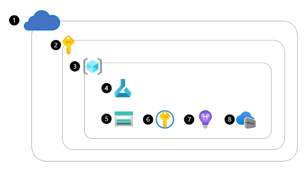

## Introducción

Azure Machine Learning proporciona una plataforma para que los científicos de datos entrenen, implementen y administren sus modelos de Machine Learning en la plataforma Microsoft Azure. Azure Machine Learning proporciona un conjunto completo de recursos y activos para entrenar e implementar modelos de Machine Learning eficaces.

## Creación de un área de trabajo de Azure Machine Learning

- Para obtener acceso a un **área de trabajo** de Azure Machine Learning, _primero debe crear Azure Machine Learning Service en su suscripción de Azure._
- El área de trabajo es un _lugar central donde puede trabajar con todos los recursos y activos disponibles para entrenar e implementar modelos de Machine Learning._ Para la reproducibilidad, el área de trabajo almacena un historial de todos los trabajos de entrenamiento, incluidos los registros, las métricas, las salidas y una instantánea del código.

### Entender Azure Machine Learning

Para crear un servicio Azure Machine Learning Service, tendrá que:

1. Obtener acceso a Azure, por ejemplo, a través de _Azure Portal_
2. Inicie sesión para obtener acceso a una suscripción de Azure
3. Cree un _grupo de recursos_ dentro de la suscripción
4. Cree un _servicio Azure ML Service_ para crear un área de trabajo.
   > Cuando se aprovisiona un área de trabajo, Azure creará automáticamente otros recursos de Azure en el mismo grupo de recursos para admitir el área de trabajo
5. Cuenta de _Azure Storage_: para almacenar archivos y cuadernos usados en el área de trabajo, así como metadatos de trabajos y modelos.
6. Azure _Key Vault_: para administrar de forma segura secretos como las claves de autenticación y las credenciales que se usan en el área de trabajo.
7. Application Insights: para supervisar los servicios predictivos en el área de trabajo
8. Azure Container Registry: se crea cuando es necesario para almacenar imágenes para entornos de Azure Machine Learning



### Creación del área de trabajo

Puede crear un área de trabajo de Azure ML de cualquiera de las maneras siguientes:

- Use la interfaz de usuario en _Azure Portal_ para crear un servicio de _Azure ML Service_
- Cree un plantilla de _Azure Resource Manager (ARM)_. enlace: https://github.com/Azure/azure-quickstart-templates/blob/master/quickstarts/microsoft.machinelearningservices/machine-learning-workspace-vnet/azuredeploy.json
- Use la interfaz de línea de comandos (CLI) de Azure con la extensión de la _CLI_ para Azure ML

  - Instalación de la CLI de Azure

  > Tambien se puede usar desde el navegador cloud shell que esta dentro de la interfaz de windows

  - Instalación Windows

    Ejecutable: https://learn.microsoft.com/es-es/cli/azure/install-azure-cli-windows?tabs=azure-cli

  - Instalación de la extensión AZ ML

    ```Azure CLI
    az extension add -n ml -y
    az ml -h
    ```

  - Estructura del equipo:

    - Área de trabajo por equipo: si todos los miembros del equipo necesitan el mismo nivel de acceso a los datos y a los recursos de experimentación
    - Área de trabajo por proyecto: Si necesita separar los datos y los recursos de experimentación por proyecto, elaboración de informes o presupuestos a nivel de proyecto
    - Área de trabajo única

  - Creación de un área de trabajo con la CLI (v2)

    - Creación de un grupo de recursos y su establecimiento predeterminado

    ```Azure CLI
    az group create --name "nombre-grupo" --location "eastus"
    ```

    enlace comandos: https://learn.microsoft.com/es-es/cli/azure/group?view=azure-cli-latest

    - Incluir grupo de recursos como predeterminado. Evitarme incluirlo cada vez

    ```Azure CLI
    az configure --defaults group="nombre-grupo"
    ```

    - Creación del área de trabajo Azure ML (con el grupo de recursos predeterminado)

    ```Azure CLI
    az ml workspace create --name "area-trabajo-nombre"
    ```

    - Establecer el área de trabajo como predeterminado

    ```Azure CLI
    az configure --defaults workspace="area-trabajo-nombre"
    ```

    - Para ejecución de notebooks o scripts necesita un _recurso de proceso_, para ello se muestra como crear una instancia de proceso:

    ```Azure CLI
    az ml compute create --name "nombre-instancia" --size STANDARD_DS11_V2 --type ComputeInstance
    ```

    ComputeInstance: Instancia de proceso
    Size: https://learn.microsoft.com/es-es/azure/machine-learning/concept-compute-target?view=azureml-api-2 Tamaño de VM que usará la Instancia de proceso

    - Para el cluster es similar:

    ```Azure CLI
    az ml compute create --name "nombre-cluster" --size STANDARD_DS11_V2 --max-instances 2 --type AmlCompute
    ```

    AmlCompute: cluster de proceso
    min-instances: número mínimo de nodos (predeterminado 0)
    max-instances: número máximo de nodos (predeterminado 4)

    - Creación de un entorno

    > Si necesita crear uno porque los que existen no le gustan:

    ```Azure CLI
    az ml environment create --file basic-env.yml
    ```

    Para crear un entorno dentro del área de trabajo que pueda reutilizar en cualquier momento, debe hacer referencia a un archivo YAML. En ese archivo puede especificar:

    - Nombre del entorno como se conocerá en el área de trabajo.
    - Versión del entorno.
    - Imagen base de Docker.
    - La ruta de acceso local al archivo de entorno de Conda que enumera los paquetes y bibliotecas que quiere usar.

    El archivo de entorno de Conda puede ser otro archivo YAML como este:

    ```yml
    name: basic-env-ml
    channels:
        - conda-forge
    dependencies:
        - python=3.8
        - pip
    - pip:
        - numpy
        - pandas
        - scikit-learn
        - matplotlib
        - azureml-mlflow
    ```

    El archivo YAML para crear el entorno, que hará referencia al archivo de entorno de Conda, tendrá el siguiente aspecto:

    ```yml
    $schema: https://azuremlschemas.azureedge.net/latest/environment.schema.json
    name: basic-env-scikit
    version: 1
    image: mcr.microsoft.com/azureml/openmpi3.1.2-ubuntu18.04
    conda_file: file:conda-envs/basic-env-ml.yml
    ```

    Ambos _YAML_ deben estar almacenados localmente en el mismo equipo desde el que ejecutará el comando para crear el entorno

    - Creación de un recurso de conjunto de datos

    Necesita crear un YAML y ejecutar `az ml dataset create`

    Almacene el archivo YAML y el conjunto de datos CSV en algún lugar del equipo: (Descripción opcional)

    ```yml
    $schema: https://azuremlschemas.azureedge.net/latest/asset.schema.json
    name: customer-churn-data
    version: 1
    local_path: customer-churn.csv
    description: Dataset pointing to customer churn CSV on local computer. Data will be uploaded to default datastore.
    ```

    vaya al lugar del archivo YAML y el CSV. ejecutará el comando para crear el conjunto de dato en el área de trabajo

    ```Azure CLI
    az ml dataset create --file data-local-path.yml
    ```

    - Enumeración de todos los conjuntos de datos dentro del área de trabajo

    ```Azure CLI
    az ml dataset list
    ```

- Use el _SDK_ de Azure ML para _Python_

```Python
from azure.ai.ml.entities import Workspace

workspace_name = "mlw-example" #Area de trabajo

ws_basic = Workspace(
    name=workspace_name,
    location="eastus",
    display_name="Basic workspace-example",
    description="This example shows how to create a basic workspace",
)
ml_client.workspaces.begin_create(ws_basic)
```

## Conceder acceso al área de trabajo de Azure ML

**RBAC (Control de acceso basado en rol)**

En la pestaña Control de acceso, puede administrar permisos para restringir las acciones que pueden realizar determinados usuarios o equipos. Por ejemplo, podría crear una directiva que solo permita a los usuarios del grupo de administradores de Azure crear destinos de proceso y almacenes de datos. Aunque los usuarios del grupo de científicos de datos pueden crear y ejecutar trabajos para entrenar modelos y registrar modelos.

Hay tres roles integrados generales que puede usar entre recursos y grupos de recursos para asignar permisos a otros usuarios:

- Propietario: obtiene acceso total a todos los recursos y puede conceder acceso a otros usuarios mediante el control de acceso.
- Colaborador: obtiene acceso total a todos los recursos, pero no puede conceder acceso a otros usuarios.
- Lector: solo puede ver el recurso, pero no se permite realizar ningún cambio.

Además, Azure Machine Learning tiene roles integrados específicos que puede usar:

- Científico de datos de AzureML: puede realizar todas las acciones dentro del área de trabajo, excepto para crear o eliminar recursos de proceso, o editar la configuración del área de trabajo.
- Operador de proceso de AzureML: se permite crear, cambiar y administrar el acceso a los recursos de proceso dentro de un área de trabajo.

```Azure CLI
az role assignment create --role "Contributor" --assignee "joe@contoso.com" --resource-group this-rg
```
